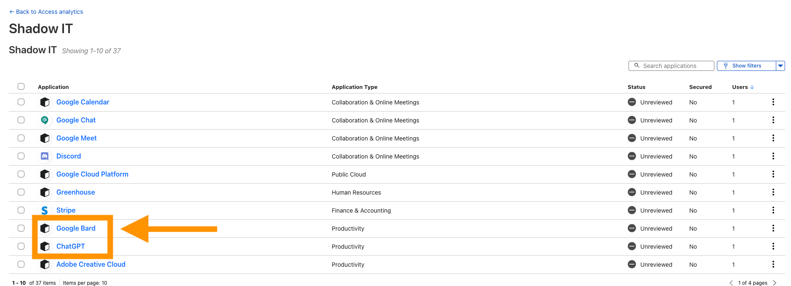
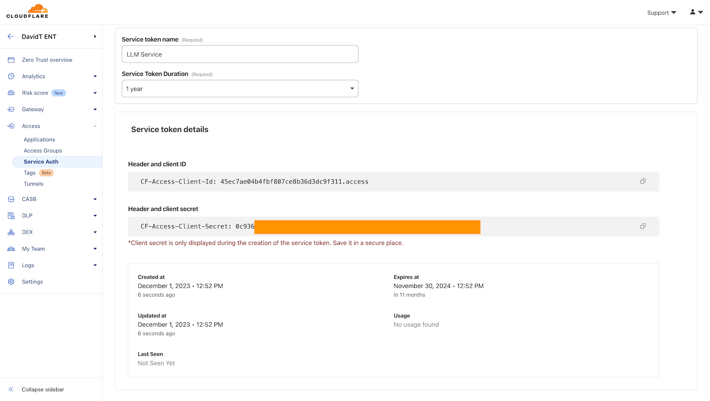
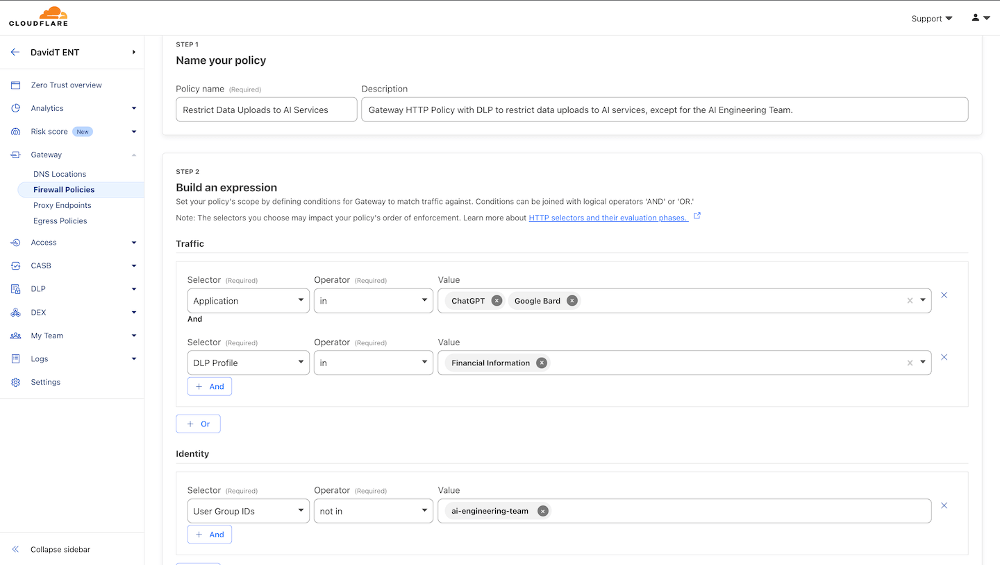
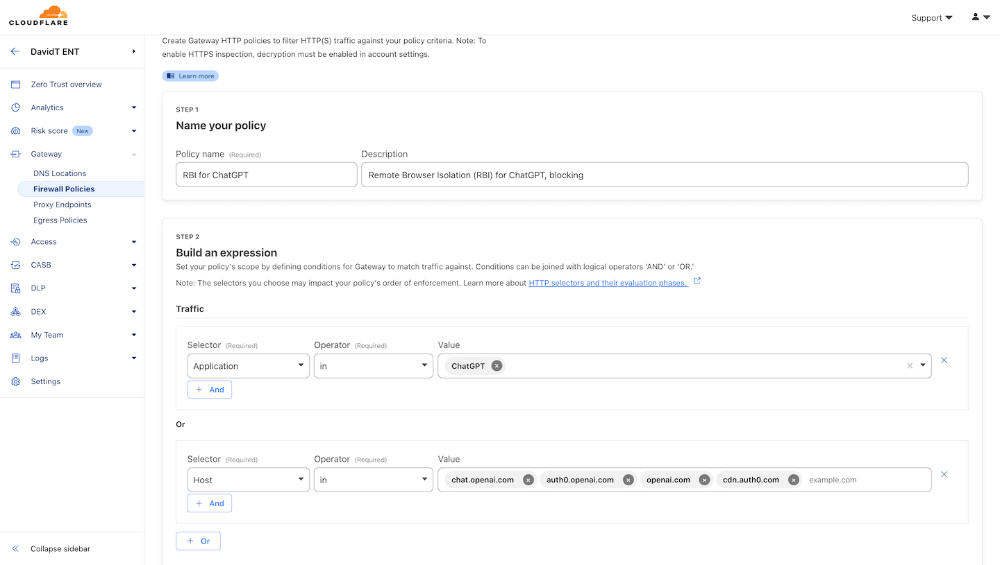
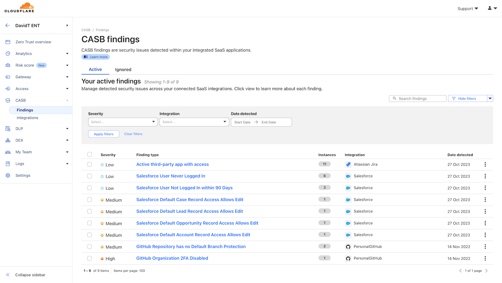
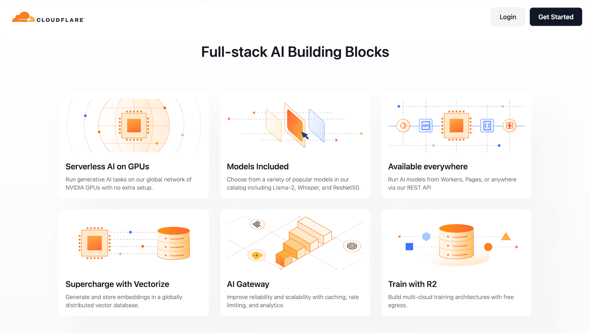
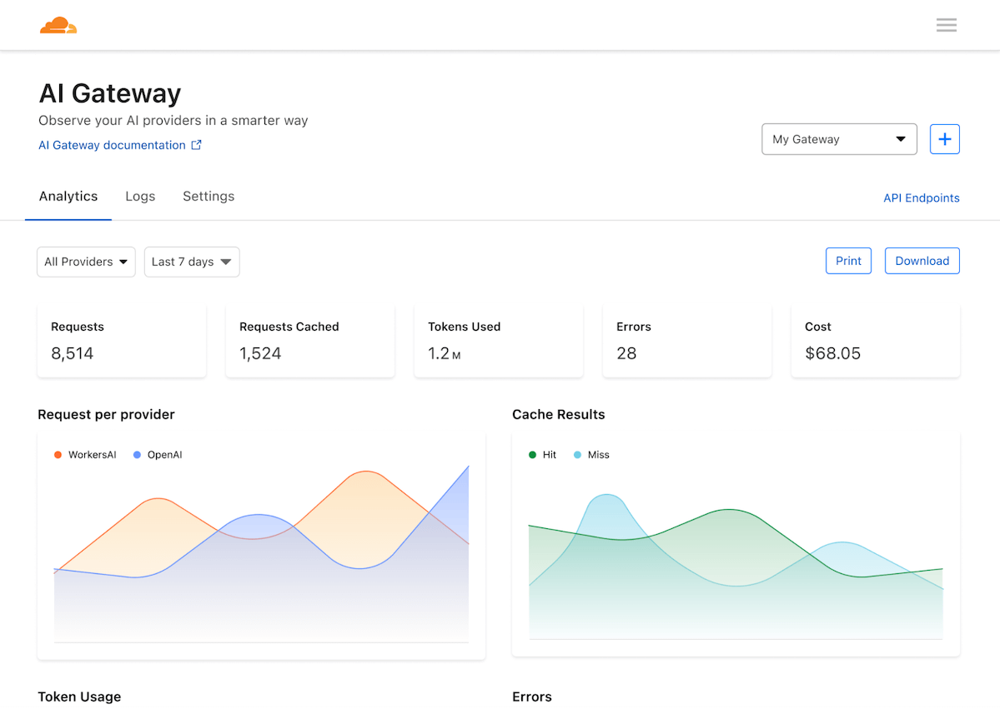

In this blog post, we will be going over two important interactions with Artificial Intelligence (AI):

1. **Zero Trust and AI** – navigating the balance between empowering employees to leverage AI services and safeguarding against potential information leaks and misuse.

2. **Developers and AI** – exploring the simplicity behind building, training, inferring, and optimizing AI applications.

## Zero Trust and AI

### Measuring Usage

> _**Shadow IT Discovery** provides visibility into the SaaS applications and private network origins your end users are visiting._

By implementing **[Cloudflare Gateway](https://developers.cloudflare.com/cloudflare-one/policies/gateway/)**, and hence **[Shadow IT](https://developers.cloudflare.com/cloudflare-one/insights/analytics/access/)**, IT departments can review AI usage, helping in budgeting and policy-making decisions, as well as the ability to block AI services if needed.

### Controlling API Access

> _**Cloudflare Access** determines who can reach your application by applying the Access policies you configure._

Developers can use **[Service Tokens](https://developers.cloudflare.com/cloudflare-one/identity/service-tokens/)** on **[Cloudflare Access](https://developers.cloudflare.com/cloudflare-one/policies/access/)** Policies for secure API access control, allowing teams to share training data securely, or granting plug-in access for an AI service, enforcing authentication on each and every request made.

### Restricting Data Uploads

> _**Cloudflare Data Loss Prevention (DLP)** allows you to scan your web traffic and SaaS applications for the presence of sensitive data such as social security numbers, financial information, secret keys, and source code._

Human involvement always has the potential for security incidents through oversharing. By implementing Cloudflare's **[Data Loss Prevention (DLP)](https://developers.cloudflare.com/cloudflare-one/policies/data-loss-prevention/)** with **[Gateway HTTP Policies](https://developers.cloudflare.com/cloudflare-one/policies/gateway/http-policies/)**, IT departments can define data parameters and establish detailed rules for sharing sensitive information with AI services, essentially preventing information leaks.

#### Restrict Interactions with AI

Additionally, with Cloudflare's **[Remote Browser Isolation (RBI)](https://developers.cloudflare.com/cloudflare-one/policies/browser-isolation/)** one can transparently disable different interactions with AI services, such as preventing copy / paste or upload / download.

### Controlling Use without a Proxy

> _**Cloudflare's API-driven Cloud Access Security Broker (CASB)** scans SaaS applications for misconfigurations, unauthorized user activity, shadow IT, and other data security issues that can occur after a user has successfully logged in._

Potential misconfigurations in SaaS applications, like AI plug-ins having more access than one wants to, can be identified by Cloudflare's **[Cloud Access Security Broker (CASB)](https://developers.cloudflare.com/cloudflare-one/applications/scan-apps/)**, with upcoming integrations to check for misconfigurations in popular AI services.

## Developers and AI

> _Build and deploy ambitious AI applications to Cloudflare's global network_

Building full-stack AI applications is now easier and more accessible than ever. Explore a variety of [examples here](https://workers.cloudflare.com/built-with/collections/ai-workers/) to gain insights into the possibilities.

### Storing Training Data efficiently

Leverage **[R2 Object Storage](https://developers.cloudflare.com/r2/)** for storing training data to reduce egress fees and maintain the flexibility required for multi-cloud architectures.

### Global and Fast Inference

Execute and deploy models seamlessly with **[Workers AI](https://developers.cloudflare.com/workers-ai/)**, harnessing the capabilities of recently [deployed GPUs worldwide](https://www.cloudflare.com/network/).

Additionally, efficiently store and retrieve embeddings using **[Vectorize](https://developers.cloudflare.com/vectorize/)** to accelerate vector look-ups.

### Optimizing Scalability and Observability

Integrate your AI application with **[AI Gateway](https://developers.cloudflare.com/ai-gateway/)** for enhanced observability through analytics, along with controlled scalability featuring caching and granular rate limiting.

## Summary

By seamlessly integrating with [Cloudflare's SSE & SASE Platform](https://www.cloudflare.com/zero-trust/) and the [Cloudflare Developer Platform](https://www.cloudflare.com/developer-platform/products/), you can streamline various facets of a complete AI application stack, encompassing tasks such as training, inference, security, and optimization.

Get started now, for [FREE](https://developers.cloudflare.com/learning-paths/get-started-free/)!

---

## Disclaimer

Educational purposes only.

This blog post is independent and not affiliated with, endorsed by, or necessarily reflective of the opinions of Cloudflare or any other entities mentioned.

Certain content, images, and screenshots are sourced from publicly available resources or directly captured from the Cloudflare Zero Trust Dashboard.

This blog post is inspired by the contents of the blog posts [A complete suite of Zero Trust security tools to help get the most from AI](https://blog.cloudflare.com/zero-trust-ai-security/), [How to secure Generative AI applications](https://blog.cloudflare.com/secure-generative-ai-applications/) and [Announcing AI Gateway: making AI applications more observable, reliable, and scalable](https://blog.cloudflare.com/announcing-ai-gateway/), as well as the site [ai.cloudflare.com](https://ai.cloudflare.com/).
