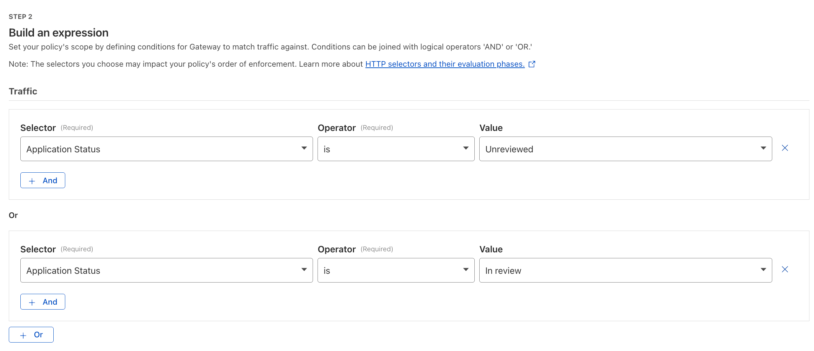
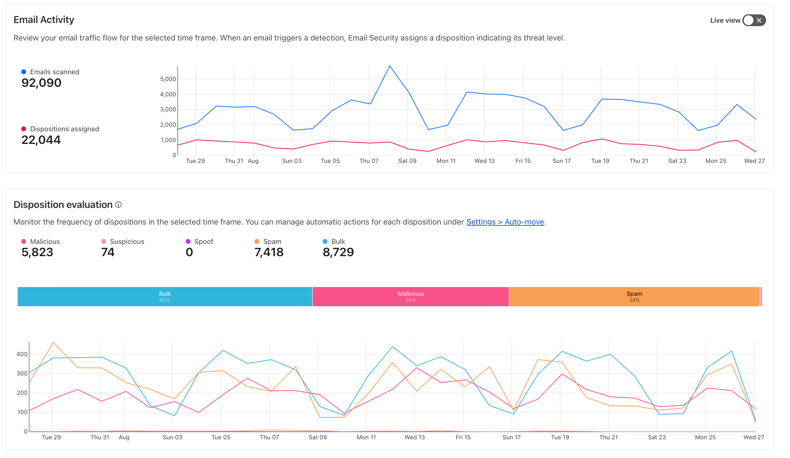

This post updates the earlier article [_Cybersecurity and Artificial Intelligence (AI)_](articles/ai-cybersecurity/) from 2023, reflecting new capabilities announced during Cloudflare [AI Week 2025](https://www.cloudflare.com/innovation-week/ai-week-2025/).

## TL;DR

Cloudflare provides an integrated approach to AI security, combining Zero Trust (SASE) and Developer Platform capabilities to help CISOs:

- Detect and manage Shadow AI usage
- Prevent data leaks to public LLMs
- Protect AI APIs against prompt injection, scraping, and overuse
- Enforce access control for developers, agents, and services
- Mitigate AI-driven phishing and deepfake risks
- Implement enforceable governance policies
- Run and scale AI inference securely at the edge

---

## Securing the AI Revolution: A CISO's Practical Guide with Cloudflare

Artificial Intelligence (AI) is reshaping our world. But as it enables new capabilities, it also introduces new threat surfaces and risks, from model abuse to AI-powered phishing and compliance.

A proactive [Zero Trust (SASE) strategy](https://blog.cloudflare.com/best-practices-sase-for-ai/), extended to AI Security Posture Management (AI-[SPM](https://www.cloudflare.com/learning/cloud/what-is-sspm/)), is essential. The following use cases highlight practical approaches with Cloudflare's platform to address real AI-era risks.

### Use Case 1: Discovering Shadow AI

**The Problem:** Employees using unsanctioned AI tools create potential data leakage and compliance risks.

**The Solution:** Deploy [Cloudflare Gateway](https://developers.cloudflare.com/cloudflare-one/policies/gateway/) with [Shadow IT Discovery](https://developers.cloudflare.com/cloudflare-one/insights/analytics/shadow-it-discovery/) through the [WARP client](https://developers.cloudflare.com/cloudflare-one/connections/connect-devices/warp/) to monitor SaaS and AI application usage. Block or [isolate](https://developers.cloudflare.com/cloudflare-one/policies/gateway/http-policies/#isolate) unauthorized AI applications. Use [CASB](https://blog.cloudflare.com/casb-ai-integrations/) API integrations for misconfiguration and data exposure detection, even without a device client.

### Use Case 2: Preventing Data Leaks to Public LLMs

**The Problem:** Employees may expose sensitive data in public AI tools.

**The Solution:** Enforce [Data Loss Prevention (DLP)](https://developers.cloudflare.com/cloudflare-one/policies/data-loss-prevention/) and [Remote Browser Isolation (RBI)](https://developers.cloudflare.com/cloudflare-one/policies/browser-isolation/) policies – both part of the [Cloudflare Gateway](https://developers.cloudflare.com/cloudflare-one/policies/gateway/) HTTP Policies – to scan outbound traffic and mitigate certain [behavior](https://developers.cloudflare.com/cloudflare-one/policies/gateway/http-policies/#selectors) or [interactions](https://developers.cloudflare.com/cloudflare-one/policies/browser-isolation/isolation-policies/#policy-settings) (upload, download, copy-paste, etc.) before they reach public LLMs.

### Use Case 3: Protecting AI Applications from Abuse

**The Problem:** AI APIs face prompt injection, data extraction, and malicious misuse.

**The Solution:** Apply [layered defenses](https://www.cloudflare.com/learning/security/glossary/what-is-defense-in-depth/) with the [Cloudflare reverse proxy](https://developers.cloudflare.com/fundamentals/concepts/how-cloudflare-works/).

- [Firewall for AI](https://developers.cloudflare.com/waf/detections/firewall-for-ai/) to detect and block harmful payloads and avoid data leaks.

- [Advanced Rate Limiting](https://developers.cloudflare.com/waf/rate-limiting-rules/) controls abuse via request body, headers, or custom fields.

- [AI Gateway](https://developers.cloudflare.com/ai-gateway/) with [Guardrails](https://developers.cloudflare.com/ai-gateway/guardrails/), [Evaluations](https://developers.cloudflare.com/ai-gateway/evaluations/), and [dynamic routing](https://developers.cloudflare.com/ai-gateway/features/dynamic-routing/).

### Use Case 4: Controlling Access to Self-Hosted AI

**The Problem:** Internal models or AI APIs must only be accessible to verified, authorized and authenticated users, agents, or services, in order to prevent synthetic identity fraud (SIF).

**The Solution:** Implement Cloudflare [Access](https://developers.cloudflare.com/cloudflare-one/policies/access/) (Zero Trust Network Access (ZTNA)) with user identity, device posture, and geographic rules. For agents and services, enforce [Service Tokens](https://developers.cloudflare.com/cloudflare-one/identity/service-tokens/) or [MCP Server Portals](https://blog.cloudflare.com/zero-trust-mcp-server-portals/) for [MCP Authorization](https://developers.cloudflare.com/agents/model-context-protocol/authorization/).

### Use Case 5: Auditing and Controlling AI Content Scrapers

**The Problem:** ([_Some_](https://blog.cloudflare.com/from-googlebot-to-gptbot-whos-crawling-your-site-in-2025/)) AI bots crawl websites without consent to collect training data. Review the [AI bot & crawler traffic insights](https://radar.cloudflare.com/ai-insights).

**The Solution:** Monitor with [AI Audit / AI Crawl Control](https://developers.cloudflare.com/ai-audit/) and configure [Pay-per-Crawl](https://blog.cloudflare.com/introducing-pay-per-crawl/) where applicable. Combine with [Bot Management](https://developers.cloudflare.com/bots/get-started/bot-management/) and [WAF](https://developers.cloudflare.com/waf/) to granularly block, challenge or allow ([skip](https://developers.cloudflare.com/waf/custom-rules/skip/)) bots based on business policy. Review the [Verified Bots Directory](https://radar.cloudflare.com/bots/directory) for details.

### Use Case 6: Preventing API Abuse and Cost Overruns

**The Problem:** Excessive or automated queries (i.e. prompt spamming) increase token costs and infrastructure load on self-hosted models.

**The Solution:** Apply [Advanced Rate Limiting](https://developers.cloudflare.com/waf/rate-limiting-rules/#availability) with [JWTs](https://developers.cloudflare.com/waf/custom-rules/use-cases/check-jwt-claim-to-protect-admin-user/) via [API Shield](https://developers.cloudflare.com/api-shield/) or based on JSON fields. Use [AI Gateway](https://developers.cloudflare.com/ai-gateway/) for [cost observability](https://developers.cloudflare.com/ai-gateway/observability/costs/) and [caching](https://developers.cloudflare.com/ai-gateway/configuration/caching/).

### Use Case 7: Defending Against Model Denial-of-Service

**The Problem:** Floods of malicious traffic can deny access to AI APIs. Review the [application layer DDoS attacks distribution insights](https://radar.cloudflare.com/security/application-layer#application-layer-ddos-attacks-distribution).

**The Solution:** Use the [Cloudflare reverse proxy](https://developers.cloudflare.com/fundamentals/concepts/how-cloudflare-works/) in front of your applications and follow [origin server security best practices](https://developers.cloudflare.com/fundamentals/security/protect-your-origin-server/).

- Always-on [DDoS Protection](https://developers.cloudflare.com/ddos-protection/about/attack-coverage/).
- [WAF](https://developers.cloudflare.com/waf/), [Rate Limiting](https://developers.cloudflare.com/waf/rate-limiting-rules/), and [Enterprise Bot Management](https://developers.cloudflare.com/bots/get-started/bot-management/) to mitigate abnormal patterns.
- [AI Gateway](https://developers.cloudflare.com/ai-gateway/) for traffic visibility and [request handling](https://developers.cloudflare.com/ai-gateway/configuration/request-handling/).

### Use Case 8: Preventing AI-Powered Social Engineering

**The Problem:** AI-generated phishing can trick employees into breaches. [Here](https://www.cloudflare.com/the-net/security-signals/ai-powered-threats/) are concrete real-world examples.

**The Solution:** Deploy Cloudflare [Email Security](https://developers.cloudflare.com/cloudflare-one/email-security/). Reinforce with [ZTNA](<(https://developers.cloudflare.com/cloudflare-one/policies/access/)>) policies: [MFA](https://developers.cloudflare.com/cloudflare-one/policies/access/mfa-requirements/), [identity selectors](https://developers.cloudflare.com/cloudflare-one/policies/gateway/identity-selectors/), and [device posture](https://developers.cloudflare.com/cloudflare-one/identity/devices/) checks.

### Use Case 9: Building Custom Governance Logic

**The Problem:** Standard policies may not meet specific AI governance needs, custom and flexible security logic and checks might be required instead.

**The Solution:** Extend enforcement with [Cloudflare Workers](https://developers.cloudflare.com/reference-architecture/diagrams/sase/augment-access-with-serverless/). Run edge (custom code) logic for prompt validation, dynamic authorization, or external database lookups. Extend further by building [fullstack applications](https://developers.cloudflare.com/reference-architecture/diagrams/serverless/fullstack-application/) or deploying workloads with [Containers](https://developers.cloudflare.com/containers/).

### Use Case 10: Running and Scaling AI Inference at the Edge

**The Problem:** Scaling inference workloads requires distributed infrastructure.

**The Solution:** Train, optimize, and infer on [Cloudflare's Developer Platform](https://www.cloudflare.com/ai-solution/).

- Use [Workers AI](https://developers.cloudflare.com/workers-ai/) to serve models globally on Cloudflare's edge.
- Store inputs, outputs, or models with [R2 Object Storage](https://developers.cloudflare.com/r2/).
- Speed up retrievals using [Vectorize](https://developers.cloudflare.com/vectorize/).
- Manage cost and control with [AI Gateway](https://blog.cloudflare.com/ai-gateway-aug-2025-refresh/).

---

## Table Summary

| #   | Use Case                                                                              | Problem                                                | Solution Summary                                     |
| --- | ------------------------------------------------------------------------------------- | ------------------------------------------------------ | ---------------------------------------------------- |
| 1   | [Shadow AI Discovery](#use-case-1-discovering-shadow-ai)                              | Unmanaged AI tools create data risk                    | Gateway with Shadow IT Discovery, CASB               |
| 2   | [Preventing Data Leaks to LLMs](#use-case-2-preventing-data-leaks-to-public-llms)     | Sensitive data exposure to public AIs                  | DLP + Remote Browser Isolation                       |
| 3   | [AI Application Abuse](#use-case-3-protecting-ai-applications-from-abuse)             | Prompt injection, misuse                               | Firewall for AI, Advanced Rate Limiting, AI Gateway  |
| 4   | [Developer Access Control](#use-case-4-controlling-access-to-self-hosted-ai)          | Unauthorized access to internal models / AI tools      | Access policies, Service Tokens, MCP Auth            |
| 5   | [AI Content Scraping](#use-case-5-auditing-and-controlling-ai-content-scrapers)       | AI bots crawl sites without consent                    | AI Audit, Bot Management, WAF                        |
| 6   | [API Overuse & Cost](#use-case-6-preventing-api-abuse-and-cost-overruns)              | Excessive queries drive token and infrastructure costs | Advanced Rate Limiting, API Shield, AI Gateway       |
| 7   | [Denial-of-Service Protection](#use-case-7-defending-against-model-denial-of-service) | Malicious floods overwhelm AI APIs                     | DDoS Protection, WAF, Bot Management, AI Gateway     |
| 8   | [AI-Powered Social Engineering](#use-case-8-preventing-ai-powered-social-engineering) | Phishing and deepfakes trick employees                 | Email Security, ZTNA Identity & Posture-based Access |
| 9   | [Custom Governance](#use-case-9-building-custom-governance-logic)                     | Need custom logic and enforcement                      | Cloudflare Workers + Access                          |
| 10  | [Inference at the Edge](#use-case-10-running-and-scaling-ai-inference-at-the-edge)    | Scaling inference workloads is complex                 | Workers AI, Vectorize, R2, AI Gateway                |

---

## Conclusion: Securing AI by Design

Jumping into the AI revolution doesn't mean leaving security behind. As attackers increasingly adopt AI, defending against these threats requires organizations to enhance observability, act in real time, and apply AI-driven defenses to match the speed and sophistication of adversaries.

[Best practices](https://blog.cloudflare.com/best-practices-sase-for-ai/) for securing AI in a SASE framework highlight four imperatives:

- **Visibility:** Organizations must know which AI tools, APIs, and agents are in use across the enterprise.
- **Control:** Access decisions must be identity-aware, device-aware, and context-aware, applying the principle of least privilege.
- **Data Protection:** Guard against sensitive data loss to public LLMs, prevent data extraction from APIs, and enforce governance around model usage.
- **Resilience:** Ensure AI systems remain available and reliable under adversarial conditions, with layered DDoS protection, rate limiting, and caching.

By building on a Zero Trust foundation and securing your AI stack – from inference workloads to access control, from APIs to end-user interfaces – Cloudflare enables CISOs and security teams to navigate and manage risk, compliance, and cost. With a unified platform for both SASE and developer operations, you're not just adopting AI, you're doing it securely, by design.

---

## Disclaimer

Educational purposes only.

This blog post is independent and not affiliated with, endorsed by, or necessarily reflective of the opinions of Cloudflare or any other entities mentioned. Screenshots and images are taken from the Cloudflare Dashboard, public Cloudflare website, and public Cloudflare Developer Documentation.

This blog post was partially drafted and refined with AI assistance.
