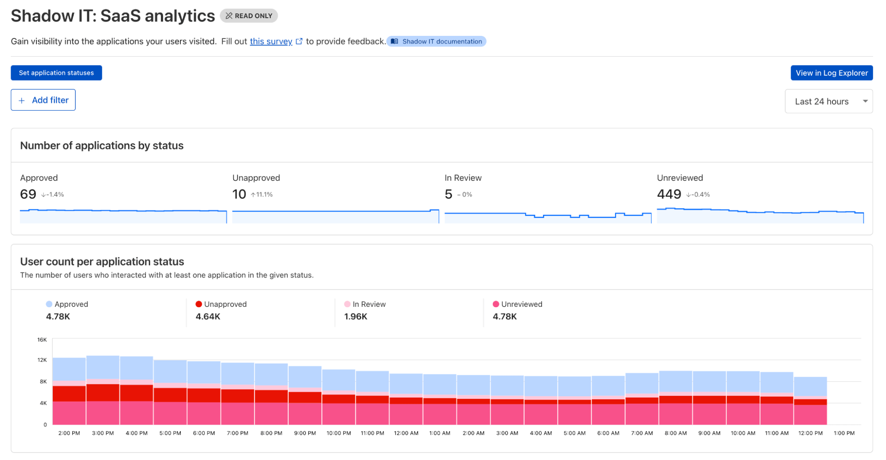

This is a continuation and update of the previous blog post [_Cybersecurity and Artificial Intelligence (AI)_](articles/ai-cybersecurity/) from 2023.

## TL;DR

Cloudflare offers a unified approach to AI security, combining Zero Trust (SASE) and Developer Platform solutions to help CISOs:

- Discover and manage Shadow AI usage
- Prevent data leaks to public LLMs
- Secure AI APIs against abuse, scraping, and overuse
- Control developer and agent access to internal models
- Mitigate AI-powered phishing and deepfakes
- Build custom, enforceable AI governance policies

---

## Securing the AI Revolution: A CISO's Practical Guide with Cloudflare

Artificial Intelligence (AI) is reshaping our world. But as it enables new capabilities, it also introduces new threat surfaces, from model abuse to AI-powered phishing.

To stay ahead, CISOs must adopt a proactive, Zero Trust security posture. This guide focuses on practical strategies using Cloudflare's platform to address real AI-era risks.

### [Use Case 1: Discovering Shadow AI](#use-case-1-discovering-shadow-ai)

**The Problem:** Employees are using unsanctioned AI tools. This creates unmanaged risk and potential data leaks.

**The Solution:** Use [Cloudflare Gateway](https://developers.cloudflare.com/cloudflare-one/policies/gateway/) with [Shadow IT Discovery](https://developers.cloudflare.com/cloudflare-one/insights/analytics/shadow-it-discovery/) to monitor SaaS and AI tool usage. Block unauthorized tools and set policies for approved ones.

### [Use Case 2: Preventing Data Leaks to Public LLMs](#use-case-2-preventing-data-leaks-to-public-llms)

**The Problem:** Employees may paste sensitive data into public AI tools.

**The Solution:** Deploy [Data Loss Prevention (DLP)](https://developers.cloudflare.com/cloudflare-one/policies/data-loss-prevention/) and/or [Remote Browser Isolation (RBI)](https://developers.cloudflare.com/cloudflare-one/policies/browser-isolation/) – both part of the [Cloudflare Gateway](https://developers.cloudflare.com/cloudflare-one/policies/gateway/) HTTP Policies – to scan outbound traffic and block risky content or interactions (upload, download, copy-paste, etc.) in real time.

### [Use Case 3: Protecting AI Applications from Abuse](#use-case-3-protecting-ai-applications-from-abuse)

**The Problem:** Your AI API is vulnerable to prompt injection, data extraction, or malicious misuse.

**The Solution:** Use a layered defense via the [Cloudflare reverse proxy](https://developers.cloudflare.com/fundamentals/concepts/how-cloudflare-works/).

- [Firewall for AI](https://developers.cloudflare.com/waf/detections/firewall-for-ai/) blocks known malicious payloads and avoids data leaks.

- [AI Gateway](https://developers.cloudflare.com/ai-gateway/) applies [Guardrails](https://developers.cloudflare.com/ai-gateway/guardrails/) and [Evaluations](https://developers.cloudflare.com/ai-gateway/evaluations/).

- [Advanced Rate Limiting](https://developers.cloudflare.com/waf/rate-limiting-rules/) controls abuse via request body, headers, or custom fields.

### [Use Case 4: Controlling Access to Self-Hosted AI](#use-case-4-controlling-access-to-self-hosted-ai)

**The Problem:** Internal AI APIs need to be accessible only to authorized users or services / agents and one needs to prevent synthetic identity fraud (SIF).

**The Solution:** Implement Zero Trust Network Access (ZTNA) and authorization.

- Use [Cloudflare Access](https://developers.cloudflare.com/cloudflare-one/policies/access/) for identity-aware access control based on user, group, device posture, or geography.

- For services or agents, use [Service Tokens](https://developers.cloudflare.com/cloudflare-one/identity/service-tokens/) or [MCP Authorization](https://developers.cloudflare.com/agents/model-context-protocol/authorization/).

### [Use Case 5: Auditing and Controlling AI Content Scrapers](#use-case-5-auditing-and-controlling-ai-content-scrapers)

**The Problem:** AI bots are crawling your website to train their models without permission. Review the [AI bot & crawler traffic insights](https://radar.cloudflare.com/ai-insights).

**The Solution:** Mitigate AI bots.

- Use [AI Audit](https://developers.cloudflare.com/ai-audit/) to monitor crawler activity. Or configure [pay per crawl](https://blog.cloudflare.com/introducing-pay-per-crawl/).

- Combine with [Enterprise Bot Management](https://developers.cloudflare.com/bots/get-started/bot-management/) and the [WAF](https://developers.cloudflare.com/waf/) to granularly block, challenge or allow bots based on business policy. Review the [Verified Bots Directory](https://radar.cloudflare.com/bots/directory) for details.

### [Use Case 6: Preventing API Abuse and Cost Overruns](#use-case-6-preventing-api-abuse-and-cost-overruns)

**The Problem:** Self-hosted models are vulnerable to prompt spamming or excessive use, increasing token costs and infrastructure load.

**The Solution:** Limit operations and gain observability.

- Use [Advanced Rate Limiting](https://developers.cloudflare.com/waf/rate-limiting-rules/#availability) with JWTs or JSON body fields.
- Leverage [AI Gateway](https://developers.cloudflare.com/ai-gateway/) for [cost observability](https://developers.cloudflare.com/ai-gateway/observability/costs/) and [caching](https://developers.cloudflare.com/ai-gateway/configuration/caching/) to reduce usage.

### [Use Case 7: Defending Against Model Denial-of-Service](#use-case-7-defending-against-model-denial-of-service)

**The Problem:** Malicious traffic can overwhelm your AI API, denying service to real users. Review the [application layer DDoS attacks distribution insights](https://radar.cloudflare.com/security/application-layer#application-layer-ddos-attacks-distribution).

**The Solution:** Use the [Cloudflare reverse proxy](https://developers.cloudflare.com/fundamentals/concepts/how-cloudflare-works/).

- Always-on [DDoS Protection](https://developers.cloudflare.com/ddos-protection/about/attack-coverage/).
- [WAF](https://developers.cloudflare.com/waf/), [Rate Limiting](https://developers.cloudflare.com/waf/rate-limiting-rules/), and [Enterprise Bot Management](https://developers.cloudflare.com/bots/get-started/bot-management/) to block abnormal patterns.
- [AI Gateway](https://developers.cloudflare.com/ai-gateway/) for traffic visibility and [request handling](https://developers.cloudflare.com/ai-gateway/configuration/request-handling/).

### [Use Case 8: Preventing AI-Powered Social Engineering](#use-case-8-preventing-ai-powered-social-engineering)

**The Problem:** AI-generated phishing can trick employees into breaches. [Here](https://www.cloudflare.com/the-net/security-signals/ai-powered-threats/) are concrete real-world examples.

**The Solution:** A layered Zero Trust defense.

- Use [Email Security](https://developers.cloudflare.com/cloudflare-one/email-security/) to filter AI-driven phishing attacks.

- Back it up with [Zero Trust](https://developers.cloudflare.com/cloudflare-one/policies/access/) controls like [MFA](https://developers.cloudflare.com/cloudflare-one/policies/access/mfa-requirements/), [identity selectors](https://developers.cloudflare.com/cloudflare-one/policies/gateway/identity-selectors/), and [device posture](https://developers.cloudflare.com/cloudflare-one/identity/devices/) checks.

### [Use Case 9: Building Custom Governance Logic](#use-case-9-building-custom-governance-logic)

**The Problem:** You need custom security logic and checks not handled by standard tools.

**The Solution:** Use [Cloudflare Workers](https://developers.cloudflare.com/reference-architecture/diagrams/sase/augment-access-with-serverless/) to run custom code at the edge. Inject logic for prompt screening, dynamic access decisions, or proprietary database lookups directly in the request path.

### [Use Case 10: Running and Scaling AI Inference at the Edge](#use-case-10-running-and-scaling-ai-inference-at-the-edge)

**The Problem:** Traditional inference workloads require complex infrastructure and scaling strategies.

**The Solution:** Use [Workers AI](https://developers.cloudflare.com/workers-ai/) to serve models globally on Cloudflare's edge.

- Store inputs or models with [R2 Object Storage](https://developers.cloudflare.com/r2/)
- Speed up retrievals using [Vectorize](https://developers.cloudflare.com/vectorize/)
- Manage cost and control with [AI Gateway](https://developers.cloudflare.com/ai-gateway/)

---

## Table Summary

| #   | Use Case                                                                              | Problem                                            | Solution Summary                                    |
| --- | ------------------------------------------------------------------------------------- | -------------------------------------------------- | --------------------------------------------------- |
| 1   | [Shadow AI Discovery](#use-case-1-discovering-shadow-ai)                              | Unmanaged AI tools create visibility and data risk | SWG with Cloudflare Gateway and Shadow IT Discovery |
| 2   | [Preventing Data Leaks to LLMs](#use-case-2-preventing-data-leaks-to-public-llms)     | Sensitive data may be pasted into public AI tools  | DLP + Remote Browser Isolation                      |
| 3   | [AI Application Abuse](#use-case-3-protecting-ai-applications-from-abuse)             | Prompt injection or model misuse                   | Firewall for AI, AI Gateway, Advanced Rate Limiting |
| 4   | [Developer Access Control](#use-case-4-controlling-access-to-self-hosted-ai)          | Unauthorized access to internal AI                 | Access, MCP Authorization, Service Tokens           |
| 5   | [AI Content Scraping](#use-case-5-auditing-and-controlling-ai-content-scrapers)       | AI bots crawl sites without consent                | AI Audit, Bot Management, WAF                       |
| 6   | [API Overuse & Cost](#use-case-6-preventing-api-abuse-and-cost-overruns)              | Prompt spam drives infra and token costs           | Rate Limiting, AI Gateway Observability & Caching   |
| 7   | [Denial-of-Service Protection](#use-case-7-defending-against-model-denial-of-service) | Overwhelmed AI API due to traffic floods           | DDoS Protection, WAF, Bot Management, AI Gateway    |
| 8   | [AI-Powered Social Engineering](#use-case-8-preventing-ai-powered-social-engineering) | Deepfakes or phishing trick employees              | Email Security, Identity & Posture-based Access     |
| 9   | [Custom Governance](#use-case-9-building-custom-governance-logic)                     | Need bespoke logic or data checks                  | Cloudflare Workers for edge logic enforcement       |
| 10  | [Inference at the Edge](#use-case-10-running-and-scaling-ai-inference-at-the-edge)    | Inference workloads hard to scale                  | Workers AI, Vectorize, R2, AI Gateway               |

---

## Conclusion: Build the Future on a Secure Foundation

Jumping into the AI revolution doesn't mean leaving security behind. As also attackers increasingly adopt AI, defending against these threats requires organizations to enhance observability, act in real time, and apply AI-driven defenses to match the speed and sophistication of adversaries.

By building on a Zero Trust foundation and securing your AI stack – from inference to access, from APIs to browsers – Cloudflare enables CISOs and security teams to navigate risk, compliance, and cost. With a unified platform for both SASE and developer operations, you're not just adopting AI, you're doing it securely, by design.

---

## Disclaimer

Educational purposes only.

This blog post is independent and not affiliated with, endorsed by, or necessarily reflective of the opinions of Cloudflare or any other entities mentioned. Screenshot images are taken from the Cloudflare Dashboard, public Cloudflare website, and public Cloudflare Developer Documentation.

This blog post was partially written and improved by AI tools.
