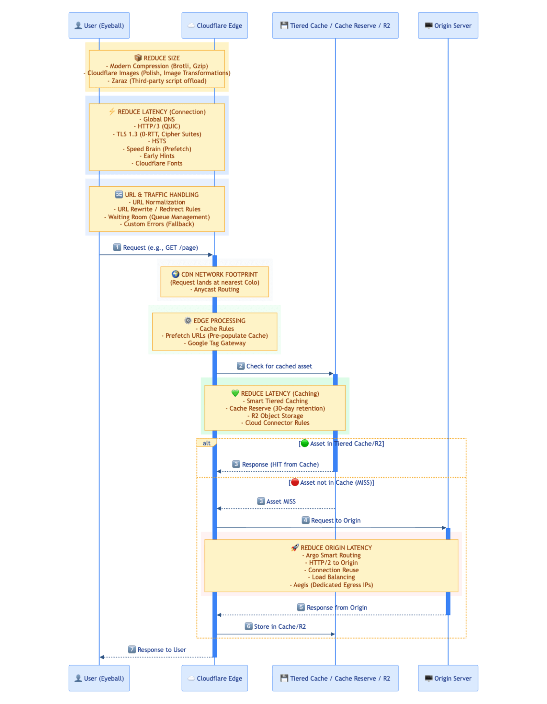

This guide provides non-exhaustive recommendations and general best practices for building a comprehensive Layer 7 (L7) Application Performance strategy **for your website / web application** with Cloudflare. It outlines how to leverage Cloudflare's performance and resiliency solutions and features to optimize web delivery, reduce latency, and improve [Core Web Vitals (CWV)](https://web.dev/performance#core-web-vitals) metrics – primarily relevant for Chromium browsers.

## Common Performance Goals

Technical goals:

- Low Time To First Byte (TTFB)
- High cache hit ratio
- Improved Core Web Vitals (CWV)

Translating these into business impact:

- **Better performance / lower latency** → Improved user experience (UX) and higher conversion rates

- **Reduced origin load and bandwidth** → Lower infrastructure and maintenance costs

- **Ensured availability / uptime** → Business resiliency, positive reputation, better UX

## Key Performance Metrics

Effective optimization starts with measuring the _right_ things – which interestingly is slightly different for everyone. Nonetheless, most people would agree to focus on user-centric metrics for website performance, using TTFB as a diagnostic tool for server responsiveness, but prioritizing Core Web Vitals for measuring user experience.

| **METRIC**                          | **WHAT IT MEASURES**                                                                                                                                                                                                                                                                                                                         | **TARGET (75th Percentile)** |     |     |
| ----------------------------------- | -------------------------------------------------------------------------------------------------------------------------------------------------------------------------------------------------------------------------------------------------------------------------------------------------------------------------------------------- | ---------------------------- | --- | --- |
| **Largest Contentful Paint (LCP)**  | Measures loading performance. Marks the point when the largest image or text block in the viewport becomes visible. When optimizing LCP, it's helpful to try to optimize these subparts individually: TTFB (HTML Document), Resource Load Delay (Stylesheet CSS), Resource Load Duration (Images + Scripts), Element Render Delay (Scripts). | LCP < 2.5 seconds            |     |     |
| **Interaction to Next Paint (INP)** | Measures interactivity. Assesses the overall responsiveness of the page to user clicks, taps, and keyboard inputs.                                                                                                                                                                                                                           | INP < 200 ms ms              |     |     |
| **Cumulative Layout Shift (CLS)**   | Measures visual stability. Quantifies how much unexpected layout shifts affect the user experience as the page loads.                                                                                                                                                                                                                        | CLS < 0.1 score score        |     |     |
| **Time to First Byte (TTFB)**       | Measures server responsiveness. It's the time between the client/eyeball request and the arrival of the first byte of the (Cloudflare) server response. A high TTFB will always lead to a poor LCP, but a good TTFB doesn't guarantee a good LCP.                                                                                            | TTFB < 800 ms ms             |     |     |
| **Time to Last Byte (TTLB)**        | Measures the time it takes until the last byte of a resource is received.                                                                                                                                                                                                                                                                    | TTLB < 1.5 seconds           |     |     |

> _Note that **every browser behaves differently**. Check [Can I use](https://caniuse.com/) for compatibility. For example, Safari doesn't support [LCP](https://caniuse.com/wf-largest-contentful-paint).

## Practical Recommendations

Here's a high-level visual representation of the different Cloudflare features that can potentially improve the relevant metrics:

> Review the [network diagram](https://developers.cloudflare.com/smart-shield/concepts/network-diagram/) visualization for Cloudflare's [Smart Shield](https://blog.cloudflare.com/introducing-observatory-and-smart-shield/) capabilities.

> Note the [Phases list](https://developers.cloudflare.com/ruleset-engine/reference/phases-list/), highlighting the order of execution, as well as the Cloudflare [API rate limits](https://developers.cloudflare.com/fundamentals/api/reference/limits/).

### User (Eyeball Client)

Many variables affect performance at the user connection stage: device hardware (and age), operating system (OS), CPU/RAM capacity, browser, location, Internet Service Provider (ISP), and more.

The user's [proxied](https://developers.cloudflare.com/dns/proxy-status/) request typically lands at the [closest Cloudflare Point of Presence (PoP)](https://www.cloudflare.com/network/) via [anycast](https://www.cloudflare.com/learning/cdn/glossary/anycast-network/). This is when Cloudflare's [peering and network interconnects](https://bgp.he.net/report/exchanges#_participants) is relevant.

Some of the Cloudflare-related features that could potentially improve some of the relevant metrics are:

- **Global DNS**: By using Cloudflare's [managed DNS](https://developers.cloudflare.com/fundamentals/concepts/how-cloudflare-works/#cloudflare-as-a-dns-provider), the assigned anycast IP addresses are announced [worldwide](https://www.cloudflare.com/network/), likely physically close to the user too. Review third-party DNS performance on [dnsperf.com](https://www.dnsperf.com/).

- **Protocols**: Use modern protocols such as **[HTTP/3 (with QUIC)](https://developers.cloudflare.com/speed/optimization/protocol/http3/)** for faster, more reliable connections. This improves latency, especially in mobile or unreliable network environments. Also enable [0-RTT Connection Resumption](https://developers.cloudflare.com/speed/optimization/protocol/0-rtt-connection-resumption/) to improve performance for clients who have previously connected to your website, reducing latency for returning users. Additionally, enable [TLS 1.3](https://developers.cloudflare.com/ssl/edge-certificates/additional-options/tls-13/) for improved performance, as well as improved security, especially in the context of [Post-Quantum Cryptography (PQC)](https://developers.cloudflare.com/ssl/post-quantum-cryptography/). If possible, also support modern [Cipher Suites](https://developers.cloudflare.com/ssl/edge-certificates/additional-options/cipher-suites/). Moreover, you might want to prevent clients connecting via unencrypted/plaintext HTTP, so you [enforce HTTPS connections](https://developers.cloudflare.com/ssl/edge-certificates/encrypt-visitor-traffic/). And even [HSTS](https://developers.cloudflare.com/ssl/edge-certificates/additional-options/http-strict-transport-security/) could improve performance by implementing a browser-redirect, instead of a server-redirect.

> Automate TLS certificate renewal with [Advanced Certificate Manager (ACM)](https://developers.cloudflare.com/ssl/edge-certificates/advanced-certificate-manager/).

- **Normalizing Inbound Traffic**: **[URL normalization](https://developers.cloudflare.com/rules/normalization/how-it-works/)** modifies the URLs of incoming requests so that they conform to a consistent formatting standard.

- **Manipulate URLs**: Take advantage of [URL Rewrite Rules](https://developers.cloudflare.com/rules/transform/url-rewrite/) or [Redirect Rules](https://developers.cloudflare.com/rules/url-forwarding/).

- **Compression**: Configure and overwrite default compression behavior via [Compression Rules](https://developers.cloudflare.com/rules/compression-rules/) for assets to reduce page load times by minimizing the size of text-based content like HTML, CSS, and JavaScript and [others](https://developers.cloudflare.com/speed/optimization/content/compression/).

- **Image Optimization**: Use **[Polish](https://developers.cloudflare.com/images/polish/)** or (recommended) **Image Transformations** for optimization of images ([resize](https://developers.cloudflare.com/images/transform-images/), [draw overlays and watermarks](https://developers.cloudflare.com/images/transform-images/draw-overlays/), implement [lazy loading](https://developers.cloudflare.com/images/tutorials/optimize-mobile-viewing/), [make responsive images](https://developers.cloudflare.com/images/transform-images/make-responsive-images/) with `srcset`, using [parameters](https://developers.cloudflare.com/images/transform-images/transform-via-url/#options) like `width=auto` and `format=auto` among others, etc.) to ensure faster loading with potential full customization.

> Check out this [simple Image Transformation demo](https://automatic-demo.com/demos/performance/image-transformation).

- **Speed Brain Prefetching**: Implement **[Speed Brain](https://developers.cloudflare.com/speed/optimization/content/speed-brain/)** (Speculation Rules API) for proactive browser fetching of frequently requested resources (that are cached on the Cloudflare Edge) to enhance key metrics like LCP, TTFB and overall page load time.

- **Asynchronous instructions for the Browser**: **[Early Hints](https://developers.cloudflare.com/cache/advanced-configuration/early-hints/)** takes advantage of "server think time" to asynchronously send instructions to the browser to begin loading resources (render the page) while the origin server is compiling the full response. This hinting, when the response contains link headers with `preconnect` or `preload` `rel` types, speeds up page load times and generally [reduces user-perceived latency](https://blog.cloudflare.com/early-hints/).

- **Third-party Script Offload**: Use **[Zaraz](https://developers.cloudflare.com/zaraz/)** to offload third-party tools and services, such as [Google Analytics 4 or Mixpanel](https://developers.cloudflare.com/zaraz/reference/supported-tools/), to the cloud and improve the speed – specifically [Total Blocking Time](https://blog.cloudflare.com/cloudflare-acquires-zaraz-to-enable-cloud-loading-of-third-party-tools/), impacting INP –, and security of your website.

### Cloudflare Edge (Anycast)

The relevant Cloudflare features are:

- **Customized Caching**: Define precise **[Cache Rules](https://developers.cloudflare.com/cache/how-to/cache-rules/)** or **[Origin Cache Control Headers](https://developers.cloudflare.com/cache/concepts/cache-control/)** to control which resources are cached and for how long, optimizing caching and reducing the need to fetch assets from the origin server.

> Note the [default cache behavior](https://developers.cloudflare.com/cache/concepts/default-cache-behavior/) and [cacheable size limits](https://developers.cloudflare.com/cache/concepts/default-cache-behavior/#cacheable-size-limits). Programmatic customization is possible via [Snippets and Workers](https://developers.cloudflare.com/rules/snippets/when-to-use/).

> For mainland China CDN, consider [China Network](https://developers.cloudflare.com/china-network/), when all requirements are met.

- **Faster Google Fonts**: Leverage [Cloudflare Fonts](https://developers.cloudflare.com/speed/optimization/content/fonts/) to reduce the time spent on [DNS lookups and TLS connections](https://blog.cloudflare.com/cloudflare-fonts-enhancing-website-privacy-speed/), improving LCP, by replacing Google Fonts links with inline CSS to load directly from the same website domain.

- **Improve (Google) Ad Measurement**: deploy Google scripts using your own domain with [Google tag gateway for advertisers](https://developers.cloudflare.com/google-tag-gateway/), enhancing data privacy and improving signal measurement recovery.

- **Queueing in Users**: By using [Waiting Room](https://developers.cloudflare.com/waiting-room/), also relevant for [preparing for surges or spikes in web traffic](https://developers.cloudflare.com/learning-paths/surge-readiness/concepts/).

- **Smart Routing**: Enable **[Argo Smart Routing](https://developers.cloudflare.com/argo-smart-routing/)** to route requests over the fastest and most reliable paths (between the first Cloudflare PoP and the closest Cloudflare PoP to your origin server), minimizing latency (reducing TTFB) and ensuring faster connections. This is mainly beneficial for dynamic requests such as API requests.

- **Pre-populate the Edge Cache**: Use [Prefetch URLs](https://developers.cloudflare.com/speed/optimization/content/prefetch-urls/) to increase the Cache Hit Ratio and reduce latency to critical resources (which can be [cached by default](https://developers.cloudflare.com/cache/concepts/default-cache-behavior/#default-cached-file-extensions)), by including a link HTTP response header pointing to a manifest file with the `rel="prefetch"` attribute and then serve the manifest file with `text/plain` as the content-type response header.

- **Error Handling**: Implement fallback strategies for potential origin server or Cloudflare product errors by leveraging [Custom Errors](https://developers.cloudflare.com/rules/custom-errors/). This allows serving custom assets or maintenance pages to users, providing a consistent brand experience.

### Cloudflare Edge (Tiered Cache / Storage)

- **Tiered Caching**: Leverage a **[Tiered Caching Topology](https://developers.cloudflare.com/cache/how-to/tiered-cache/)** to ensure that assets are served from a hierarchy of Cloudflare PoPs, increasing [Cache Hit Ratio](https://developers.cloudflare.com/cache/performance-review/cache-analytics/), reducing latency, potentially saving bandwidth and load on the origin server, and improving response times for users (since optimally there's no additional network hop to the origin). Smart Tiered Caching is normally the recommended option.

- **Cache Reserve**: since Cloudflare's CDN is based on the algorithm [Least Recently Used (LRU)](https://developers.cloudflare.com/cache/concepts/retention-vs-freshness/), enable **[Cache Reserve](https://developers.cloudflare.com/cache/advanced-configuration/cache-reserve/)** to serve less-frequently requested content from Cloudflare's global storage, due to a retention period of 30 days, ensuring better content availability, increased Cache Hit Ratio, and reduced origin server load. It is recommended to use Cache Reserve in combination with Tiered Caching, as part of a wider caching topology.

- **Connection Reuse**: taking advantage of HTTP/2, requests from Cloudflare can use the same connection – [connection reuse](https://developers.cloudflare.com/smart-shield/concepts/connection-reuse/) – even if they are for different domains, reducing the amount of connections – TCP and TLS handshakes –, improve overall performance, and reduce the load to the origin server.

- **Simplify cloud routing and object storage configurations**: route matching incoming traffic from your website to a public cloud provider that you define with [Cloud Connector Rules](https://developers.cloudflare.com/rules/cloud-connector/).

- **Data or Storage Options at the Edge**: Store assets or data in different [data or storage options](https://developers.cloudflare.com/workers/platform/storage-options/), such as **[Cloudflare R2](https://developers.cloudflare.com/r2/how-r2-works/)**, a distributed object storage solution, offering [faster retrieval](https://developers.cloudflare.com/r2/how-r2-works/#performance) and potential cost savings. Depending on your use case, different options are available.

### Origin Server

> There's the alternative option of going serverless / originless by building and hosting directly on Cloudflare's [Developer Platform](https://developers.cloudflare.com/learning-paths/workers/devplat/intro-to-devplat/), such as Workers [Static Assets](https://developers.cloudflare.com/workers/static-assets/) or [Frameworks](https://developers.cloudflare.com/workers/framework-guides/). Here's an example of [fullstack applications](https://developers.cloudflare.com/reference-architecture/diagrams/serverless/fullstack-application/).

- **Reduce Origin Latency**: Use **[HTTP/2 to Origin](https://developers.cloudflare.com/speed/optimization/protocol/http2-to-origin/)** and connection multiplexing to minimize origin server latency and reduce page load times.

- **Load Balancing**: Implement effective **[load balancing](https://developers.cloudflare.com/load-balancing/understand-basics/proxy-modes/)** to distribute traffic evenly across multiple origin servers / endpoints, ensuring high availability and reliability.

- **Improve Origin Security**: [dedicated CDN egress IP addresses (Aegis)](https://developers.cloudflare.com/aegis/). This is one of several [options to protect the origin server](https://developers.cloudflare.com/fundamentals/security/protect-your-origin-server/).

## Monitorting & Testing Tools

- [Cloudflare Observatory](https://dash.cloudflare.com/?to=/:account/:zone/speed/overview) – [Developer documentation](https://developers.cloudflare.com/speed/observatory/)
- [Web Analytics](https://developers.cloudflare.com/web-analytics/)
- [Network Error Logging (NEL)](https://developers.cloudflare.com/network-error-logging/) – Edge Reachability
- [WebPageTest](https://www.webpagetest.org/)
- [Google Search Console](https://search.google.com/search-console/about)
- [Google PageSpeed Insights](https://pagespeed.web.dev/)
- [DebugBear Free Site Speed Tools](https://www.debugbear.com/tools)
- [Pingdom Website Speed Test](https://tools.pingdom.com/)
- [Site Speed Report](https://treo.sh/sitespeed)

## Security Matters Too!

For application security recommendations, see: [General Application Security Recommendations](/articles/cloudflare-l7-security-recommendations/).

---

## Disclaimer

Educational purposes only.

This blog post is independently created and is not affiliated with, endorsed by, or necessarily representative of the views or opinions of any organizations or services mentioned herein.

The images used in this article primarily consist of screenshots from the Cloudflare Dashboard or other publicly available materials, such as Cloudflare webinar slides. The mermaid diagram image was generated by Artificial Intelligence (AI).

The guidelines provided in this post are intended for general educational purposes. They should be customized to fit your specific use cases and tech stack – every website is differently built. You are responsible for configuring settings according to your unique requirements, and it is important to understand their potential impact. Familiarity with Cloudflare concepts such as [Phases](https://developers.cloudflare.com/ruleset-engine/reference/phases-list/), [Proxy Status](https://developers.cloudflare.com/dns/manage-dns-records/reference/proxied-dns-records/), and other relevant features is recommended.

The author of this post is not responsible for any misconfigurations, errors, or unintended consequences that may arise from implementing the guidelines or recommendations discussed herein. You assume full responsibility for any actions taken based on this content and for ensuring that configurations are appropriate for your specific environment.

For additional learning resources, explore the following:

- [Learning Paths](https://developers.cloudflare.com/learning-paths/)
- [Enterprise Customer Portal](https://www.cloudflare.com/ecp/overview/) (for Enterprise customers)
