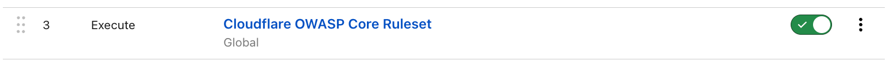
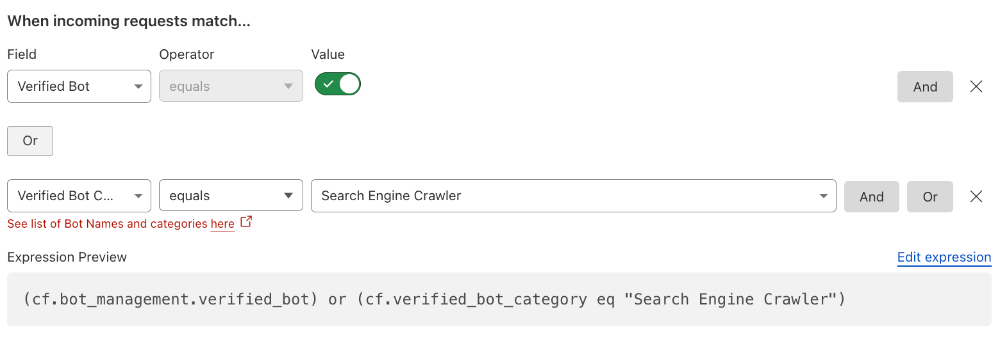
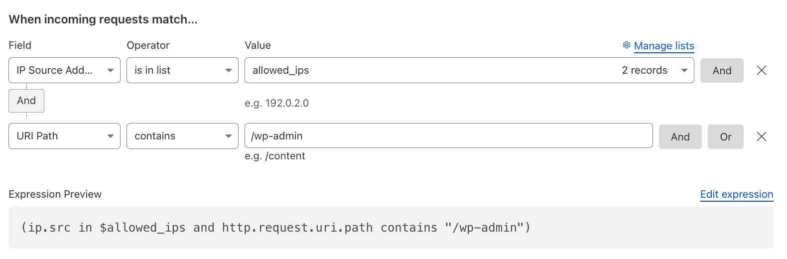
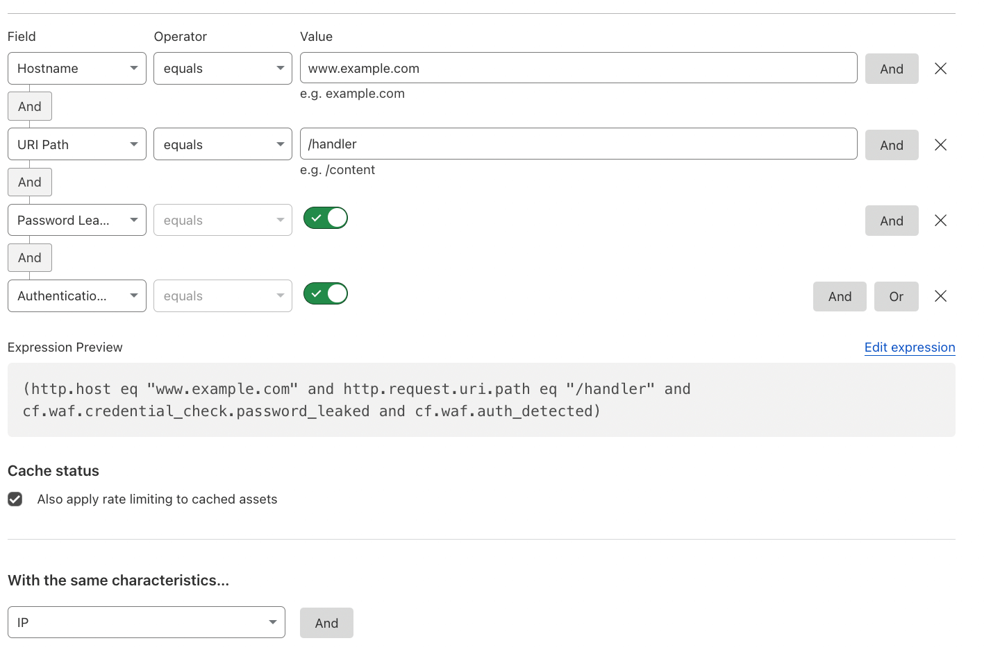

## Introduction

This guide provides non-exhaustive recommendations and general best practices to achieve a comprehensive **Layer 7 (L7) / Application Security approach** with Cloudflare.

Some features mentioned are available only through advanced Cloudflare bundles, such as **WAF Advanced**, [Advanced Rate Limiting](https://developers.cloudflare.com/waf/rate-limiting-rules/#availability), or **Enterprise** features like [Enterprise Bot Management](https://developers.cloudflare.com/bots/plans/bm-subscription/).

---

## Troubleshooting

- Review the [Cloudflare Status page](https://www.cloudflarestatus.com/).
- Consult the [Troubleshooting section](https://developers.cloudflare.com/support/troubleshooting/).
- [Gather necessary information](https://developers.cloudflare.com/support/troubleshooting/general-troubleshooting/) and contact [Cloudflare Support](https://developers.cloudflare.com/support/contacting-cloudflare-support/#methods-of-contacting-cloudflare-support).
- Use [Trace](https://developers.cloudflare.com/fundamentals/basic-tasks/trace-request/) to understand the impact of your Cloudflare configurations on specific requests.

## Recommendations

In general, in most cases you can create rules with the action set to "Log" for testing purposes. This allows you to review what it matches in the [Security Events](https://developers.cloudflare.com/waf/analytics/security-events/) and fine-tune it as needed before applying a more impactful action, such as "Block", "Managed Challenge", or even "SKIP".

For more information, review the older article [Protecting OSI layers](/articles/protecting-osi-layers/).

### **WAF Managed Rules**

#### **Deploy WAF Managed Ruleset**

It's widely recommended to briefly review and then deploy the [Managed Ruleset](https://developers.cloudflare.com/waf/managed-rules/reference/cloudflare-managed-ruleset/) across the entire [Zone](https://developers.cloudflare.com/dns/concepts/#zone). Create specific [exceptions](https://developers.cloudflare.com/waf/managed-rules/waf-exceptions/), if required.

Reference: [Cloudflare Managed Ruleset](https://developers.cloudflare.com/waf/managed-rules/reference/cloudflare-managed-ruleset/).

#### **Stricter Security Requirements with WAF Managed Ruleset**

For additional and stricter security requirements, deploy some of the following rules:

* *XSS, HTML Injection* with Rule ID *882b37d6bd5f4bf2a3cdb374d503ded0*.  
* *Anomaly:URL:Path - Multiple Slashes, Relative Paths, CR, LF or NULL* with Rule ID *6e759e70dc814d90a003f10424644cfb*.  
* *Anomaly:Body - Large* with Rule ID *7b822fd1f5814e17888ded658480ea8f*, in order to mitigate body payloads which are higher than the [processing limit](https://developers.cloudflare.com/ruleset-engine/rules-language/fields/http-request-body/).   
  * It is generally recommended to add [WAF exceptions](https://developers.cloudflare.com/waf/managed-rules/waf-exceptions/) for this, especially for [upload endpoints](https://developers.cloudflare.com/cache/concepts/default-cache-behavior/#upload-limits).  
* *Anomaly:Port - [Non Standard Port](https://developers.cloudflare.com/fundamentals/reference/network-ports/#how-to-block-traffic-on-additional-ports) (not 80 or 443)* with Rule ID *8e361ee4328f4a3caf6caf3e664ed6fe*.  
* *Anomaly:Method - Unusual HTTP Method* with Rule ID *ab53f93c9b03472ab34a5405d9bdc7d5*.  
* *Anomaly:Method - Unknown HTTP Method* with Rule ID *6e2240ffcb87477bbd4881b6fd13142f*.  
* Including all the *Vulnerability scanner activity*-related Rules.  
* Any [other relevant Rules](https://developers.cloudflare.com/waf/change-log/) you might need.

[Log the payload of matched rules](https://developers.cloudflare.com/waf/managed-rules/payload-logging/), if required, to help diagnosing the behavior of the rules. The encrypted payloads can be found in the Metadata field in [Firewall events](https://developers.cloudflare.com/logs/reference/log-fields/zone/firewall_events/) logs.

It is also generally recommended to disable [Browser Integrity Check (BIC)](https://developers.cloudflare.com/waf/tools/browser-integrity-check/), especially to prevent potential false positives with API / automated traffic.

Reference: [Security Events](https://developers.cloudflare.com/waf/analytics/security-events/) and [Changelog](https://developers.cloudflare.com/changelog/).

#### **Deploy OWASP Core Ruleset**

If required, review and then deploy the [OWASP Core Ruleset](https://developers.cloudflare.com/waf/managed-rules/reference/owasp-core-ruleset/). 

> Note that those types of rules are prone for false positives. 

For customers also using [Zaraz](https://developers.cloudflare.com/zaraz/), it is recommended configuring an [exception](https://developers.cloudflare.com/ruleset-engine/managed-rulesets/create-exception/) for the configured Zaraz endpoint.

Reference: [Handle false positives](https://developers.cloudflare.com/waf/managed-rules/handle-false-positives/).

---

### **WAF Custom Rules**

#### **Allow Verified Bots**

It's ordinarily recommended to have as one of the first top Custom Rules a [SKIP Custom Rule](https://developers.cloudflare.com/waf/custom-rules/skip/), allowing Verified Bots, such as i.e. Search Engine Crawler (like *GoogleBot*).

Reference: [Verified Bots](https://developers.cloudflare.com/bots/concepts/bot/#verified-bots)

#### **Allow APIs**

It's generally recommended to have as one of the first top Custom Rules a [SKIP Custom Rule](https://developers.cloudflare.com/waf/custom-rules/skip/), allowing your and/or partner APIs (i.e. payment callbacks, PreRender IO, etc.), being as specific and using as many [fields](https://developers.cloudflare.com/ruleset-engine/rules-language/fields/) as possible. The ultimate goal is to pursue a **positive security model** by implementing [API Shield](https://developers.cloudflare.com/api-shield/security/).

Reference: [API Shield](https://developers.cloudflare.com/api-shield/).

#### **Redirect to Custom HTML**

Using a [Custom HTML](https://developers.cloudflare.com/waf/custom-rules/create-dashboard/#configure-a-custom-response-for-blocked-requests) response type, one can create a redirect to another site for specific requests. In this example, any non-verified bot requests coming from the US are redirected.

#### **Block Fallthrough API Requests**

In order to truly enforce a Positive Security Model, for any fallthrough action of requests not matching any of the [API Shield-managed endpoints](https://developers.cloudflare.com/api-shield/management-and-monitoring/), create a WAF Custom Rule similar to the one below, preferably with more specific fields to your API. 

Reference: [Schema Validation](https://developers.cloudflare.com/api-shield/security/schema-validation/).

#### **Visibility into Non-expected Request Methods**

In some cases, you want to be specific about what type of HTTP Request Methods are allowed on certain endpoints or coming from specific requests, or even just logging relevant methods for visibility.

Reference: [HTTP Method Field](https://developers.cloudflare.com/ruleset-engine/rules-language/fields/standard-fields/#httprequestmethod).

#### **Mitigate likely Malicious Payloads**

Every HTTP request with a payload receives a WAF Attack Score, indicating the likelihood of containing something malicious related to SQLi, XSS, or RCE attacks.

Reference: [WAF attack score](https://developers.cloudflare.com/waf/about/waf-attack-score/).

#### **Mitigate known Open Proxies, Anonymizers, VPNs, Malware, and Botnets**

By using the Cloudflare-Managed IP Lists, including your own [Custom Lists](https://developers.cloudflare.com/waf/tools/lists/custom-lists/), you can decide what to do with those IP categories. Generally, one wants to block Botnets and Malware.

Reference: [Managed IP Lists](https://developers.cloudflare.com/waf/tools/lists/managed-lists/#managed-ip-lists).

#### **Mitigate Tor Traffic**

In case that Tor traffic – an overlay network for enabling anonymous communication – is unwanted, one can simply mitigate it. Make sure to also disable [Onion Routing](https://developers.cloudflare.com/network/onion-routing/#enable-onion-routing) in this case.

Reference: [Onion Routing and Tor support](https://developers.cloudflare.com/network/onion-routing/).

#### **Mitigate unwanted ASNs**

Any unwanted traffic coming from Cloud ASNs (such as AWS, Azure, GCP, etc.) or other ASNs from which you don't expect traffic, you might want to mitigate. Use [Lists with ASNs](https://developers.cloudflare.com/waf/tools/lists/custom-lists/#lists-with-asns) to easily manage these.

Reference: [Custom Lists](https://developers.cloudflare.com/waf/tools/lists/custom-lists/).

#### **Block High Risk Countries**

Block high risk countries like the ones that appear in the [official OFAC List](https://sanctionssearch.ofac.treas.gov/), as they might pose a higher threat. Alternatively, instead of blocking them altogether, you can set a [Managed Challenge](https://developers.cloudflare.com/waf/reference/cloudflare-challenges/#managed-challenge-recommended).

Reference: [Sanctions List Search](https://sanctionssearch.ofac.treas.gov/).

#### **Block known Bot User-Agents**

Block unwanted requests of user-agents known to be used by bots, such as *cURL*, *go-http-client*, or even empty user-agents.

Reference: [Challenge bad bots](https://developers.cloudflare.com/waf/custom-rules/use-cases/challenge-bad-bots/).

#### **Restrict WP Admin Dashboard Access**

If you are using WordPress, restrict access to the */wp-admin* to only specific static source IPs of employees or admins, or alternatively opt for a Zero Trust approach with [Cloudflare Access](https://developers.cloudflare.com/learning-paths/zero-trust-web-access/).

Reference: [Allow traffic from IP addresses in allowlist only](https://developers.cloudflare.com/waf/custom-rules/use-cases/allow-traffic-from-ips-in-allowlist/).

#### **Restrict Access to Employees Only**

If you have employee portals or extranets, restrict access to countries in which you have employees located, or preferably opt for a [Zero Trust approach](https://developers.cloudflare.com/learning-paths/zero-trust-web-access/). Try to be as specific as possible.

Another alternative is to take advantage of [mTLS](https://developers.cloudflare.com/ssl/client-certificates/), only allowing access to employees with valid client certificates.

Reference: [Allow traffic from specific countries only](https://developers.cloudflare.com/waf/custom-rules/use-cases/allow-traffic-from-specific-countries/).

#### **Mutual TLS Authentication**

Block all requests that do not have a valid client certificate for Mutual TLS (mTLS) authentication on a specific hostname.

Additionally, another consideration is to also check if the Client Certificates, generated with the default Cloudflare Managed CA, have been [revoked](https://developers.cloudflare.com/api-shield/security/mtls/configure/#check-for-revoked-certificates) and block those.

References: [Cloudflare Public Key Infrastructure (PKI)](https://developers.cloudflare.com/ssl/client-certificates/), [CFSSL](https://cfssl.org/), [API Shield mTLS](https://developers.cloudflare.com/api-shield/security/mtls/) and [Workers mTLS](https://developers.cloudflare.com/workers/runtime-apis/bindings/mtls/).

Another interesting use case is to associate specific mTLS hostnames with Client Certificate Serial Numbers ([`cf.tls_client_auth.cert_serial`](https://developers.cloudflare.com/ruleset-engine/rules-language/fields/dynamic-fields/#cftls_client_authcert_serial)). This allows for more granular control.

#### **Visibility into Automated Bot Traffic**

In general, one wants to have visibility into automated traffic. This can be commonly achieved with a [LOG](https://developers.cloudflare.com/ruleset-engine/rules-language/actions/) action, logging anything with a [Bot Score](https://developers.cloudflare.com/bots/concepts/bot-score/) likely automated.

Reference: [Bot Management variables](https://developers.cloudflare.com/bots/reference/bot-management-variables/).

#### **Visibility into IPv6 IPs**

Most web applications want to be available via IPv6 IP addresses. However, in case that IPv6 is undesired, customers can mitigate IPv6 IPs through the WAF and also disable [IPv6 compatibility](https://developers.cloudflare.com/network/ipv6-compatibility/#disable-ipv6-compatibility), if needed.

Reference: [IPv6 compatibility](https://developers.cloudflare.com/network/ipv6-compatibility/).

#### **Account Takeover (ATO) Detections**

To detect and mitigate predictable bot behavior, such as *login failures*, one can use [Detection IDs](https://developers.cloudflare.com/bots/concepts/detection-ids/). This is also available for Rate Limiting Rules.

Reference: [Account takeover detections](https://developers.cloudflare.com/bots/concepts/detection-ids/#account-takeover-detections) and [Turnstile](https://developers.cloudflare.com/turnstile/).

#### **Mitigate Disposable Emails on SignUps**

To prevent users from signing up with known disposable emails, Cloudflare's Disposable Email Check can easily check this behavior and the customer can decide what to do with this: block, challenge, log, rate limit, or even [add a request header](https://developers.cloudflare.com/rules/transform/request-header-modification/) for the origin server.

Reference: [Cloudflare Fraud Detection](https://blog.cloudflare.com/cloudflare-fraud-detection).

#### **More Common Use Cases for Custom Rules**

Review the [common use cases for custom rules](https://developers.cloudflare.com/waf/custom-rules/use-cases/) for more examples. Additionally, for some use cases or if you are managing many Zones, the [Account-level WAF](https://developers.cloudflare.com/waf/managed-rules/deploy-account-dashboard/) can be a good feature to have.

Moreover, monitor and [replace insecure JS libraries](https://developers.cloudflare.com/waf/tools/replace-insecure-js-libraries/) used in your applications.

Review all the [fields reference](https://developers.cloudflare.com/ruleset-engine/rules-language/fields/).

---

### **Rate Limiting Rules**

#### **IP-based Rate Limiting for Logins**

To protect login endpoints from multiple login attempts from the same IP address, rate limit based on the required [characteristics](https://developers.cloudflare.com/waf/rate-limiting-rules/parameters/#with-the-same-characteristics).

Reference: [Rate limiting parameters](https://developers.cloudflare.com/waf/rate-limiting-rules/parameters/).

#### **Rate Limiting Uploads**

To prevent too many uploads / HTTP requests using POST / PUT / PATCH methods.

Reference: [Standard fields](https://developers.cloudflare.com/ruleset-engine/rules-language/fields/#standard-fields).

#### **Rate Limit Credential Stuffing**

To protect against credential stuffing attacks, it's generally recommended using a layered-security approach. This rate limiting rule is but one example of several approaches.  

Reference: [Protecting against credential stuffing](https://developers.cloudflare.com/waf/rate-limiting-rules/best-practices/#protecting-against-credential-stuffing) and [Find an appropriate rate limit](https://developers.cloudflare.com/waf/rate-limiting-rules/find-rate-limit/).

#### **Rate Limit Suspicious Logins**

Implement rate limiting for suspicious login attempts (authentication event) using leaked credentials, specifically leaked passwords, as per [Have I been Pwned (HIBP)](https://haveibeenpwned.com/).

Reference: [Leaked credentials detection](https://developers.cloudflare.com/waf/detections/leaked-credentials/).

#### **Geography-based Rate Limiting**

If there are markets from which one does not expect a lot of traffic coming from in general, one could rate limit requests coming from those countries based on IPs or other [characteristics](https://developers.cloudflare.com/waf/rate-limiting-rules/parameters/#with-the-same-characteristics).

Reference: [Enforcing granular access control](https://developers.cloudflare.com/waf/rate-limiting-rules/best-practices/#enforcing-granular-access-control).

#### **IPv6-based Rate Limiting**

To protect against entire [IPv6 Prefixes](https://en.wikipedia.org/wiki/IPv6_address), rate limit with the [custom characteristics](https://developers.cloudflare.com/waf/rate-limiting-rules/parameters/#with-the-same-characteristics) using the [cidr6 function](https://developers.cloudflare.com/ruleset-engine/rules-language/functions/#cidr6) and specifying the prefix length.

Reference: [Rules language](https://developers.cloudflare.com/ruleset-engine/rules-language/).

#### **Client Certificate-based Rate Limiting**

Rate limit based on the same Client Certificate being used multiple times over a specific period of time, in order to prevent abuse of potentially compromised certificates or devices. This is part of mTLS protection.

Reference: [SHA-256 fingerprint of the certificate](https://developers.cloudflare.com/ruleset-engine/rules-language/fields/dynamic-fields/#cftls_client_authcert_fingerprint_sha256).

#### **More Common Use Cases for Rate Limiting Rules**

Review the [rate limiting best practices](https://developers.cloudflare.com/waf/rate-limiting-rules/best-practices/) for more examples. 

Review all the [fields reference](https://developers.cloudflare.com/ruleset-engine/rules-language/fields/).

---

### **Turnstile**

Cloudflare's [Turnstile](https://developers.cloudflare.com/turnstile/) allows [challenges](https://developers.cloudflare.com/waf/reference/cloudflare-challenges/) anywhere on your site. It runs in standard browsers, including mobile, and can be used in native apps via WebViews for iOS and Android. [Implicit rendering](https://developers.cloudflare.com/turnstile/get-started/client-side-rendering/#implicitly-render-the-turnstile-widget) auto-loads on static pages, while [explicit rendering](https://developers.cloudflare.com/turnstile/get-started/client-side-rendering/#explicitly-render-the-turnstile-widget) offers control over when and where it appears, ideal for dynamic content or Single-Page Applications (SPAs). Learn more about the differences [here](https://developers.cloudflare.com/turnstile/tutorials/implicit-vs-explicit-rendering).

When [integrating on mobile](https://developers.cloudflare.com/turnstile/get-started/mobile-implementation/), address common issues to ensure smooth functionality.

It is also suggested to [integrate Turnstile with WAF and Bot Management](https://developers.cloudflare.com/turnstile/tutorials/integrating-turnstile-waf-and-bot-management).

---

### **Page Shield**

Monitor your application's JavaScript dependencies and get notified of any changes with Cloudflare [Page Shield](https://developers.cloudflare.com/page-shield/how-it-works/).

In general, you would want to periodically [monitor resources and cookies](https://developers.cloudflare.com/page-shield/detection/monitor-connections-scripts/) running on your application.

Create [Policies](https://developers.cloudflare.com/page-shield/policies/) to enforce a positive security model, allowing only specific resources.

---

### **SSL/TLS Certificates**

It is typically recommended to use the [Advanced Certificate Manager (ACM)](https://developers.cloudflare.com/ssl/edge-certificates/advanced-certificate-manager/). 

Soon you'll be benefiting from the [Automatic SSL/TLS](https://developers.cloudflare.com/ssl/origin-configuration/ssl-modes/#automatic-ssltls-default).

For customers with stricter requirements, additionally, disable the [Universal SSL](https://developers.cloudflare.com/ssl/edge-certificates/universal-ssl/disable-universal-ssl/) certificate.

Those seeking [PCI compliance](https://developers.cloudflare.com/ssl/reference/compliance-and-vulnerabilities/) and granular customization over [cipher suites](https://developers.cloudflare.com/ssl/reference/cipher-suites/customize-cipher-suites/) should review the developer documentations, as well as the features [TLS 1.3](https://developers.cloudflare.com/ssl/edge-certificates/additional-options/tls-13/), [Minimum TLS Version](https://developers.cloudflare.com/ssl/edge-certificates/additional-options/minimum-tls/) (TLS 1.2 is the recommended option here), [Automatic HTTPS Rewrites](https://developers.cloudflare.com/ssl/edge-certificates/additional-options/automatic-https-rewrites/), [Always Use HTTPS](https://developers.cloudflare.com/ssl/edge-certificates/additional-options/always-use-https/) (or preferably [disable HTTP plaintext](https://jviide.iki.fi/http-redirects) altogether). 

Additionally, it is recommended to configure the origin server to [match on origin](https://developers.cloudflare.com/ssl/reference/cipher-suites/matching-on-origin/).

Verify that there's always a valid and active [Edge Certificate](https://developers.cloudflare.com/ssl/edge-certificates/) for your Zones.

Moreover, enabling [HTTP/2](https://developers.cloudflare.com/speed/optimization/protocol/http2/), [HTTP/3](https://developers.cloudflare.com/speed/optimization/protocol/http3/) (QUIC), and [HTTP/2 to Origin](https://developers.cloudflare.com/speed/optimization/protocol/http2-to-origin/) are performance-related features, but also good for improved security.

---

### **Branding**

In case that branding is important to you and your business, you are able to [configure Custom Pages (Error and Challenge)](https://developers.cloudflare.com/support/more-dashboard-apps/cloudflare-custom-pages/configuring-custom-pages-error-and-challenge/).

Additionally, for the Cloudflare WAF, you are able to [configure a custom response for blocked requests](https://developers.cloudflare.com/waf/custom-rules/create-dashboard/#configure-a-custom-response-for-blocked-requests) or [custom error responses](https://developers.cloudflare.com/rules/custom-error-responses/) for the Cloudflare Rules.

---

### **Analytics & Log Management**

You can review all matched Rules in the [Security Events](https://developers.cloudflare.com/waf/analytics/security-events/) section. A broader overview of all requests can be found in the [Security Analytics](https://developers.cloudflare.com/waf/analytics/security-analytics/) section.

For an account-level overview, review the [Account Analytics](https://developers.cloudflare.com/analytics/account-and-zone-analytics/account-analytics/).

> Note that all Cloudflare Dashboard analytics are [sampled](https://developers.cloudflare.com/analytics/graphql-api/sampling/).

It is strongly recommended to use [Logpush](https://developers.cloudflare.com/logs/about/), pushing your [logs](https://developers.cloudflare.com/logs/reference/log-fields/) to storage services (such as [R2](https://developers.cloudflare.com/r2), S3, or others), SIEMs, or log management providers.

It is highly recommended to set up [Notifications](https://developers.cloudflare.com/notifications/) to keep up to date with everything, and periodically review the [Cloudflare Status](https://www.cloudflarestatus.com/) page.

---

### **Automation**

Automate deployments and configuration changes or even rollbacks with:

* [Cloudflare API](https://developers.cloudflare.com/api/)  
* [SDKs](https://developers.cloudflare.com/fundamentals/api/reference/sdks/)  
* [Terraform](https://developers.cloudflare.com/terraform/)  
  * For external scripts / uncovered resources, use [external](https://registry.terraform.io/providers/hashicorp/external/latest/docs/data-sources/external).  
  * If you're planning to change from Dashboard UI to Terraform, use [cf-terraforming](https://github.com/cloudflare/cf-terraforming).  
* [Pulumi](https://developers.cloudflare.com/pulumi/)

---

### **Origin Server Protection**

Generally, it's recommended to restrict external connections to your origin servers.

There's a variety of different ways and options explained on the Developer Documentation to [protect your origin server](https://developers.cloudflare.com/fundamentals/basic-tasks/protect-your-origin-server/). 

[Post-Quantum Cryptography (PQC)](https://blog.cloudflare.com/post-quantum-to-origins) might also be interesting to explore. Carefully evaluate these and talk to your account team about the different options.

Additionally, review and enable the [available Managed Transforms](https://developers.cloudflare.com/rules/transform/managed-transforms/reference/) options to add some bot protection headers, remove "X-Powered-By” headers, or even create your own Content Security Policy (CSP) with the [Transform Rules](https://developers.cloudflare.com/rules/transform/).

Reference: [Encryption modes](https://developers.cloudflare.com/ssl/origin-configuration/ssl-modes/).

---

## Disclaimer

Educational purposes only.

This blog post is independent and not affiliated with, endorsed by, or necessarily reflective of the opinions of any entities mentioned.

Most images are screenshots from the Cloudflare Dashboard or other publicly-available resources, such as Cloudflare webinar slides.

The guidelines illustrated in this article should be adapted to your own specific use cases and traffic types. You are responsible for configuring settings according to your requirements, understanding their impact. Familiarity with Cloudflare concepts such as [WAF Phases](https://developers.cloudflare.com/waf/reference/phases/), [Proxy Status](https://developers.cloudflare.com/dns/manage-dns-records/reference/proxied-dns-records/), and others is required.

For more learning resources, visit the [Learning Paths](https://developers.cloudflare.com/learning-paths/), [Enterprise Customer Portal](https://www.cloudflare.com/ecp/overview/) – if you are an Enterprise customer –, and the [Security Center](https://developers.cloudflare.com/security-center/).

For questions or help, [contact Cloudflare support](https://developers.cloudflare.com/support/contacting-cloudflare-support/#methods-of-contacting-cloudflare-support).
