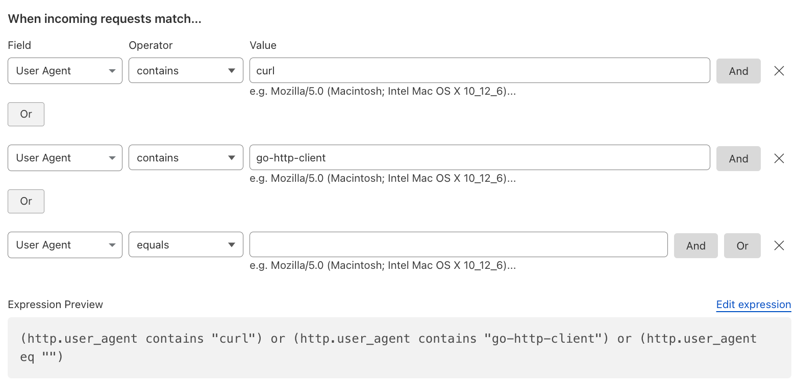
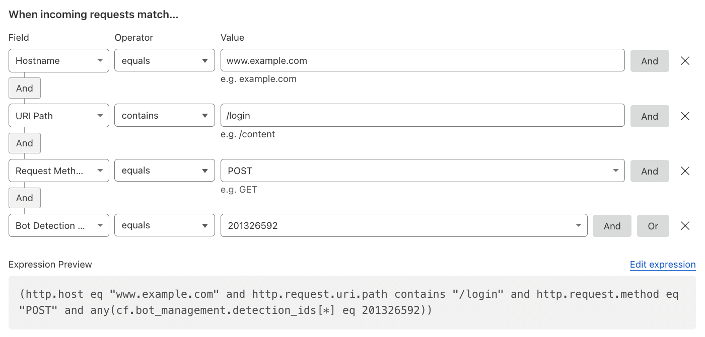
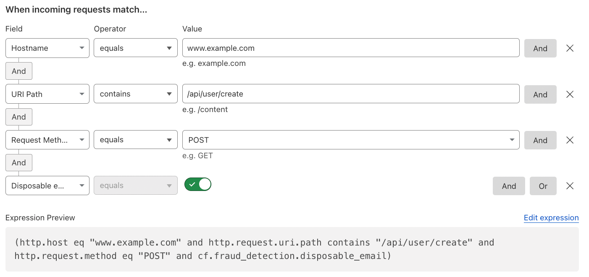

## Introduction

This guide provides non-exhaustive recommendations and general best practices to achieve a comprehensive **Layer 7 (L7) / Application Security approach** with Cloudflare.

> _This may be relevant for those seeking similar frameworks, such as [CIS Benchmarks](https://downloads.cisecurity.org/#/)._

Some features mentioned are available only through advanced Cloudflare bundles, such as **WAF Advanced**, [Advanced Rate Limiting](https://developers.cloudflare.com/waf/rate-limiting-rules/#availability), or **Enterprise** features like [Enterprise Bot Management](https://developers.cloudflare.com/bots/plans/bm-subscription/).

This guide assumes that your domain is already onboarded to Cloudflare as a [Zone](https://developers.cloudflare.com/fundamentals/setup/accounts-and-zones/#zones) and configured using [Full Setup](https://developers.cloudflare.com/dns/zone-setups/full-setup/), meaning Cloudflare is acting as your authoritative DNS provider. Additionally, it's recommended to have [DNSSEC](https://developers.cloudflare.com/dns/dnssec/) enabled and being familiar with [Zone Holds](https://developers.cloudflare.com/fundamentals/account/account-security/zone-holds/).

> **You can find all recommendations, security rules and more in the _[Cloudflare L7 Best Practices Repository (Database)](https://db.automatic-demo.com/)_ for quick searches.**

---

## Troubleshooting

- Review the [Cloudflare Status page](https://www.cloudflarestatus.com/).
- Consult the [Troubleshooting section](https://developers.cloudflare.com/support/troubleshooting/).
- [Gather necessary information](https://developers.cloudflare.com/support/troubleshooting/general-troubleshooting/) and contact [Cloudflare Support](https://developers.cloudflare.com/support/contacting-cloudflare-support/#methods-of-contacting-cloudflare-support).
- Use [Trace](https://developers.cloudflare.com/fundamentals/basic-tasks/trace-request/) to understand the impact of your Cloudflare configurations on specific requests.

## Recommendations

In general, in most cases you can create rules with the action set to "Log" for testing purposes. This allows you to review what it matches in the [Security Events](https://developers.cloudflare.com/waf/analytics/security-events/) and fine-tune it as needed before applying a more impactful action, such as "Block", "Managed Challenge", or even "SKIP".

For more information, review the older article [Protecting OSI layers](/articles/protecting-osi-layers/).

### **WAF Managed Rules**

#### Deploy WAF Managed Ruleset

It's widely recommended to briefly review and then deploy the [Managed Ruleset](https://developers.cloudflare.com/waf/managed-rules/reference/cloudflare-managed-ruleset/) across the entire [Zone](https://developers.cloudflare.com/dns/concepts/#zone). Create specific [exceptions](https://developers.cloudflare.com/waf/managed-rules/waf-exceptions/), if required.


> _**Note**: that it is not recommended to have both [Account-level WAF](https://developers.cloudflare.com/waf/account/) Managed Rules, as well as Zone-level WAF Managed Rules deployed and enabled at the same time as this could lead to confusion when reviewing the [Security Events](https://developers.cloudflare.com/waf/analytics/security-events/). Preferably, standardize at account level with the Account-level WAF Managed Rules; avoid duplicating the same ruleset at the zone level unless you need zone‑specific overrides._

Reference: [Cloudflare Managed Ruleset](https://developers.cloudflare.com/waf/managed-rules/reference/cloudflare-managed-ruleset/).

#### Stricter Security Requirements with WAF Managed Ruleset

For additional and stricter security requirements, deploy some of the following rules:

- _XSS, HTML Injection_ with Rule ID _882b37d6bd5f4bf2a3cdb374d503ded0_.
- _Anomaly:URL:Path - Multiple Slashes, Relative Paths, CR, LF or NULL_ with Rule ID _6e759e70dc814d90a003f10424644cfb_.
- _Anomaly:Body - Large_ with Rule ID _7b822fd1f5814e17888ded658480ea8f_, in order to mitigate body payloads which are higher than the [processing limit](https://developers.cloudflare.com/ruleset-engine/rules-language/fields/http-request-body/).
  - It is generally recommended to add [WAF exceptions](https://developers.cloudflare.com/waf/managed-rules/waf-exceptions/) for this, especially for [upload endpoints](https://developers.cloudflare.com/cache/concepts/default-cache-behavior/#upload-limits).
- _Anomaly:Port - [Non Standard Port](https://developers.cloudflare.com/fundamentals/reference/network-ports/#how-to-block-traffic-on-additional-ports) (not 80 or 443)_ with Rule ID _8e361ee4328f4a3caf6caf3e664ed6fe_.
- _Anomaly:Method - Unusual HTTP Method_ with Rule ID _ab53f93c9b03472ab34a5405d9bdc7d5_.
- _Anomaly:Method - Unknown HTTP Method_ with Rule ID _6e2240ffcb87477bbd4881b6fd13142f_.
- Including all the _Vulnerability scanner activity_-related Rules.
- Any [other relevant Rules](https://developers.cloudflare.com/waf/change-log/) you might need.

[Log the payload of matched rules](https://developers.cloudflare.com/waf/managed-rules/payload-logging/), if required, to help diagnosing the behavior of the rules. The encrypted payloads can be found in the Metadata field in [Firewall events](https://developers.cloudflare.com/logs/reference/log-fields/zone/firewall_events/) logs.

> _**Note**: it is also generally recommended to disable (globally or selectively) [Browser Integrity Check (BIC)](https://developers.cloudflare.com/waf/tools/browser-integrity-check/), especially to prevent potential false positives with APIs / automated traffic and non-browser endpoints. Use modern detections like WAF Managed Rules and Bot Management instead._

Reference: [Security Events](https://developers.cloudflare.com/waf/analytics/security-events/) and [Changelog](https://developers.cloudflare.com/changelog/).

#### Deploy OWASP Core Ruleset

If required, review and then deploy the [OWASP Core Ruleset](https://developers.cloudflare.com/waf/managed-rules/reference/owasp-core-ruleset/).

> _**Note**: Those types of rules are prone for false positives. For customers also using [Zaraz](https://developers.cloudflare.com/zaraz/), it is recommended to configure an [exception](https://developers.cloudflare.com/ruleset-engine/managed-rulesets/create-exception/) for the configured Zaraz endpoint._


Reference: [Handle false positives / Troubleshooting](https://developers.cloudflare.com/waf/managed-rules/troubleshooting/).

---

### **WAF Custom Rules**

Custom rules give you granular control to tailor your security policy to your application's specific needs. Rules are executed in [order / phases](https://developers.cloudflare.com/waf/reference/phases/), so place your most important rules at the top.

#### Allow Verified Bots

It's ordinarily recommended to have as one of the first top Custom Rules a [SKIP Custom Rule](https://developers.cloudflare.com/waf/custom-rules/skip/), allowing Verified Bots, such as i.e. Search Engine Crawler (like _GoogleBot_).


Reference: [Verified Bots](https://developers.cloudflare.com/bots/concepts/bot/#verified-bots)

#### Allow APIs

It's generally recommended to have as one of the first top Custom Rules a [SKIP Custom Rule](https://developers.cloudflare.com/waf/custom-rules/skip/), allowing your and/or partner APIs (i.e. payment callbacks, PreRender IO, etc.), being as specific and using as many [fields](https://developers.cloudflare.com/ruleset-engine/rules-language/fields/) as possible. The ultimate goal is to pursue a **positive security model** by implementing [API Shield](https://developers.cloudflare.com/api-shield/security/).


Reference: [API Shield](https://developers.cloudflare.com/api-shield/).

#### Redirect to Custom HTML

Using a [Custom HTML](https://developers.cloudflare.com/waf/custom-rules/create-dashboard/#configure-a-custom-response-for-blocked-requests) response type, one can create a redirect to another site for specific requests. In this example, any non-verified bot requests coming from the US are redirected.


#### Block Fallthrough API Requests

In order to truly enforce a Positive Security Model, for any fallthrough action of requests not matching any of the [API Shield-managed endpoints](https://developers.cloudflare.com/api-shield/management-and-monitoring/), create a WAF Custom Rule similar to the one below, preferably with more specific fields to your API.


Reference: [Schema Validation](https://developers.cloudflare.com/api-shield/security/schema-validation/).

#### Visibility into Non-expected Request Methods

In some cases, you want to be specific about what type of HTTP Request Methods are allowed on certain endpoints or coming from specific requests, or even just logging relevant methods for visibility.


Reference: [HTTP Method Field](https://developers.cloudflare.com/ruleset-engine/rules-language/fields/reference/http.request.method/).

#### Mitigate likely Malicious Payloads

Every HTTP/S request receives a WAF Attack Score (WAF ML), indicating the likelihood of containing something malicious related to SQLi, XSS, or RCE attacks. This should be used to complement existing security rules and serve as an additional signal to help mitigate potential attacks.


Reference: [WAF attack score](https://developers.cloudflare.com/waf/about/waf-attack-score/).

#### Mitigate known Open Proxies, Anonymizers, VPNs, Malware, and Botnets

By using the Cloudflare-Managed IP Lists, including your own [Custom Lists](https://developers.cloudflare.com/waf/tools/lists/custom-lists/), you can decide what to do with those IP categories. Generally, one wants to block Botnets and Malware.


Reference: [Managed IP Lists](https://developers.cloudflare.com/waf/tools/lists/managed-lists/#managed-ip-lists).

> _**Note**: If you wish to manually block VPNs, here's a list of ASNs commonly associated with popular VPN providers: `AS62041, AS202420, AS20473, AS23966, AS36352, AS14061, AS209854, AS20001, AS20115, AS32934, AS16276`. This information might change and illustrative only._

#### Mitigate Tor Traffic

In case that Tor traffic – an overlay network for enabling anonymous communication – is unwanted, one can simply mitigate it. Make sure to also disable [Onion Routing](https://developers.cloudflare.com/network/onion-routing/#enable-onion-routing) in this case.


Reference: [Onion Routing and Tor support](https://developers.cloudflare.com/network/onion-routing/).

#### Mitigate unwanted ASNs

Any unwanted traffic coming from Cloud ASNs (such as AWS, Azure, GCP, etc.) or other ASNs from which you don't expect traffic, you might want to mitigate. Use [Lists with ASNs](https://developers.cloudflare.com/waf/tools/lists/custom-lists/#lists-with-asns) to easily manage these. One can also opt for dynamic [Managed IP Lists](https://developers.cloudflare.com/waf/tools/lists/managed-lists/#managed-ip-lists).


Reference: [Custom Lists](https://developers.cloudflare.com/waf/tools/lists/custom-lists/).

#### Block High Risk Countries

Block high risk countries like the ones that appear in [The Office of Foreign Assets Control (OFAC) List](https://sanctionssearch.ofac.treas.gov/).


References: [Sanctions List Search](https://sanctionssearch.ofac.treas.gov/) and [OpenSanctions](https://www.opensanctions.org/).

#### Block known Bot User-Agents

Block unwanted requests of user-agents known to be used by bots, such as _cURL_, _go-http-client_, or even empty user-agents.



Reference: [Challenge bad bots](https://developers.cloudflare.com/waf/custom-rules/use-cases/challenge-bad-bots/).

#### Restrict WP Admin Dashboard Access

If you are using WordPress, restrict access to the `/wp-admin` to only specific static source IPs of employees or admins, or alternatively opt for a Zero Trust approach with [Cloudflare Access](https://developers.cloudflare.com/learning-paths/zero-trust-web-access/).


Reference: [Allow traffic from IP addresses in allowlist only](https://developers.cloudflare.com/waf/custom-rules/use-cases/allow-traffic-from-ips-in-allowlist/).

#### Restrict Access to Employees Only

If you have employee portals or extranets, restrict access to countries in which you have employees located, or preferably opt for a [Zero Trust approach](https://developers.cloudflare.com/learning-paths/zero-trust-web-access/). Try to be as specific as possible using multiple conditions like HTTP Header, ASN, and HTTP method.


Another alternative is to take advantage of [mTLS](https://developers.cloudflare.com/ssl/client-certificates/), only allowing access to employees with valid client certificates.

Reference: [Allow traffic from specific countries only](https://developers.cloudflare.com/waf/custom-rules/use-cases/allow-traffic-from-specific-countries/).

#### Mutual TLS Authentication

Block all requests that do not have a valid client certificate for Mutual TLS (mTLS) authentication on a specific hostname. In this scenario, mTLS refers to the connection between the client and Cloudflare.


Additionally, another consideration is to also check if the Client Certificates, generated with the default Cloudflare Managed CA, have been [revoked](https://developers.cloudflare.com/api-shield/security/mtls/configure/#check-for-revoked-certificates) and block those.


References: [Cloudflare Public Key Infrastructure (PKI)](https://developers.cloudflare.com/ssl/client-certificates/), [CFSSL](https://cfssl.org/), [API Shield mTLS](https://developers.cloudflare.com/api-shield/security/mtls/) and [Workers mTLS](https://developers.cloudflare.com/workers/runtime-apis/bindings/mtls/). Check out this Learning Path on [mTLS at Cloudflare](https://developers.cloudflare.com/learning-paths/mtls/).

Another interesting use case is to associate specific mTLS hostnames with Client Certificate Serial Numbers ([`cf.tls_client_auth.cert_serial`](https://developers.cloudflare.com/ruleset-engine/rules-language/fields/dynamic-fields/#cftls_client_authcert_serial)). This allows for more granular control.


#### User-Specific JWT Claim Mitigation

To enhance the security of your API endpoints that rely on JSON Web Tokens (JWT), you can create rules targeting specific JWT claims, such as the user claim.

In this example, requests from `admin` users based on the `user` claim are subjected to additional scrutiny by challenging requests flagged as potentially malicious based on their [WAF Attack Score](https://developers.cloudflare.com/waf/detections/attack-score/).


Reference: [Issue challenge for admin user in JWT claim based on attack score](https://developers.cloudflare.com/waf/custom-rules/use-cases/check-jwt-claim-to-protect-admin-user/) and [API Shield](https://developers.cloudflare.com/api-shield/).

#### Visibility into Automated Bot Traffic

In general, one wants to have visibility into automated traffic. This can be commonly achieved with a [LOG](https://developers.cloudflare.com/ruleset-engine/rules-language/actions/) action, logging anything with a [Bot Score](https://developers.cloudflare.com/bots/concepts/bot-score/) "likely automated" based on available [detection engines](https://developers.cloudflare.com/bots/concepts/bot-detection-engines/).


Reference: [Bot Management variables](https://developers.cloudflare.com/bots/reference/bot-management-variables/).

#### Mitigating Pretend-Browsers with JavaScript Detections

In scenarios where the [BotScore](https://developers.cloudflare.com/bots/concepts/bot-score/) alone may not reliably differentiate between likely human and bots, you can enhance detection by optionally enabling [JavaScript Detections (JSD)](https://developers.cloudflare.com/bots/reference/javascript-detections/).

> _**Note**: JSD can only be applied to HTML responses (`Content-Type: text/html`) and it cannot be at the root/first HTML request as the JavaScript needs to be injected first._

When enforced via [`cf.bot_management.js_detection.passed`](https://developers.cloudflare.com/ruleset-engine/rules-language/fields/dynamic-fields/#cfbot_managementjs_detectionpassed) rules and a [Managed Challenge](https://developers.cloudflare.com/cloudflare-challenges/challenge-types/challenge-pages/#managed-challenge-recommended), JSD ensures active verification checks.


> _**Note**: Test with a logging action before enforcing rules to avoid impacting legitimate traffic. Additionally, the Rule should only apply on critical paths and not on initial landing pages, where JS might have not been injected yet._

Reference: [Enforcing execution of JavaScript detections](https://developers.cloudflare.com/bots/reference/javascript-detections/#enforcing-execution-of-javascript-detections).

#### Visibility into IPv6 IPs

Most web applications want to be available via IPv6 IP addresses. However, in case that IPv6 is undesired, customers can mitigate IPv6 IPs through the WAF and also disable [IPv6 compatibility](https://developers.cloudflare.com/network/ipv6-compatibility/#disable-ipv6-compatibility), if needed.

> _**Note**: that this will also block [Cloudflare Workers](https://developers.cloudflare.com/fundamentals/reference/http-headers/#cf-worker) scripts. In order to allow Workers, review the [Mitigate Unauthorized Cloudflare Workers](#mitigate-unauthorized-cloudflare-workers) section._


Reference: [IPv6 compatibility](https://developers.cloudflare.com/network/ipv6-compatibility/).

#### Account Takeover (ATO) Detections

To detect and mitigate predictable bot behavior, such as _login failures_, one can use [Detection IDs](https://developers.cloudflare.com/bots/concepts/detection-ids/). This is also available for Rate Limiting Rules.



Reference: [Account takeover detections](https://developers.cloudflare.com/bots/concepts/detection-ids/#account-takeover-detections) and [Turnstile](https://developers.cloudflare.com/turnstile/).

#### Mitigate Disposable Emails on SignUps

To prevent users from signing up with known disposable emails, Cloudflare's Disposable Email Check can easily check this behavior and the customer can decide what to do with this: block, challenge, log, rate limit, or even [add a request header](https://developers.cloudflare.com/rules/transform/request-header-modification/) for the origin server.



Reference: [Cloudflare Fraud Detection](https://blog.cloudflare.com/cloudflare-fraud-detection).

#### Mitigate Authentication Requests

Prevent or trigger a different behavior when a user tries to log in (authentication event) with leaked credentials, as per [Have I been Pwned (HIBP)](https://haveibeenpwned.com/). Or use different related [fields](https://developers.cloudflare.com/ruleset-engine/rules-language/fields/dynamic-fields/#cfwafcredential_checkpassword_leaked).


> _**Note**: Authentication events ([`cf.waf.auth_detected`](https://developers.cloudflare.com/ruleset-engine/rules-language/fields/dynamic-fields/#cfwafauth_detected)) refers to authentication credentials detected in a request with a status code 2XX._

Reference: [Leaked credentials detection](https://developers.cloudflare.com/waf/detections/leaked-credentials/).

#### Time-based Rules

Time-based rules can leverage the [http.request.timestamp.sec](https://developers.cloudflare.com/ruleset-engine/rules-language/fields/reference/http.request.timestamp.sec/) field to apply logic based on specific time periods (useful for maintenance windows or scheduled security posture changes).

For example, you could block all POST or PUT requests to a particular endpoint during a defined time frame.


Or simply Log or Skip (allow) specific requests for a specific time.

> _**Note**: The timestamp is represented in UNIX time (epoch time) and consists of a 10-digit value._

Reference: [Configure a rule with the Skip action](https://developers.cloudflare.com/waf/custom-rules/skip/).

#### Mitigate Unauthorized Cloudflare Workers

The [`CF-Worker`](https://developers.cloudflare.com/fundamentals/reference/http-headers/#cf-worker) request header identifies the originating host of a subrequest made by a [Cloudflare Workers Subrequest](https://developers.cloudflare.com/workers/platform/limits/#subrequests), such as when using the [Fetch API](https://developers.cloudflare.com/workers/runtime-apis/fetch/).

Do not use `CF-Worker` in WAF Custom Rules, as it is added after rule evaluation. Instead, use [`cf.worker.upstream_zone`](https://developers.cloudflare.com/ruleset-engine/rules-language/fields/reference/cf.worker.upstream_zone/), which holds the same value.

**Block a specific Worker:**

```
cf.worker.upstream_zone eq "example.com"
```

**Block all Worker subrequests except from your own Worker:**

```
not (cf.worker.upstream_zone in {"" "your-zone.com"})
```


Reference: [CF-Connecting-IP in Worker subrequests](https://developers.cloudflare.com/fundamentals/reference/http-headers/#cf-connecting-ip-in-worker-subrequests).

#### More Common Use Cases for Custom Rules

Review the [get started guide](https://developers.cloudflare.com/waf/get-started/) and the [common use cases for custom rules](https://developers.cloudflare.com/waf/custom-rules/use-cases/) for more examples. Additionally, for some use cases or if you are managing many Zones, the [Account-level WAF](https://developers.cloudflare.com/waf/managed-rules/deploy-account-dashboard/) can be a good feature to have.

Moreover, monitor and [replace insecure JS libraries](https://developers.cloudflare.com/waf/tools/replace-insecure-js-libraries/) used in your applications.

Review all the [fields reference](https://developers.cloudflare.com/ruleset-engine/rules-language/fields/).

---

### **Rate Limiting Rules**

Rate limiting is essential for protecting your application from brute-force attacks, denial-of-service, and other forms of abuse.

#### IP-based Rate Limiting for Logins

To protect login endpoints from multiple login attempts from the same IP address, rate limit based on the required [characteristics](https://developers.cloudflare.com/waf/rate-limiting-rules/parameters/#with-the-same-characteristics).


Reference: [Rate limiting parameters](https://developers.cloudflare.com/waf/rate-limiting-rules/parameters/).

#### Rate Limiting Uploads

To prevent too many uploads / HTTP requests using POST / PUT / PATCH methods.


Reference: [Standard fields](https://developers.cloudflare.com/ruleset-engine/rules-language/fields/#standard-fields).

#### Rate Limit Credential Stuffing

To protect against credential stuffing attacks, it's generally recommended using a layered-security approach. This rate limiting rule is but one example of several approaches.


Reference: [Protecting against credential stuffing](https://developers.cloudflare.com/waf/rate-limiting-rules/best-practices/#protecting-against-credential-stuffing) and [Find an appropriate rate limit](https://developers.cloudflare.com/waf/rate-limiting-rules/find-rate-limit/).

#### Rate Limit Suspicious Logins

Implement rate limiting for suspicious login attempts (authentication events) using leaked credentials, specifically leaked passwords, as per [Have I been Pwned (HIBP)](https://haveibeenpwned.com/).


Reference: [Leaked credentials detection](https://developers.cloudflare.com/waf/detections/leaked-credentials/).

#### Geography-based Rate Limiting

If there are markets from which one does not expect a lot of traffic coming from in general, one could rate limit requests coming from those countries based on IPs or other [characteristics](https://developers.cloudflare.com/waf/rate-limiting-rules/parameters/#with-the-same-characteristics).


Reference: [Enforcing granular access control](https://developers.cloudflare.com/waf/rate-limiting-rules/best-practices/#enforcing-granular-access-control).

#### IPv6-based Rate Limiting

To protect against entire [IPv6 Prefixes](https://en.wikipedia.org/wiki/IPv6_address), rate limit with the [custom characteristics](https://developers.cloudflare.com/waf/rate-limiting-rules/parameters/#with-the-same-characteristics) using the [cidr6 function](https://developers.cloudflare.com/ruleset-engine/rules-language/functions/#cidr6) and specifying the prefix length.


Reference: [Rules language](https://developers.cloudflare.com/ruleset-engine/rules-language/).

#### Client Certificate-based Rate Limiting

Rate limit based on the same Client Certificate being used multiple times over a specific period of time, in order to prevent abuse of potentially compromised certificates or devices. This is part of mTLS protection.


Reference: [SHA-256 fingerprint of the certificate](https://developers.cloudflare.com/ruleset-engine/rules-language/fields/dynamic-fields/#cftls_client_authcert_fingerprint_sha256).

#### JavaScript Detection-based Rate Limiting

Use [JavaScript Detections (JSD)](https://developers.cloudflare.com/bots/reference/javascript-detections/) to identify human-like clients by solving a challenge in subsequent HTML requests, flagged as [`cf.bot_management.js_detection.passed`](https://developers.cloudflare.com/ruleset-engine/rules-language/fields/dynamic-fields/#cfbot_managementjs_detectionpassed). Since JSD cannot run on the first HTML request, track failed JSD attempts on subsequent HTML responses (`Content-Type: text/html`) and block or challenge clients i.e. after 5 consecutive failures within a 10-minute window.


Reference: [Do the Challenge actions support content types other than HTML (for example, AJAX or XHR requests)?](https://developers.cloudflare.com/cloudflare-challenges/frequently-asked-questions/#do-the-challenge-actions-support-content-types-other-than-html-for-example-ajax-or-xhr-requests).

#### Cookie-based Rate Limiting

In order to limit the amount of times a cookie can be used, one can rate limit by its [characteristics](https://developers.cloudflare.com/waf/rate-limiting-rules/parameters/#with-the-same-characteristics). For example, rate limit session cookies or limit the amount of times a single [`cf_clearance` cookie](https://developers.cloudflare.com/cloudflare-challenges/challenge-types/challenge-pages/challenge-passage/) can be used.


> _**Note**: Challenge Passage can be lowered to 15 minutes to prevent re-usage by bots. Nonetheless, normally one should set the Challenge Passage to the user session time of 90-95% of users. For example, if users normally stay 6 hours on your website, set the Challenge Passage to 8 hours, in order to avoid a second challenge during a user session._

Reference: [Cloudflare Cookies](https://developers.cloudflare.com/fundamentals/reference/policies-compliances/cloudflare-cookies/).

#### More Common Use Cases for Rate Limiting Rules

Review the [rate limiting best practices](https://developers.cloudflare.com/waf/rate-limiting-rules/best-practices/) for more examples.

Review all the [fields reference](https://developers.cloudflare.com/ruleset-engine/rules-language/fields/).

---

### **Turnstile**

Cloudflare's [Turnstile](https://developers.cloudflare.com/turnstile/) is a privacy-preserving CAPTCHA alternative that allows [challenges](https://developers.cloudflare.com/cloudflare-challenges/) anywhere on your site. It runs in standard browsers, including mobile – even [native mobile apps](https://developers.cloudflare.com/turnstile/get-started/mobile-implementation/) – when using _WebView_. [Implicit rendering](https://developers.cloudflare.com/turnstile/get-started/client-side-rendering/#implicitly-render-the-turnstile-widget) auto-loads on static pages, while [explicit rendering](https://developers.cloudflare.com/turnstile/get-started/client-side-rendering/#explicitly-render-the-turnstile-widget) offers control over when and where it appears, ideal for dynamic content or Single-Page Applications (SPAs). Learn more about the differences [here](https://developers.cloudflare.com/turnstile/tutorials/implicit-vs-explicit-rendering).

Enterprise customers can also take advantage of [Ephemeral IDs](https://developers.cloudflare.com/turnstile/concepts/ephemeral-id/), which can help track bots over longer time periods and rate limit based on these IDs instead of IPs or other characteristics.

> _**Note**: While Turnstile can be run in [invisible mode](https://developers.cloudflare.com/turnstile/concepts/widget/#invisible), it is recommended to use [managed mode](https://developers.cloudflare.com/turnstile/concepts/widget/#managed-recommended) for login and signup forms to provide users with a clear indication that an action is taking place. Alternatively, another option is to set it up with [interaction-only](https://developers.cloudflare.com/turnstile/get-started/client-side-rendering/widget-configurations/#appearance-modes). Additionally, the Turnstile [Siteverify API](https://developers.cloudflare.com/turnstile/get-started/server-side-validation/) should be triggered when the user clicks the button, initiating the POST request; (or while / before the user is already filling out the form)._

When [integrating on mobile](https://developers.cloudflare.com/turnstile/get-started/mobile-implementation/), address common issues like _WebView_ configuration and JavaScript interface to ensure smooth functionality.

It is also suggested to [integrate Turnstile with WAF and Bot Management](https://developers.cloudflare.com/turnstile/tutorials/integrating-turnstile-waf-and-bot-management).

#### API / AJAX / XHR Requests

For API protection ([AJAX/XHR requests](https://developers.cloudflare.com/cloudflare-challenges/frequently-asked-questions/#do-the-challenge-actions-support-content-types-other-than-html-for-example-ajax-or-xhr-requests)), avoid using [Challenges](https://developers.cloudflare.com/cloudflare-challenges/) directly. APIs cannot complete interactive challenges, and browser CORS (Cross-Origin Resource Sharing) restrictions prevent smooth handling.

Instead, deploy [Turnstile](https://developers.cloudflare.com/turnstile/) on high-risk frontend pages (e.g., login, checkout) to issue a [`cf_clearance` cookie](https://developers.cloudflare.com/cloudflare-challenges/concepts/clearance/#pre-clearance-support-in-turnstile). Once issued, the cookie allows subsequent API requests to pass WAF evaluation without triggering challenges, preserving both security and usability.

For native or non-browser clients, consider [detecting Challenge Page responses](https://developers.cloudflare.com/cloudflare-challenges/challenge-types/challenge-pages/detect-response/) and handling them at the application layer.

If Managed Challenge wants to be applied directly to API endpoints, configure [Transform Rules](https://developers.cloudflare.com/rules/transform/response-header-modification/) to expose the mitigation status by adding CORS:

- `Access-Control-Allow-Origin: *`
- `Access-Control-Expose-Headers: Cf-Mitigated`

This enables clients to read the `Cf-Mitigated` header and adjust behavior accordingly.

---

### **Page Shield**

Monitor your application's JavaScript dependencies and get notified of any changes with Cloudflare [Page Shield](https://developers.cloudflare.com/page-shield/how-it-works/).

In general, you would want to periodically [monitor resources and cookies](https://developers.cloudflare.com/page-shield/detection/monitor-connections-scripts/) running on your application. This is relevant for [PCI DSS compliance](https://www.cloudflare.com/trust-hub/compliance-resources/pci-dss/).

Create [Policies](https://developers.cloudflare.com/page-shield/policies/) to enforce a positive security model, allowing only specific resources.

---

### **SSL/TLS Certificates**

It is typically recommended to use the [Advanced Certificate Manager (ACM)](https://developers.cloudflare.com/ssl/edge-certificates/advanced-certificate-manager/) for features like delegated DCV, custom hostnames, total TLS, and [Automatic SSL/TLS](https://developers.cloudflare.com/ssl/origin-configuration/ssl-modes/#automatic-ssltls-default).

For customers with stricter requirements, additionally, disable the [Universal SSL](https://developers.cloudflare.com/ssl/edge-certificates/universal-ssl/disable-universal-ssl/) certificate.

Those seeking [PCI compliance](https://developers.cloudflare.com/ssl/reference/compliance-and-vulnerabilities/) and granular customization over [cipher suites](https://developers.cloudflare.com/ssl/reference/cipher-suites/customize-cipher-suites/) should review the developer documentations, as well as the features [TLS 1.3](https://developers.cloudflare.com/ssl/edge-certificates/additional-options/tls-13/), [Minimum TLS Version](https://developers.cloudflare.com/ssl/edge-certificates/additional-options/minimum-tls/) (TLS 1.2 is the recommended minimum, TLS 1.3 preferred), [Automatic HTTPS Rewrites](https://developers.cloudflare.com/ssl/edge-certificates/additional-options/automatic-https-rewrites/), [Always Use HTTPS](https://developers.cloudflare.com/ssl/edge-certificates/additional-options/always-use-https/) (or preferably [disable HTTP plaintext](https://jviide.iki.fi/http-redirects) altogether using [HSTS](https://developers.cloudflare.com/ssl/edge-certificates/additional-options/http-strict-transport-security/)).

> _**Note**: Review the [Post-Quantum Cryptography (PQC)](https://developers.cloudflare.com/ssl/post-quantum-cryptography/) documentation for quantum-resistant algorithms._

Additionally, it is recommended to configure the origin server to [match on origin](https://developers.cloudflare.com/ssl/origin-configuration/cipher-suites/#match-on-origin).

Verify that there's always a valid and active [Edge Certificate](https://developers.cloudflare.com/ssl/edge-certificates/) for your Zones at all times.

Moreover, enabling [HTTP/2](https://developers.cloudflare.com/speed/optimization/protocol/http2/), [HTTP/3](https://developers.cloudflare.com/speed/optimization/protocol/http3/) (QUIC), and [HTTP/2 to Origin](https://developers.cloudflare.com/speed/optimization/protocol/http2-to-origin/) are performance-related features, but also good for improved security.

---

### **Branding**

In case that branding is important to you and your business, you are able to use and configure [Custom Errors](https://developers.cloudflare.com/rules/custom-errors/).

Additionally, for the Cloudflare WAF, you are able to [configure a custom response for blocked requests](https://developers.cloudflare.com/waf/custom-rules/create-dashboard/#configure-a-custom-response-for-blocked-requests).

---

### **Analytics & Log Management**

You can review matched security rules in the [Security Events](https://developers.cloudflare.com/waf/analytics/security-events/) section. A broader overview of all requests and trends can be found in the [Security Analytics](https://developers.cloudflare.com/waf/analytics/security-analytics/) section.

For an account-level overview, review the [Account Analytics](https://developers.cloudflare.com/analytics/account-and-zone-analytics/account-analytics/).

> _**Note**: Cloudflare Dashboard analytics can likely be [sampled](https://developers.cloudflare.com/analytics/graphql-api/sampling/)._

> _**Note**: Exclude the [`/cdn-cgi/` endpoint](https://developers.cloudflare.com/fundamentals/reference/cdn-cgi-endpoint/) from your Security Rules, specifically relevant for [challenges](https://developers.cloudflare.com/rules/reference/troubleshooting/#interaction-between-cloudflare-challenges-and-rules-features)._

It is strongly recommended to use [Logpush](https://developers.cloudflare.com/logs/about/), pushing your [logs](https://developers.cloudflare.com/logs/reference/log-fields/) to storage services (such as [R2](https://developers.cloudflare.com/r2), S3, or others), SIEMs, or log management providers.

It is highly recommended to set up [Notifications](https://developers.cloudflare.com/notifications/) to keep up to date with everything, subscribing to incident notifications and periodically review the [Cloudflare Status](https://www.cloudflarestatus.com/) page.

---

### **Scans and Penetration Testing Policy**

Cloudflare customers may conduct scans and penetration tests (with certain restrictions) on application and network-layer aspects of their own assets.

You can review all details in the [developer documentation](https://developers.cloudflare.com/fundamentals/reference/scans-penetration/).

---

### **Automation & User Management**

Effective automation and user management are critical for maintaining security, operational efficiency, and governance across your Cloudflare infrastructure.


#### Infrastructure as Code (IaC) Options

Automate deployments, configuration changes, and rollbacks using these tools:

- [Cloudflare API](https://developers.cloudflare.com/api/)
- [SDKs](https://developers.cloudflare.com/fundamentals/api/reference/sdks/)
- [Terraform](https://developers.cloudflare.com/terraform/)
  - For external scripts / uncovered resources, use [external](https://registry.terraform.io/providers/hashicorp/external/latest/docs/data-sources/external).
  - If you're planning to change from Dashboard UI to Terraform, use [cf-terraforming](https://github.com/cloudflare/cf-terraforming).
- [Pulumi](https://developers.cloudflare.com/pulumi/)

> Note the [API rate limits](https://developers.cloudflare.com/fundamentals/api/reference/limits/).

#### User Access Management

Implement least-privilege access control following these best practices:

##### Role-Based Access Control (RBAC)

Cloudflare provides predefined [roles](https://developers.cloudflare.com/fundamentals/manage-members/roles/) with specific permission sets:

- **Super Administrator** - Full account access (limit to 2-3 users)
- **Administrator** - Most administrative functions except billing and membership
- **Domain-specific roles** - Scoped to individual zones:
  - DNS Administrator
  - Firewall Administrator
  - Cache Administrator
  - Analytics Administrator

> **Important**: API permissions differ from Dashboard permissions. Review [API token permissions](https://developers.cloudflare.com/api/resources/accounts/subresources/roles/methods/get/) separately.

##### User Groups

[User Groups](https://developers.cloudflare.com/fundamentals/manage-members/user-groups/) enable scalable permission management:

- Create groups based on teams or functions (e.g., "DevOps Team", "Security Team")
- Assign multiple IAM policies to each group
- Add users to groups instead of managing individual permissions
- Automatic permission inheritance for group members

#### Authentication Security

**Multi-Factor Authentication (MFA)**

- [Enforce MFA](https://developers.cloudflare.com/fundamentals/user-profiles/2fa/) for all users
- Support for TOTP apps
- Support for passkeys / [security keys](https://developers.cloudflare.com/fundamentals/user-profiles/2fa/#security-keys)
- Backup codes for recovery scenarios

**Single Sign-On (SSO)**

- [Configure SSO](https://developers.cloudflare.com/cloudflare-one/applications/configure-apps/dash-sso-apps/) with SAML or OIDC providers
- Automatic user (de)provisioning with [SCIM](https://developers.cloudflare.com/fundamentals/account/account-security/scim-setup/)

##### API Token Management

Use [Account-Owned Tokens](https://developers.cloudflare.com/fundamentals/api/get-started/account-owned-tokens/) for processes or services:

- Create service accounts for CI/CD pipelines
- Implement token rotation policies (i.e. 90-day maximum)
- Scope tokens to minimum required permissions
- Use separate tokens for different environments
- Store tokens in secure vaults

#### Monitoring and Compliance

##### Audit Logging

Monitor [Audit Logs](https://developers.cloudflare.com/fundamentals/account/account-security/audit-logs/) for:

- User login events and MFA usage
- Permission changes and role assignments
- API token creation / deletion
- Configuration modifications
- Failed authentication attempts

Export audit logs via:

- [Logpush](https://developers.cloudflare.com/logs/logpush/) to SIEM platforms (Splunk, Datadog, Elastic)
- [API](https://developers.cloudflare.com/fundamentals/account/account-security/audit-logs/#access-audit-logs) for custom integrations

##### Access Reviews

Establish regular review cycles:

- **Quarterly**: Review Super Administrator and Administrator assignments
- **Monthly**: Audit API tokens and remove unused ones
- **Weekly**: Check audit logs for anomalous activity
- **Automated**: Alert on privilege escalations or new user additions

##### Compliance Considerations

- Document role assignments for SOC 2, ISO 27001 compliance
- Implement separation of duties
- Maintain access control matrices
- Regular attestation of user access rights

#### Best Practices Summary

1. **Principle of Least Privilege**: Start with minimal permissions and add as needed
2. **Use Groups**: Manage permissions via groups, not individual users
3. **Automate Everything**: Use IaC for reproducible configurations
4. **Token Hygiene**: Rotate API tokens regularly, use scoped permissions
5. **Monitor Continuously**: Set up alerts for suspicious activities
6. **Document Policies**: Maintain runbooks for onboarding/offboarding
7. **Regular Audits**: Schedule periodic access reviews
8. **Emergency Access**: Define break-glass procedures for incidents

For advanced scenarios, consider implementing:

- Build your own custom RBAC using [Cloudflare Workers](https://developers.cloudflare.com/workers/) as an authentication and authorization gateway-layer for fine-grained access control
- Integration with identity governance platforms
- Automated compliance reporting using the [GraphQL Analytics API](https://developers.cloudflare.com/workers/tutorials/automated-analytics-reporting/)

> _**Note**: these are non-exhaustive resources and a generalization of proper user and account management practices. Follow industry-standards and implement appropriate procedures within your organization._

---

### **Origin Server Protection**

Generally, it's recommended to properly secure and manage your origin servers.

> When migrating to Cloudflare, it's highly recommended to rotate Origin Server IPs and [proxy](https://developers.cloudflare.com/dns/manage-dns-records/reference/proxied-dns-records/) all DNS records.

There's a variety of different ways and options explained on the Developer Documentation to [protect your origin server](https://developers.cloudflare.com/fundamentals/basic-tasks/protect-your-origin-server/), as well as [prepare for surges or spikes in web traffic](https://developers.cloudflare.com/fundamentals/basic-tasks/preparing-for-surges-or-spikes-in-web-traffic/) for seasonal events, such as during holidays or product launches.

> _**Note**: Review the [Post-Quantum Cryptography (PQC)](https://developers.cloudflare.com/ssl/post-quantum-cryptography/) documentation._


Additionally, review and enable the [available Managed Transforms](https://developers.cloudflare.com/rules/transform/managed-transforms/reference/) options to add some bot protection headers, remove "X-Powered-By” headers, or even create your own Content Security Policy (CSP) with the [Transform Rules](https://developers.cloudflare.com/rules/transform/).

Reference: [Encryption modes](https://developers.cloudflare.com/ssl/origin-configuration/ssl-modes/).

---

## HTTP/S Use Cases

### Fighting Automated Requests (Bots)

A general goal is protecting against automated requests and bots – though there are different [types of bot attacks](https://www.cloudflare.com/learning/bots/what-is-a-bot-attack/) and often it's about fraud detection or solving one of these use cases:

- Credential / Credit Card Stuffing
- Content Scraping
- Inventory Hoarding
- Account Takeover (ATO)
- Fake Account Creation
- Content Spam

The best approach to combating bots depends on the Cloudflare features available and configured, as well as the specific types of bot attacks being observed. [DDoS attacks](https://blog.cloudflare.com/ddos-threat-report-for-2024-q4/) are usually also launched by botnets. Every website is unique, and often so are the attack patterns it faces. In general, fighting bots is a _cat-and-mouse game_, requiring continuous adaptation to evolving threats. Cloudflare continuously enhances its capabilities based on [customer feedback](https://developers.cloudflare.com/bots/concepts/feedback-loop/) and its [Threat Intelligence](https://www.cloudflare.com/threat-intelligence/) to try to stay ahead.

To effectively mitigate bot traffic, consider the following (non-exhaustive) layered-security approach:

- Allow ([skip](https://developers.cloudflare.com/waf/custom-rules/skip/)) [Verified Bots](https://developers.cloudflare.com/bots/concepts/bot/#verified-bots) or [Verified Bot Categories](https://developers.cloudflare.com/bots/concepts/bot/verified-bots/categories/).
- Allow ([skip](https://developers.cloudflare.com/waf/custom-rules/skip/)) your `sitemap.xml`, `robots.txt` and RSS feed (if applicable) to everyone.
- Block or mitigate unwanted bots (i.e. [AI bots](https://developers.cloudflare.com/bots/concepts/bot/#ai-bots)) by leveraging [Bot Management fields](https://developers.cloudflare.com/bots/reference/bot-management-variables/) in combination with other security controls, solutions (i.e. [Snippets](https://developers.cloudflare.com/rules/snippets/when-to-use/)) and [fields](https://developers.cloudflare.com/ruleset-engine/rules-language/fields/reference/).
  - Example [honeypot for bots](https://developers.cloudflare.com/rules/snippets/examples/bots-to-honeypot/).
- Enable [JavaScript Detections (JSD)](https://developers.cloudflare.com/bots/reference/javascript-detections/#enable-javascript-detections) and [enforce](https://developers.cloudflare.com/bots/reference/javascript-detections/#enforcing-execution-of-javascript-detections) them if possible.
  - If enforcement isn't feasible (i.e. for native mobile apps), consider implementing [Turnstile](https://developers.cloudflare.com/turnstile/) (in [WebView](https://developers.cloudflare.com/turnstile/get-started/mobile-implementation/) for mobile) alongside the [WAF](https://developers.cloudflare.com/turnstile/tutorials/integrating-turnstile-waf-and-bot-management/) or Cloudflare's new mobile SDK (Enterprise feature), which can be combined with [API Shield JWT Validation](https://developers.cloudflare.com/api-shield/security/jwt-validation/) at the edge or programmatically with [Snippets](https://developers.cloudflare.com/rules/snippets/examples/jwt-validation/).
- Analyze heuristics using [Security Analytics](https://developers.cloudflare.com/waf/analytics/security-analytics/) and available [fields](https://developers.cloudflare.com/ruleset-engine/rules-language/fields/reference/) to build WAF Custom Rules based on your needs and signals.
  - Deploy the [WAF Managed Rules](https://developers.cloudflare.com/waf/managed-rules/) regularly updated security rules.
  - For important endpoints, we also recommend [WAF Attack Score](https://developers.cloudflare.com/waf/detections/attack-score/) enforcement.
- Identify ASN patterns and block unwanted traffic from certain networks or cloud providers (i.e. [AWS or GCP](https://radar.cloudflare.com/bots))l if no legitimate traffic is expected from them.
  - Use [Managed IP Lists](https://developers.cloudflare.com/waf/tools/lists/managed-lists/#managed-ip-lists) for dynamic mitigations.
  - Use ([Body](https://developers.cloudflare.com/ruleset-engine/rules-language/fields/reference/http.request.body.raw/)) [Payload Inspection](https://developers.cloudflare.com/waf/managed-rules/payload-logging/) to perform more detailed mitigations.
- Apply [Rate Limiting](https://developers.cloudflare.com/waf/rate-limiting-rules/) based on IP and other [characteristics](https://developers.cloudflare.com/waf/rate-limiting-rules/parameters/#with-the-same-characteristics) to prevent abuse and credential stuffing attacks.
  - This is often combined with [Leaked Credentials Detection](https://developers.cloudflare.com/waf/detections/leaked-credentials/).
- For APIs, implement a positive security model with [API Shield](https://developers.cloudflare.com/api-shield/), including [Schema Validation](https://developers.cloudflare.com/api-shield/security/schema-validation/) and [Sequence Mitigation](https://developers.cloudflare.com/api-shield/security/sequence-mitigation/).
  - Alternatively, one can use [Sequence Rules](https://developers.cloudflare.com/bots/concepts/sequence-rules/) (or also called _Cookie-based Sequences_) to track and enforce the order of requests a user has made and the time between requests.
- [Caching](https://developers.cloudflare.com/cache/concepts/default-cache-behavior/) anything possible (non-user-specific content) can also help reduce the load and resources of the origin servers.
- Cloudflare is gradually rolling out Fraud Detection features, such as [disposable email checks](https://blog.cloudflare.com/cloudflare-security-posture-management/).
- Additional bot-related configurations can be adjusted by Cloudflare's Bot Team on a case-by-case basis when talking to the Support Team.

Some additional interesting methods include:

- [Delay action](https://developers.cloudflare.com/bots/concepts/bot-score/delay-action/)
- [Send suspect bots to a honeypot](https://developers.cloudflare.com/rules/snippets/examples/bots-to-honeypot/)
- [price scraping](https://developers.cloudflare.com/turnstile/reference/workers-templates/price-scraping/)
- [Turnstile with Workers](https://developers.cloudflare.com/workers/examples/turnstile-html-rewriter/)
- [Data loss prevention](https://developers.cloudflare.com/workers/examples/data-loss-prevention/)
- Forward specific HTTP Request Headers with [Managed Transforms](https://developers.cloudflare.com/rules/transform/managed-transforms/reference/#add-bot-protection-headers) Rules for the origin to act on.

---

## Non-HTTP/S Use Cases

There are scenarios where users might want to leverage Cloudflare's global network and robust [L3/L4 DDoS protection](https://developers.cloudflare.com/ddos-protection/about/attack-coverage/) without handling TLS termination or processing HTTP/S traffic and payloads. For these specialized use cases, Cloudflare offers several options tailored to non-HTTP/S requirements.

Available Options:

1. **[Grey-Clouded DNS Records](https://developers.cloudflare.com/dns/manage-dns-records/reference/proxied-dns-records/#dns-only-records)**  
   This involves setting a DNS record to "DNS Only" mode. However, this approach is **not recommended**, as it exposes the origin server's IP address, compromising security.

2. **[Spectrum](https://developers.cloudflare.com/spectrum/)**  
   A powerful TCP/UDP proxy solution that supports various non-HTTP/S protocols.

   - It is typically recommended to enable [Proxy Protocol](https://developers.cloudflare.com/spectrum/how-to/enable-proxy-protocol/).
   - To avoid unintended handling of TLS, ensure the [Edge TLS Termination](https://developers.cloudflare.com/spectrum/reference/configuration-options/#edge-tls-termination) option is disabled.

3. **[Privacy Gateway](https://developers.cloudflare.com/privacy-gateway/)**  
   Privacy Gateway uses the **Oblivious HTTP (OHTTP)** standard to hide client IPs during backend interactions. Acting as a trusted relay, it forwards encrypted messages between clients and servers without accessing their content, ensuring enhanced privacy and anonymity.

4. **[Magic Transit](https://developers.cloudflare.com/magic-transit/)**  
   Operating at the network layer, Magic Transit offers advanced DDoS protection and traffic management without TLS termination.
   - For a deeper dive, check out the [Magic Transit Reference Architecture](https://developers.cloudflare.com/reference-architecture/architectures/magic-transit/).

### Additional Resources

For more guidance on avoiding Cloudflare TLS termination and decryption, visit the [Cloudflare Data Localization FAQ](https://developers.cloudflare.com/data-localization/faq/#are-there-other-options-if-i-prefer-not-to-have-cloudflare-handle-tls-termination-decryption).

---

## Disclaimer

Educational purposes only.

This blog post is independently created and is not affiliated with, endorsed by, or necessarily representative of the views or opinions of any organizations or services mentioned herein.

The images used in this article primarily consist of screenshots from the Cloudflare Dashboard or other publicly available materials, such as Cloudflare webinar slides.

The guidelines provided in this post are intended for general educational purposes. They should be customized to fit your specific use cases and traffic patterns. You are responsible for configuring settings according to your unique requirements, and it is important to understand their potential impact. Familiarity with Cloudflare concepts such as [WAF Phases](https://developers.cloudflare.com/waf/reference/phases/), [Proxy Status](https://developers.cloudflare.com/dns/manage-dns-records/reference/proxied-dns-records/), and other relevant features is recommended.

The author of this post is not responsible for any misconfigurations, errors, or unintended consequences that may arise from implementing the guidelines or recommendations discussed herein. You assume full responsibility for any actions taken based on this content and for ensuring that configurations are appropriate for your specific environment.

For additional learning resources, explore the following:

- [Learning Paths](https://developers.cloudflare.com/learning-paths/)
- [Enterprise Customer Portal](https://www.cloudflare.com/ecp/overview/) (for Enterprise customers)
- [Security Center](https://developers.cloudflare.com/security-center/)

For tailored support, and in general, if you have any questions or need assistance, please [contact Cloudflare support](https://developers.cloudflare.com/support/contacting-cloudflare-support/#methods-of-contacting-cloudflare-support), or (also for non-customers) call the [Under Attack (UA) Hotline](https://www.cloudflare.com/under-attack-hotline/) in emergency situations.
