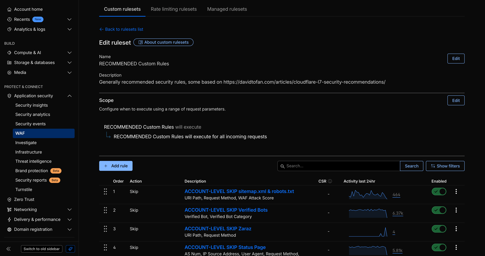
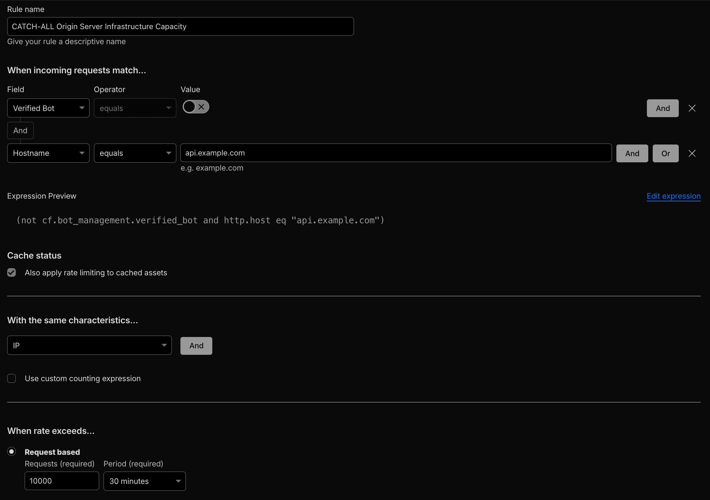
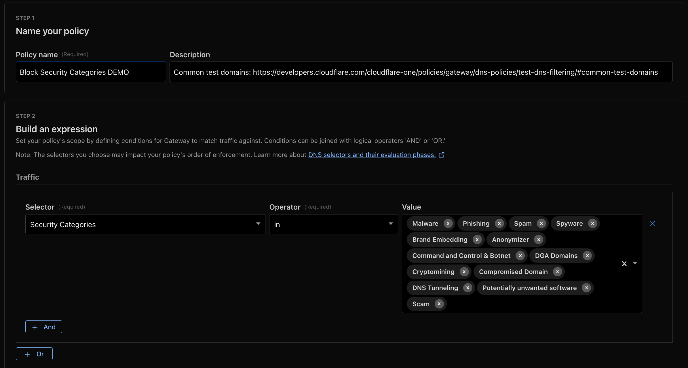
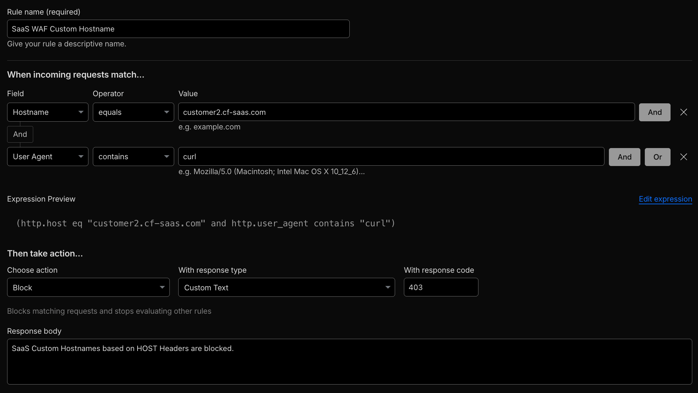
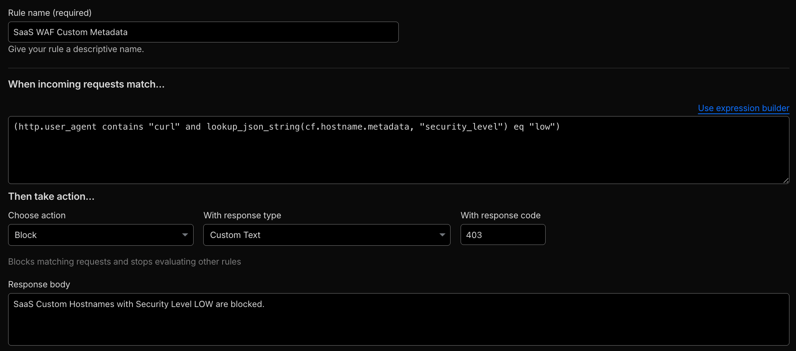
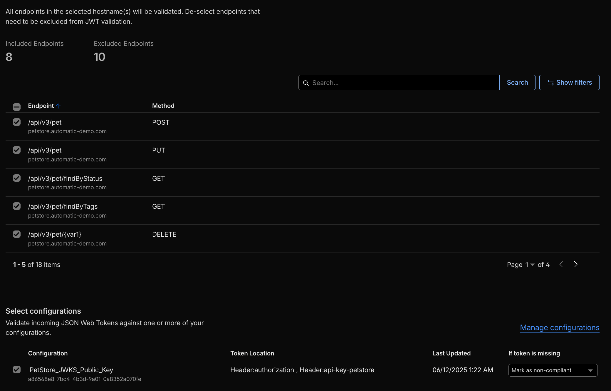
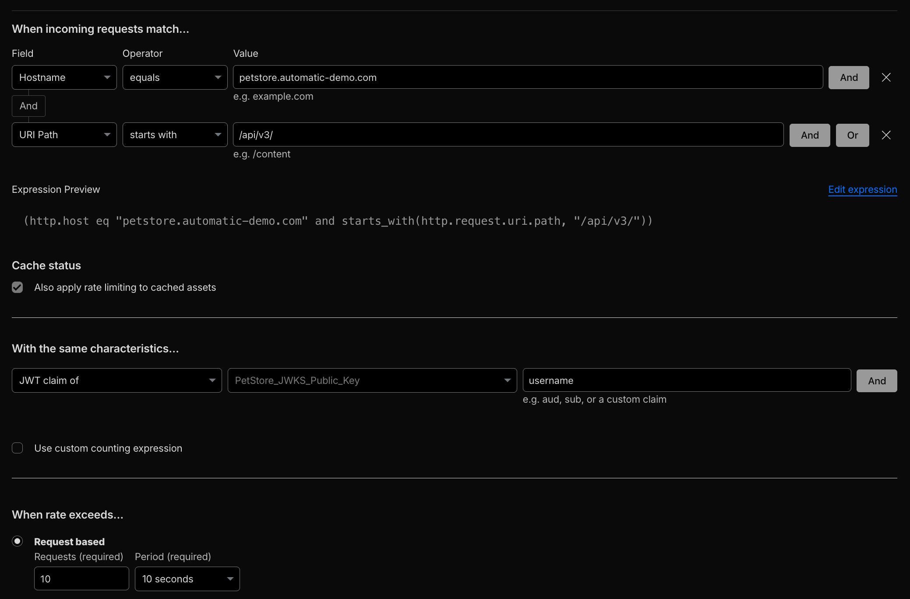
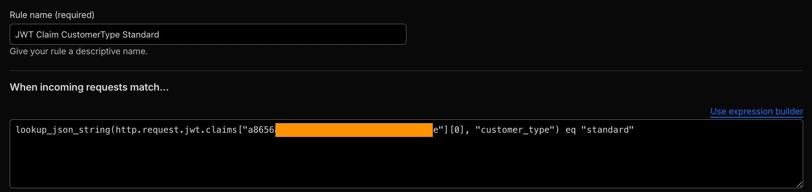
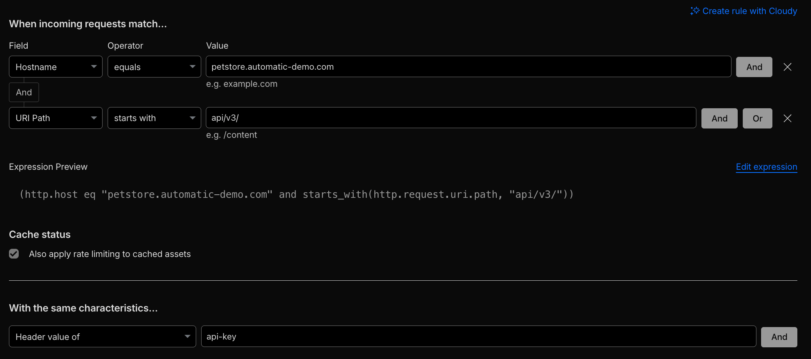

Modern SaaS and platform ecosystems rely on multi-tenant architectures – single infrastructures serving many distinct customers. This design maximizes scalability and efficiency but also centralizes risk: one vulnerability can impact all tenants. A tenant-based security strategy isolates risks, enforces per-customer policy, and maintains predictable control across layers of the stack.

This blueprint defines a practical Cloudflare-based approach to [multitenant](https://www.cloudflare.com/learning/cloud/what-is-multitenancy/) security strategy.

## 1. Foundational Layer: Account-Wide / Global Controls

All platforms begin with shared baseline controls. These global defenses must protect every tenant (user or customer) equally.

**Recommended Controls:**

- **[Account-level WAF](https://developers.cloudflare.com/waf/account/):** Apply managed and custom rulesets at the account layer for consistent protection across all zones and domains.



- **Global Rate Limiting:** Mitigate volumetric or brute-force attacks at the edge before they reach origin.



- **Gateway DNS Policies:** Apply DNS and egress filtering for [Managed Service Providers (MSPs)](https://developers.cloudflare.com/cloudflare-one/traffic-policies/managed-service-providers/) and platform operators.



These global measures define the shared defense surface, ensuring platform-wide protection regardless of tenant segmentation.

## 2. Tenant Isolation at Application Layer

SaaS applications vary widely in their exposure and tenant structure. Application layer controls must map individual requests to specific tenants to apply per-tenant policies (WAF, rate limits, logging). SaaS platforms commonly use one or more signals to identify tenants, such as: _hostnames_, _metadata_, _JWT claims_, _headers_ (`api-key`), or values embedded in request bodies/_payloads_. Below are the most common patterns and their recommended implementations.

### When No Tenant Identifier Exists

**Example scenario:** Tenants share a **common endpoint (for example `api.saas.com`)** and the request does not carry an explicit tenant ID. Therefore, identifiers must be set based on specific logic or derived dynamically.

Ideally, your application provides an explicit tenant identifier. If not, the long-term solution is to **_modify your application logic_** to introduce one. In the interim, you can use the following methods and approaches to derive or retrofit tenant identifiers:

- **Hostname Group Lists:** Use host header ([`http.host`](https://developers.cloudflare.com/ruleset-engine/rules-language/fields/reference/http.host/))-based grouping to map specific hostnames to tenant tiers or categories. Use Cloudflare **[Lists](https://developers.cloudflare.com/waf/tools/lists/#availability)** to manage groups like _free_tier_hostname_group_, which may include hostnames like `customer1.saas.com` and `customer2.saas.com`.

- **[Transform Rules](https://developers.cloudflare.com/rules/transform/):** Inject or append tenant identifiers into query strings or response headers (e.g., add `?tenant=enterprise` or `X-Customer-Tier: enterprise`), using supported [filter expressions](https://developers.cloudflare.com/rules/transform/url-rewrite/reference/fields-functions/), so later rules can use them. Verify execution order with the [phases list](https://developers.cloudflare.com/ruleset-engine/reference/phases-list/).

- **Rate limiting based on Header Value:** Use the [characteristics](https://developers.cloudflare.com/waf/rate-limiting-rules/parameters/#with-the-same-characteristics) `Header Value Of` to apply throttling keyed to an API key (e.g. `api-key`) or tenant header.

- **Rate limiting using Response Headers:** Increment counters based on response headers added by origin or backend logic (e.g., `X-Tenant-ID: TenantID#1234`) via the [increment counter](https://developers.cloudflare.com/waf/rate-limiting-rules/parameters/#increment-counter-when) option.

These methods allow you to retrofit tenant signals into a shared endpoint without changing client URLs.

### Vanity / Custom Hostnames as Tenant Identifier

**Example scenario:** Each tenant has a distinct hostname, vanity hostname or custom hostname (e.g., `customer1.saas.com` or `saas.customer1.com`). Related Case Study: [Shopify](https://www.cloudflare.com/case-studies/shopify/).

When vanity domains or custom hostnames are in play, leverage **[Cloudflare for SaaS](https://developers.cloudflare.com/cloudflare-for-platforms/cloudflare-for-saas/)** to attach **[Custom Metadata](https://developers.cloudflare.com/cloudflare-for-platforms/cloudflare-for-saas/domain-support/custom-metadata/)** and use **[host headers](https://developers.cloudflare.com/ruleset-engine/rules-language/fields/reference/http.host/)** as tenant signals:

- Use the request **host header `http.host`** in WAF and Rate Limiting expressions.



```bash
# Demo
curl https://customer2.cf-saas.com
```

- Attach per-tenant **Custom Metadata** to custom hostnames and reference that metadata in security rules:



```
(http.user_agent contains "curl" and lookup_json_string(cf.hostname.metadata, "security_level") eq "low")
```

```bash
# Demo
curl https://customer1.cf-saas.com
```

```
lookup_json_string(cf.hostname.metadata, "tier") eq "enterprise"
```

> Custom Metadata is evaluated before the WAF [phase](https://developers.cloudflare.com/ruleset-engine/reference/phases-list/), making it suitable for attaching metadata consumed directly by security rules.

### JWT-Based Controls

**Example scenario:** Shared API endpoint (`api.saas.com`) where requests carry JSON Web Tokens (JWTs) in `Authorization: Bearer wyJhbGc...`, which includes JWT claims from the [JSON Web Keys (JWKs)](https://mkjwk.org/).

Use JWT validation and JWT claims for authentication, authorization, and per-tenant policy:

- **API Shield [JWT Validation](https://developers.cloudflare.com/api-shield/security/jwt-validation/):** Validate tokens directly at the edge. For custom validation logic, use [Workers JWT Validation](https://developers.cloudflare.com/api-shield/security/jwt-validation/jwt-worker/) or lightweight [Snippets](https://developers.cloudflare.com/rules/snippets/examples/jwt-validation/).



```bash
# Demo
curl -I https://petstore.automatic-demo.com/api/v3/pet/findByStatus
```

- **Rate limiting by JWT claims:** Enforce thresholds and quotas using [custom JWT claims](https://developers.cloudflare.com/waf/rate-limiting-rules/parameters/#requirements-for-using-claims-inside-a-json-web-token-jwt) (e.g., `tenant_id`, `user_tier` claims).

_Example JWT payload ([Petstore serverless API](https://petstore.automatic-demo.com/) for reference):_

```json
{
  "iss": "https://petstore.automatic-demo.com",
  "aud": "petstore",
  "sub": "user2",
  "exp": 1762698083,
  "iat": 1762697183,
  "username": "user2",
  "customer_type": "standard",
  "customer": {
    "username": "user2",
    "customer_type": "standard",
    "email": "user2@example.com",
    "company": null,
    "subscription_tier": null
  }
}
```



- **WAF custom rules using JWT claims:** Use [`lookup_json_string`](https://developers.cloudflare.com/ruleset-engine/rules-language/functions/#lookup_json_string) together with [`http.request.jwt.claims`](https://developers.cloudflare.com/ruleset-engine/rules-language/fields/reference/?search-term=http.request.jwt.claims) to match against claim values.



```
lookup_json_string(http.request.jwt.claims["<TOKEN_CONFIGURATION_ID>"][0], "customer_type") eq "standard"
```

_For nested JSON values:_

```
lookup_json_string(http.request.jwt.claims["<TOKEN_CONFIGURATION_ID>"][0], "customer", "username") == "user2"
```

- **[Transform Rules](https://developers.cloudflare.com/api-shield/security/jwt-validation/transform-rules/):** Forward selected JWT claims (e.g., `tenant_id`) as HTTP headers to the origin server for additional server-side validation, custom logic, or logging.

### Request Header or API-Key Identification

**Example scenario:** Shared API endpoint (`api.saas.com`) where tenants are distinguished by request headers such as `api-key`, `X-Tenant-ID`, or `X-User-ID`.

Implementation notes:

- Inspect **[request header fields](https://developers.cloudflare.com/ruleset-engine/rules-language/fields/reference/?search-term=request&field-category=Headers)** to apply WAF and Rate Limiting selectively.

- For per-tenant throttling, configure rate limiting with the `Header Value Of` [characteristic](https://developers.cloudflare.com/waf/rate-limiting-rules/parameters/#with-the-same-characteristics) using the **`api-key` header** so quotas are applied per API key.



```bash
# Demo
for i in {1..400}; do
  curl -s -o /dev/null -w "%{http_code}\n" -H "api-key: something" -I "https://petstore.automatic-demo.com/api/v3/"
done
```

### Request Payload / Body

**Example scenario:** Shared API endpoint (`api.saas.com`) where tenant identifier is carried inside request body JSON or form data (e.g. `{"identifier":"TenantID#123", "data1":"content_here"}`).

Use body- / payload-aware rules to extract tenant identifiers and make decisions at the edge:

- Use **[`lookup_json_string`](https://developers.cloudflare.com/ruleset-engine/rules-language/functions/#lookup_json_string)** and **[body fields](https://developers.cloudflare.com/ruleset-engine/rules-language/fields/reference/?field-category=Body)** to match JSON bodies.

```
lookup_json_string(http.request.body.raw, "identifier") eq "TenantID#123"
```

- For multipart or form submissions (structured data), also consider **[`http.request.body.multipart`](https://developers.cloudflare.com/ruleset-engine/rules-language/fields/reference/?search-term=http.request.body.multipart&field-category=Body)** and **[`http.request.body.form`](https://developers.cloudflare.com/ruleset-engine/rules-language/fields/reference/?search-term=http.request.body.form&field-category=Body)** fields.

## 2.1 Tenant Isolation at Application Layer: Practical Summary Table

| Tenant Identification Pattern      | Example Scenario                                                                      | Cloudflare Implementation / Recommendation                                                                                                                          |
| ---------------------------------- | ------------------------------------------------------------------------------------- | ------------------------------------------------------------------------------------------------------------------------------------------------------------------- |
| **No Tenant Identifier / Derived** | Shared endpoint (`api.saas.com`) with no built-in tenant ID                           | **Modify Application Logic** to embed tenant IDs; Hostname Group Lists; Transform Rules to inject headers/query strings; Rate Limiting by Header or Response Header |
| **Vanity / Custom Hostnames**      | Tenant-specific hostnames (`customer1.saas.com` / `saas.customer1.com`)               | Cloudflare for SaaS Custom Metadata; `http.host` signals; tier-based WAF rules; per-tenant rate limits                                                              |
| **JWT Claims**                     | Shared API endpoint with `Authorization: Bearer ...` token containing tenant claims   | API Shield JWT Validation; WAF rules using `http.request.jwt.claims`; Transform Rules to forward claims; Rate Limiting by JWT claim                                 |
| **Request Header / API Key**       | Headers like `api-key` or `X-Tenant-ID` identify tenants                              | WAF selective rules on header fields; Rate Limiting using `Header Value Of` characteristic keyed to API key                                                         |
| **Request Payload / Body**         | JSON or form data contains tenant identifiers (e.g., `{"identifier":"TenantID#123"}`) | `lookup_json_string()` on `http.request.body.raw`, `http.request.body.form`, or `http.request.body.multipart` for conditional WAF or rate limiting rules            |

## 3. Tenant-Level Observability

Security enforcement is only as effective as its visibility. Observe tenant-specific behavior to maintain isolation and accountability.

- **[Security Analytics](https://developers.cloudflare.com/waf/analytics/security-analytics/) and [Security Events](https://developers.cloudflare.com/waf/analytics/security-events/):** Track attack vectors and request patterns, and depending on the identifier also per tenant.
- **[Log Explorer](https://developers.cloudflare.com/log-explorer/):** Query logs directly within the Cloudflare dashboard or create [custom dashboard](https://developers.cloudflare.com/log-explorer/custom-dashboards/) by tenant.
- **[Logpush](https://developers.cloudflare.com/logs/logpush/) with [Custom Fields](https://developers.cloudflare.com/logs/logpush/logpush-job/custom-fields/):** Export tenant identifiers or headers for correlation in external SIEM systems.
- **[GraphQL Analytics API](https://developers.cloudflare.com/analytics/graphql-api/):** Build dashboards filtered by hostname, metadata, or tenant ID for real-time insight.
- **[Custom Hostname Analytics](https://developers.cloudflare.com/cloudflare-for-platforms/cloudflare-for-saas/hostname-analytics/):** Available for Cloudflare for SaaS customers to monitor vanity domain usage.

Observability must match enforcement granularity. Always verify execution order using the [phases](https://developers.cloudflare.com/ruleset-engine/reference/phases-list/) list.

## 4. Developer Platform (Customization)

Platform providers offering custom code execution environments for tenants must enforce strict sandboxing. Use **[Workers for Platforms](https://developers.cloudflare.com/cloudflare-for-platforms/workers-for-platforms/) (WfP)** to isolate tenant workloads securely.

- **[Dynamic Dispatch Worker](https://developers.cloudflare.com/cloudflare-for-platforms/workers-for-platforms/get-started/dynamic-dispatch/):** Routes requests to tenant [User Workers](https://developers.cloudflare.com/cloudflare-for-platforms/workers-for-platforms/get-started/user-workers/), handles authentication, sanitizes responses.
- **[Outbound Workers](https://developers.cloudflare.com/cloudflare-for-platforms/workers-for-platforms/configuration/outbound-workers/):** Restrict and control outbound (egress) traffic to prevent data exfiltration.
- **[Rate Limiting API](https://developers.cloudflare.com/workers/runtime-apis/bindings/rate-limit/):** Enforce per-tenant or per-function throughput within Workers.
- **[Workers Analytics Engine](https://developers.cloudflare.com/analytics/analytics-engine/) (WAE):** Track tenant usage and detect anomalies. **[Alternative storage solutions](https://developers.cloudflare.com/workers/platform/storage-options/)** are available; one recommended one is [Cloudflare D1 SQLite database](https://developers.cloudflare.com/d1/platform/limits/), which supports millions to tens of millions of isolated databases per account.

> No tenant code executes without boundary [isolation](https://developers.cloudflare.com/workers/reference/how-workers-works/).

In terms of observability:

- [Workers Observability](https://developers.cloudflare.com/workers/observability/), which includes metrics and analytics, [Logs](https://developers.cloudflare.com/workers/observability/logs/), and more.
- Build your own with [Tail Workers](https://developers.cloudflare.com/workers/observability/logs/tail-workers/) and/or [Workers Analytics Engine (WAE)](https://developers.cloudflare.com/analytics/analytics-engine/).
- When using [Custom Domain / Routes](https://developers.cloudflare.com/workers/configuration/routing/), one also benefits from the HTTP/S Application Services visibility.

## 5. Security Framework Summary

| Layer              | Goal                                 | Cloudflare Mechanism                                                   |
| ------------------ | ------------------------------------ | ---------------------------------------------------------------------- |
| Account            | Shared baseline                      | Account-level WAF, Rate Limiting, Gateway DNS                          |
| Application        | Tenant differentiation               | Metadata, JWT, API Key, Headers, Tier Logic                            |
| Observability      | Tenant visibility                    | Logpush, Analytics, GraphQL                                            |
| Developer Platform | Tenant execution & storage isolation | Workers for Platforms, Rate Limit API, D1 SQLite, Durable Objects (DO) |

### Operational Checklist & Recommended Practices

- [ ] Map tenant-identifiers: decide which signal(s) will be canonical (host, metadata, JWT claim, header, body).
- [ ] Apply account-level WAF & global rate limits as default deny/mitigation quotas.
- [ ] Implement metadata for vanity hostnames using Cloudflare for SaaS where possible.
- [ ] Validate JWTs at the edge, and extract tenant claims for rate limiting and logging.
- [ ] Use `Header Value Of` for per-key rate limiting when APIs rely on API keys.
- [ ] Use Transform Rules to normalize or inject tenant context when clients or application-logic cannot be changed.
- [ ] Ensure logs and exported fields include tenant identifiers for SIEM correlation (Logpush custom fields).
- [ ] Test rule execution order using the [phases list](https://developers.cloudflare.com/ruleset-engine/reference/phases-list/).
- [ ] For platforms exposing tenant code, enforce egress control, per-tenant rate limits, and ephemeral storage constraints.
- [ ] Periodically drill incident simulations that measure detection, containment, and tenant notification flows.

## **Result**

Tenant-aware security transforms Cloudflare's global edge into an adaptive programmable enforcement and execution fabric: distributed, per-tenant isolated, and resilient. Shared infrastructure stays shared in design, not in exposure. The result is predictable, auditable tenant isolation with the operational controls needed for SaaS and platform providers.

### Additional Options and Resources

- [DNS Tenant Custom Nameservers (TCNS)](https://developers.cloudflare.com/dns/nameservers/custom-nameservers/tenant-custom-nameservers/)
- [AI Search Multitenancy](https://developers.cloudflare.com/ai-search/how-to/multitenancy/)
- [Protect ISP and telecommunications networks from DDoS attacks](https://developers.cloudflare.com/reference-architecture/diagrams/network/protecting-sp-networks-from-ddos/)
- [Durable Objects as Micro-Databases](https://boristane.com/blog/durable-objects-graph-databases/)

---

## Disclaimer

Educational purposes only.

This blog post is independently created and is not affiliated with, endorsed by, or necessarily representative of the views or opinions of any organizations or services mentioned herein.

The images used in this article primarily consist of screenshots from the Cloudflare Dashboard or other publicly available materials, such as Cloudflare webinar slides.

The author of this post is not responsible for any misconfigurations, errors, or unintended consequences that may arise from implementing the guidelines or recommendations discussed herein. You assume full responsibility for any actions taken based on this content and for ensuring that configurations are appropriate for your specific environment and use case.
