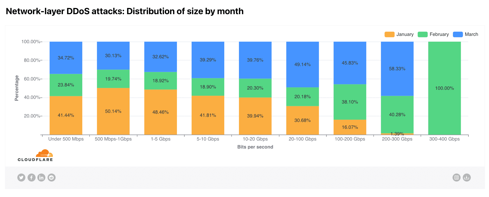

Let's take a look at the [Cloudflare Radar](https://radar.cloudflare.com/).

* * *

## Cloudflare Radar

The Cloudflare Radar shares insights on data and attack trends across the Cloudflare network.

_Each second, Cloudflare handles on average 18 million HTTP requests and 6 million DNS requests. With 1 billion unique IP addresses connecting to Cloudflare’s network we have one of the most representative views on Internet traffic worldwide._

_And by blocking 72 billion cyberthreats every day Cloudflare also has a unique position in understanding and mitigating Internet threats._ – Source: [Introducing Cloudflare Radar](https://blog.cloudflare.com/introducing-cloudflare-radar/)

Meanwhile (as of August 2022), Cloudflare is blocking an average of 124 billion cyber threats per day.

Check it out and see if you can find your own website: [davidtofan.com](https://radar.cloudflare.com/domains/domain/davidtofan.com)

Furthermore, since **Alexa Rankings** is no more, say hi to the [Cloudflare Radar Domain Rankings](https://blog.cloudflare.com/radar-domain-rankings/), as well as the [Internet Outages Map](https://radar.cloudflare.com/outage-center).

### DDoS attack trends

Another interesting thing, every Quarter, Cloudflare releases a report on the latest [DDoS attack trends](https://radar.cloudflare.com/reports?q=DDoS).

_Image Source: [DDoS attack trends](https://radar.cloudflare.com/reports?q=DDoS)_

### Verified Bots

Cloudflare published a more detailed list on [Verified Bots](https://radar.cloudflare.com/traffic/verified-bots) on Cloudflare Radar.

The data on the list is updated in real time, and we'll be able to see [Bot Tags](https://developers.cloudflare.com/bots/concepts/cloudflare-bot-tags/), which provide more _detail about why Cloudflare assigned a bot score to a request_.

### ASN

Cloudflare opens up more data, specifically data about [Autonomous System Numbers (ASN)](https://blog.cloudflare.com/asn-on-radar/): _"a group of routable IP prefixes belonging to a single entity, and is one of the key building blocks of the Internet"_.

For example: [radar.cloudflare.com/traffic/as3209](https://radar.cloudflare.com/traffic/as3209)

### Future Improvements

It would be great to see more data become available at some point in the future, as well as to be able to use that data via API – essentially an open / public API.

Stay tuned for updates!

### Help Improve

Go to [radar.cloudflare.com/domains/feedback](https://radar.cloudflare.com/domains/feedback) in order to provide Domain Categorization Feedback.

* * *

## Disclaimer

Educational purposes only, and this blog post does not necessarily reflect the opinions of Cloudflare. This is not legal advice. There are many more aspects to Cloudflare and its products and services – this is merely a brief educational intro. Properly inform yourself, keep learning, keep testing, and feel free to share your learnings and experiences as I do. Hope it was helpful! Images are online and publicly accessible.
