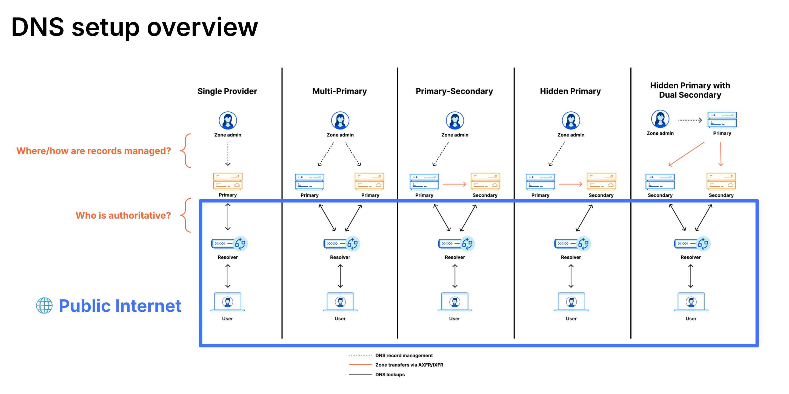

Cloudflare separates its **[Control Plane](https://www.cloudflare.com/learning/network-layer/what-is-the-control-plane/)** (management/[API](https://developers.cloudflare.com/api/)/Dashboard) from its **Data Plane** ([traffic flow](https://developers.cloudflare.com/fundamentals/concepts/traffic-flow-cloudflare/)/Edge), ensuring traffic continues to flow even if the management dashboard is unavailable. Cloudflare's global anycast [network](https://www.cloudflare.com/network/) is architected for resilience – every server in every data center shares the same tech stack and announces IP addresses via [anycast](https://www.cloudflare.com/learning/cdn/glossary/anycast-network/), providing inherent redundancy.

While Cloudflare strives for maximum [resilience](https://blog.cloudflare.com/18-november-2025-outage/) – constantly improving through learning and innovation – some customers require documented contingency ("break glass") strategies to meet risk compliance, regulatory, or sovereignty requirements. This document provides a high-level introduction to architectural patterns for designing failover capabilities while maintaining security posture.

**The goal is not to offboard from Cloudflare, but to provide a potential safety net (backup plan) that allows customers to rely on the platform with confidence.**

## Critical Self-Risk Assessment

Before activating any bypass strategy or failover plan, organizations must answer:

> **At what point does the security risk of exposing infrastructure outweigh the downtime of waiting for service restoration?**

Considerations:

- **Loss of WAF/DDoS protection**: Disabling Cloudflare [exposes origin IPs](https://developers.cloudflare.com/fundamentals/security/protect-your-origin-server/) directly to the Internet.
- **Integration breakage**: Third-party scripts and integrations, Workers, Load Balancing logic, and SaaS integrations may fail – if they are also using Cloudflare.
- **Attack surface exposure**: Malicious actors monitor DNS changes; bypassing protections during outages creates potential exploitation windows.
- **Operational cost**: Maintaining parallel infrastructure, training staff on multiple platforms, and designing applications for vendor-agnostic operation requires significant investment, time and additional resources.

For most organizations, the answer is: **wait for service restoration**. The cost of maintaining bypass / a backup infrastructure, the security risk of exposure, and the complexity of [multi-vendor](https://developers.cloudflare.com/reference-architecture/architectures/multi-vendor/) operations exceeds the cost of brief service degradation.

## Part 1: Application Services (Reverse Proxy / CDN / WAF)

The primary mechanism for circumventing [Cloudflare reverse proxy](https://developers.cloudflare.com/fundamentals/concepts/how-cloudflare-works/) for application traffic relies on [DNS architecture](https://developers.cloudflare.com/dns/zone-setups/) and origin security.

### Diagram: Emergency Bypass Flow

```
┌────────────────────────────────────────────────────────────────────────────┐
│                           DNS RESOLUTION LAYER                             │
├────────────────────────────────────────────────────────────────────────────┤
│                                                                            │
│    User ──► DNS Query ──► Authoritative DNS                                │
│                               │                                            │
│              ┌────────────────┴────────────────┐                           │
│              ▼                                 ▼                           │
│    ┌─────────────────────┐          ┌─────────────────────┐                │
│    │   PATH A: STANDARD  │          │  PATH B: EMERGENCY  │                │
│    │   (Recommended)     │          │  (Contingency)      │                │
│    └─────────┬───────────┘          └─────────┬───────────┘                │
│              ▼                                 ▼                           │
│    Cloudflare Anycast IPs           Backup Provider IP                     │
│              │                      OR Direct Origin IP                    │
│              ▼                                 │                           │
│    ┌─────────────────────┐                     │                           │
│    │  Cloudflare Edge    │                     │                           │
│    │  • DDoS Protection  │                     │                           │
│    │  • Bot Management   │                     │                           │
│    │  • WAF              │                     │                           │
│    │  • Rate Limiting    │                     │                           │
│    │  • CDN/Cache        │                     │                           │
│    └─────────┬───────────┘                     │                           │
│              │                                 │                           │
│              └────────────┬────────────────────┘                           │
│                           ▼                                                │
│                    Origin Server(s)                                        │
│                    (Must have publicly trusted TLS certs)                  │
│                                                                            │
└────────────────────────────────────────────────────────────────────────────┘

DECISION POINT: Switch occurs at the Authoritative DNS layer
```

### Architecture Components & Failover Steps

| Component             | Resiliency Strategy                                                                                                                                                                                                                                                                                                                                             | Failure Scenario Action ("Break glass")                                                                                                                                                                                                                             |
| --------------------- | --------------------------------------------------------------------------------------------------------------------------------------------------------------------------------------------------------------------------------------------------------------------------------------------------------------------------------------------------------------- | ------------------------------------------------------------------------------------------------------------------------------------------------------------------------------------------------------------------------------------------------------------------- |
| **Management**        | Infrastructure as Code (IaC): Manage configurations via [API](https://developers.cloudflare.com/fundamentals/api/get-started/account-owned-tokens/) / [Terraform](https://developers.cloudflare.com/terraform/) instead of Dashboard UI. Use [CI/CD](https://developers.cloudflare.com/workers/ci-cd/) pipelines.                                               | If Dashboard (Control Plane) is unavailable, API often remains operational. Use pipelines to rollback or push bypass configs.                                                                                                                                       |
| **Domain Registrar**  | **Decoupled Registrar**: Keep [Domain Registrar](https://developers.cloudflare.com/registrar/) separate from Cloudflare.                                                                                                                                                                                                                                        | Ultimate control point. Ensures capability to change [Nameserver (NS) records](https://developers.cloudflare.com/dns/nameservers/) even if Cloudflare is entirely unreachable.                                                                                      |
| **DNS (CNAME Setup)** | Use external Authoritative DNS (Route53, Azure DNS) and CNAME specific subdomains to Cloudflare. Take into account [DNSSEC](https://developers.cloudflare.com/dns/zone-setups/zone-transfers/cloudflare-as-secondary/dnssec-for-secondary/).                                                                                                                    | [Remove CNAME record](https://developers.cloudflare.com/dns/zone-setups/partial-setup/setup/#3-add-dns-records) pointing to `cdn.cloudflare.net` and replace with A/CNAME record pointing to origin or backup provider.                                             |
| **DNS (Full Setup)**  | Configure [Secondary DNS](https://developers.cloudflare.com/dns/zone-setups/zone-transfers/cloudflare-as-secondary/) provider with [zone transfers](https://developers.cloudflare.com/dns/zone-setups/zone-transfers/). Take into account [DNSSEC](https://developers.cloudflare.com/dns/zone-setups/zone-transfers/cloudflare-as-primary/dnssec-for-primary/). | If Cloudflare are nameservers unresponsive, secondary provider answers queries. Requires zone synchronization.                                                                                                                                                      |
| **Origin Security**   | **Publicly Trusted Certificates**: Ensure origins have valid, publicly trusted SSL/TLS certificates (not Cloudflare-issued Certificates only).                                                                                                                                                                                                                  | Critical: If disabling Cloudflare, origin (or backup provider) must terminate TLS directly without certificate errors. Using a [Custom Certificate](https://developers.cloudflare.com/ssl/edge-certificates/custom-certificates/) can be advantageous in this case. |
| **CDN/Proxy**         | [Multi-vendor architecture](https://developers.cloudflare.com/reference-architecture/architectures/multi-vendor/) (Primary-Fallback or Active-Active) for those who can afford operational complexity.                                                                                                                                                          | Route traffic to backup CDN / security provider via DNS steering.                                                                                                                                                                                                   |

### DNS Setup Options



**Option 1: [CNAME (Partial) Setup](https://developers.cloudflare.com/dns/zone-setups/partial-setup/)**

- Use an external Authoritative DNS provider.
- [Proxy](https://developers.cloudflare.com/dns/proxy-status/) only specific hostnames via Cloudflare.
- Fastest failover: [remove CNAME](https://developers.cloudflare.com/dns/zone-setups/partial-setup/setup/#3-add-dns-records), point to origin/backup.
- [DNS TTL](https://developers.cloudflare.com/dns/manage-dns-records/reference/ttl/)-dependent propagation for change.

**Option 2: Secondary DNS with Override**

- Cloudflare as [Primary or Secondary](https://developers.cloudflare.com/dns/zone-setups/zone-transfers/).
- Zone transfers maintain synchronization.
- [Secondary DNS Override](https://developers.cloudflare.com/dns/zone-setups/zone-transfers/cloudflare-as-secondary/proxy-traffic/) enables proxying specific records.
- Provides DNS-level redundancy.

**Option 3: [Full Setup](https://developers.cloudflare.com/dns/zone-setups/full-setup/) (Cloudflare Authoritative)**

- Weigh trade-off when [unproxying](https://developers.cloudflare.com/dns/proxy-status/#dns-only-records): exposed [origin IPs should be rotated](https://developers.cloudflare.com/learning-paths/prevent-ddos-attacks/advanced/protect-origin-ip/#rotate-ip-addresses) post-incident.
- Consider accepting (unlikely) temporary unavailability vs. security exposure, in the unlikely event that Cloudflare suffers a serious incident.
- May be preferable to wait for restoration rather than expose infrastructure.

### Multi-Vendor Architecture Options

For organizations with resources to maintain parallel infrastructure:

```
┌─────────────────────────────────────────────────────────────────────────────┐
│                    MULTI-VENDOR DNS LOAD BALANCING                          │
├─────────────────────────────────────────────────────────────────────────────┤
│                                                                             │
│                      External DNS Provider                                  │
│                      (Route53 / Azure DNS)                                  │
│                             │                                               │
│            ┌────────────────┴────────────────┐                             │
│            ▼                                 ▼                             │
│   ┌─────────────────┐               ┌─────────────────┐                    │
│   │   Cloudflare    │               │  Backup Vendor  │                    │
│   │   (Primary)     │               │  (Fallback)     │                    │
│   │                 │               │                 │                    │
│   │  Full feature   │               │  Baseline       │                    │
│   │  set enabled    │               │  protection     │                    │
│   └────────┬────────┘               └────────┬────────┘                    │
│            │                                 │                             │
│            └────────────┬────────────────────┘                             │
│                         ▼                                                   │
│                   Origin Server(s)                                          │
│                                                                             │
│   Traffic Distribution: Health-check based, performance-based,             │
│                         or weighted round-robin                            │
│                                                                             │
└─────────────────────────────────────────────────────────────────────────────┘
```

**Configuration Management**: Maintain parity via Terraform across providers. [API](https://developers.cloudflare.com/fundamentals/api/get-started/account-owned-tokens/)-first approach enables automated synchronization.

---

## Part 2: SASE (Zero Trust) & Network Services

For Zero Trust ([WARP Device Client](https://developers.cloudflare.com/cloudflare-one/team-and-resources/devices/warp/) / [Secure Web Gateway](https://developers.cloudflare.com/cloudflare-one/traffic-policies/)) and Network services ([Magic Transit](https://developers.cloudflare.com/magic-transit/)), contingency planning can be more complex as these services are deeply integrated into employee workflows and network infrastructure.

### Diagram: SASE Failover Logic

```
┌───────────────────────────────────────────────────────────────────────────┐
│                     ZERO TRUST FAILOVER DECISION TREE                     │
├───────────────────────────────────────────────────────────────────────────┤
│                                                                           │
│                        ┌─────────────────┐                                │
│                        │  WARP Client    │                                │
│                        │  (User Device)  │                                │
│                        └────────┬────────┘                                │
│                                 │                                         │
│                        ┌────────▼────────┐                                │
│                        │ Service Status? │                                │
│                        └────────┬────────┘                                │
│                    ┌────────────┴────────────┐                            │
│                    ▼                         ▼                            │
│           ┌──────────────┐          ┌──────────────┐                      │
│           │    NORMAL    │          │   FAILURE    │                      │
│           └──────┬───────┘          └──────┬───────┘                      │
│                  ▼                         │                              │
│    ┌─────────────────────┐      ┌──────────┴──────────┐                   │
│    │   WARP Tunnel       │      ▼                     ▼                   │
│    │        │            │  ┌─────────┐        ┌──────────┐               │
│    │        ▼            │  │FAIL OPEN│        │FAIL CLOSE│               │
│    │ Cloudflare Gateway  │  │(Trigger)│        │(Default) │               │
│    │        │            │  └────┬────┘        └────┬─────┘               │
│    │        ▼            │       ▼                  ▼                     │
│    │ Internet / Company  │  Direct Internet     Block All                 │
│    │ Applications        │  (No filtering)      Traffic                   │
│    └─────────────────────┘  HIGH AVAILABILITY   HIGH SECURITY             │
│                             LOW SECURITY        ZERO AVAILABILITY         │
│                                                                           │
└───────────────────────────────────────────────────────────────────────────┘

┌─────────────────────────────────────────────────────────────────────────────┐
│                      MAGIC TRANSIT FAILOVER                                 │
├─────────────────────────────────────────────────────────────────────────────┤
│                                                                             │
│    Normal State:                                                            │
│    Customer IP Prefix ──► Cloudflare BGP Announcement ──► DDoS Scrubbing    │
│                                ──► GRE / IPsec Tunnel ──► Customer Network  │
│                                                                             │
│    Failure State:                                                           │
│    Withdraw BGP from Cloudflare ──► Announce via ISP directly               │
│                                                                             │
│    ⚠ WARNING: Direct ISP announcement removes Cloudflare DDoS protection    │
│                                                                             │
└─────────────────────────────────────────────────────────────────────────────┘
```

### Architecture Components & Failover Steps

| Component                                     | Resiliency Strategy                                                                                                                                                                                                                                                                                                                                                                                                         | Failure Scenario Action ("Break glass")                                                                                                                                                                                                                                                                                                                                                                                                                                                                                                                                                                                                                                                                                                                                                                                                                                                                                                          |
| --------------------------------------------- | --------------------------------------------------------------------------------------------------------------------------------------------------------------------------------------------------------------------------------------------------------------------------------------------------------------------------------------------------------------------------------------------------------------------------- | ------------------------------------------------------------------------------------------------------------------------------------------------------------------------------------------------------------------------------------------------------------------------------------------------------------------------------------------------------------------------------------------------------------------------------------------------------------------------------------------------------------------------------------------------------------------------------------------------------------------------------------------------------------------------------------------------------------------------------------------------------------------------------------------------------------------------------------------------------------------------------------------------------------------------------------------------ |
| **Client Agent (WARP)**                       | Mobile Device Management (MDM) [Managed Deployment](https://developers.cloudflare.com/cloudflare-one/team-and-resources/devices/warp/deployment/mdm-deployment/): Deploy WARP via Intune / Jamf to retain control over agent state. Or use the [Cloudflare API](https://developers.cloudflare.com/api/resources/zero_trust/subresources/devices/) for configuration changes.                                                | Push MDM command to [change mode](https://developers.cloudflare.com/cloudflare-one/team-and-resources/devices/warp/configure-warp/warp-modes/#device-information-only) or trigger [fail-open](https://developers.cloudflare.com/cloudflare-one/team-and-resources/devices/warp/configure-warp/warp-settings/#global-warp-override) via [API](https://developers.cloudflare.com/api/resources/zero_trust/subresources/devices/subresources/resilience/subresources/global_warp_override/methods/create/) or (worst-case [remove](https://developers.cloudflare.com/cloudflare-one/team-and-resources/devices/warp/remove-warp/)) WARP. Note: Removes all Zero Trust [traffic policies](https://developers.cloudflare.com/cloudflare-one/traffic-policies/).<br>**Fail Open**: Users access Internet directly (availability, low security). <br>**Fail Close (default behavior)**: Users blocked until recovery (high security, low availability). |
| **Internal Connectivity (Cloudflare Tunnel)** | High Availability (HA) [Replicas](https://developers.cloudflare.com/cloudflare-one/networks/connectors/cloudflare-tunnel/configure-tunnels/tunnel-availability/): Deploy multiple `cloudflared` instances across servers for local redundancy. Additionally, use a fallback connectivity mechanism (other VPN) to allow to connect to the internal resources.                                                               | Activate "Shadow VPN" (legacy connector). Users disconnect WARP and connect to dormant legacy VPN (i.e. OpenVPN). Alternatively, via the Public Internet.                                                                                                                                                                                                                                                                                                                                                                                                                                                                                                                                                                                                                                                                                                                                                                                        |
| **Authentication (Access)**                   | Token Lifecycle: Adjust [session duration (JWT)](https://developers.cloudflare.com/cloudflare-one/access-controls/access-settings/session-management/) to balance security vs. resilience and user-experience.                                                                                                                                                                                                              | "Shadow VPN" must authenticate directly against the [Identity Provider (IdP)](https://developers.cloudflare.com/cloudflare-one/integrations/identity-providers/), circumventing Cloudflare Access during outage. It is also recommended to have a [backup IdP](https://developers.cloudflare.com/fundamentals/manage-members/dashboard-sso/#bypass-dashboard-sso).                                                                                                                                                                                                                                                                                                                                                                                                                                                                                                                                                                               |
| **Private DNS**                               | Internal [private hostnames](https://developers.cloudflare.com/cloudflare-one/networks/connectors/cloudflare-tunnel/private-net/cloudflared/connect-private-hostname/) resolve via WARP (exposing [Private DNS](https://developers.cloudflare.com/cloudflare-one/networks/connectors/cloudflare-tunnel/private-net/cloudflared/private-dns/) or using [Internal DNS](https://developers.cloudflare.com/dns/internal-dns/)). | "Shadow VPN" server must push internal DNS resolvers that resolve to local LAN IPs (RFC1918) instead.                                                                                                                                                                                                                                                                                                                                                                                                                                                                                                                                                                                                                                                                                                                                                                                                                                            |
| **Publicly Exposed Apps and SaaS**            | IP Allowlisting with [Dedicated Egress IPs](https://developers.cloudflare.com/cloudflare-one/traffic-policies/egress-policies/dedicated-egress-ips/) for SaaS apps, and [Access](https://developers.cloudflare.com/cloudflare-one/access-controls/policies/) authentication for [self-hosted apps](https://developers.cloudflare.com/cloudflare-one/access-controls/applications/http-apps/).                               | Configure origin firewall to allow traffic from "Shadow VPN" NAT IP or specific Admin IPs. Allow access via direct IP or backup hostname.                                                                                                                                                                                                                                                                                                                                                                                                                                                                                                                                                                                                                                                                                                                                                                                                        |
| **Magic Transit**                             | BGP Control & Redundancy: [GRE / IPsec tunnels](https://developers.cloudflare.com/magic-transit/reference/gre-ipsec-tunnels/) to diverse PoPs, maintain backup ISP paths. In addition, consider [Network Interconnect (CNI)](https://developers.cloudflare.com/network-interconnect/) (peering) for dedicated links.                                                                                                        | [Withdraw BGP prefixes](<(https://developers.cloudflare.com/magic-transit/how-to/advertise-prefixes/)>) from Cloudflare. Announce prefixes directly to upstream ISPs. Requires ["BGP Zombie"](https://blog.cloudflare.com/going-bgp-zombie-hunting/) mitigation planning. Review [RPKI](https://developers.cloudflare.com/magic-transit/get-started/#optional-rpki-check-for-prefix-validation).                                                                                                                                                                                                                                                                                                                                                                                                                                                                                                                                                 |
| **Private Links**                             | Private [Network Interconnect](https://developers.cloudflare.com/network-interconnect/) (PNI / CNI): Direct physical links where possible.                                                                                                                                                                                                                                                                                  | Fallback to traditional [GRE / IPsec tunnels](https://developers.cloudflare.com/magic-transit/reference/gre-ipsec-tunnels/), VPNs ("Shadow VPN"), or direct MPLS links.                                                                                                                                                                                                                                                                                                                                                                                                                                                                                                                                                                                                                                                                                                                                                                          |

## Monitoring & Incident Detection

Independent monitoring is essential for informed failover decisions.

| Capability               | Implementation                                                                                                                                                                                                                                                                                                                     |
| ------------------------ | ---------------------------------------------------------------------------------------------------------------------------------------------------------------------------------------------------------------------------------------------------------------------------------------------------------------------------------- |
| **Status Notifications** | Subscribe to [Cloudflare Status](https://www.cloudflarestatus.com/). Configure [webhook](https://developers.cloudflare.com/notifications/get-started/configure-webhooks/) / [PagerDuty](https://developers.cloudflare.com/notifications/get-started/configure-pagerduty/) alerts.                                                  |
| **Logpush**              | Stream logs (HTTP requests, Firewall, Audit, etc.) with [Logpush](https://developers.cloudflare.com/logs/logpush/) to SIEM / observability platform for anomaly detection.                                                                                                                                                         |
| **Internal Monitoring**  | [Monitor origin servers](https://developers.cloudflare.com/health-checks/) for errors, latency spikes, [traffic anomalies](https://developers.cloudflare.com/notifications/notification-available/#traffic-monitoring), using tools such as [Grafana](https://grafana.com/grafana/dashboards/13609-rancher-03-staging/) or others. |
| **External Monitoring**  | Third-party synthetic monitoring ([ThousandEyes](https://docs.thousandeyes.com/product-documentation/tests), Catchpoint, [OnlineOrNot](https://onlineornot.com/website-down-checker), etc.) to verify end-to-end availability independent of Cloudflare's status page.                                                             |

---

## Summary: Operational Discipline

Resilience is not a one-time setup but an ongoing discipline.

### Key Principles

1. **Own Your Control Points**: Unfettered, secure access to Domain Registrar and MDM platform is non-negotiable, following a [principle of least privilege](https://developers.cloudflare.com/fundamentals/manage-members/).

2. **Infrastructure as Code**: Manage all configurations via API / [Terraform](https://developers.cloudflare.com/terraform/). Enable rapid, audited, transferable changes. Prevent self-inflicted outages.

3. **Secure Origins for Bypass**: Ensure origins have publicly trusted SSL certificates and robust security posture (i.e. using [`iptables`](https://developers.cloudflare.com/fundamentals/concepts/cloudflare-ip-addresses/#configure-origin-server)) independent of Cloudflare protections.

4. **Monitor Externally**: Gain unbiased view of service health from user perspective.

5. **Test Playbooks**: An untested incident response plan is just a paper. Regularly test "break glass" scenarios on non-production / staging subdomains.

6. **Accept the Trade-off**: For most organizations, the security risk of circumventing Cloudflare exceeds the cost of temporary service degradation. Design for this reality.

### Recommended Artifacts

- Documented runbooks with step-by-step failover procedures for all involved teams.
- Terraform / IaC templates for "Emergency Bypass" configurations, applying the principle of least privilege.
- Pre-staged DNS records (inactive) for rapid failover.
- "Shadow VPN" infrastructure (dormant) for Zero Trust contingency.
- Company-wide communication plans and escalation paths.

## Related Resources

- [Multi-vendor Application Security and Performance Reference Architecture](https://developers.cloudflare.com/reference-architecture/architectures/multi-vendor/)
- [Secondary DNS Configuration](https://developers.cloudflare.com/dns/zone-setups/zone-transfers/)
- [Cloudflare Tunnel](https://developers.cloudflare.com/cloudflare-one/connections/connect-apps/)
- [Magic Transit](https://developers.cloudflare.com/magic-transit/)
- [Cloudflare Status](https://www.cloudflarestatus.com/)

---

## Disclaimer

Educational purposes only.

This blog post is independently created and is not affiliated with, endorsed by, or necessarily representative of the views or opinions of any organizations or services mentioned herein.

The guidelines provided in this post are intended for general educational purposes. They should be customized to fit your specific use cases and situation. You are responsible for configuring settings according to your unique requirements, and it is important to understand their potential impact. Familiarity with Cloudflare concepts such as [Phases](https://developers.cloudflare.com/ruleset-engine/reference/phases-list/), [Proxy Status](https://developers.cloudflare.com/dns/manage-dns-records/reference/proxied-dns-records/), and other relevant features is recommended.

The author of this post is not responsible for any misconfigurations, errors, or unintended consequences that may arise from implementing the guidelines or recommendations discussed herein. You assume full responsibility for any actions taken based on this content and for ensuring that configurations are appropriate for your specific environment.

The images used in this article primarily consist of screenshots from the Cloudflare Dashboard or other publicly available materials, such as Cloudflare webinar slides.
