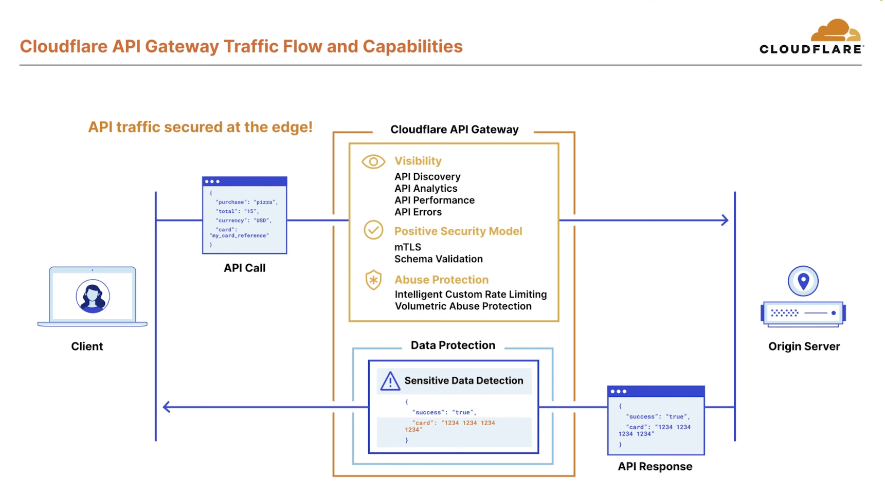

In this article, we explore general recommendations and best practices for safeguarding a comprehensive IT architecture. The following use cases are highlighted for protection and optimization:

- **[Websites / web applications](#l7-http-web-applications)** (standard HTTP requests)
- **[API endpoints](#l7-http-api-endpoints)** (HTTP requests with `content-type` JSON)
- **[SSL VPN endpoints](#use-case-ssl-vpn)** (TCP and UDP segments)
- **[Data Center with a CIDR notation /24](#use-case-cidr-24)** (IP Prefix)

Cloudflare can be instrumental in enhancing security and streamlining operational complexity by **consolidating multiple tools into a unified, integrated platform**. Real-world case studies illustrating organizations benefiting from this approach include [Carrefour](https://www.cloudflare.com/case-studies/carrefour/) (the eighth-largest retailer globally by revenue) and [Chrono24](https://www.cloudflare.com/case-studies/chrono24/) (one of the world's largest online marketplaces for luxury watches).

Other interesting case studies are: [Eurovision](https://blog.cloudflare.com/how-cloudflare-scaled-and-protected-eurovision-2023-voting), [Discord](https://www.cloudflare.com/case-studies/discord/), [Republic of Estonia Information Security Authority](https://www.cloudflare.com/case-studies/republic-of-estonian-information-security-authority/), [DHL Parcel](https://www.cloudflare.com/case-studies/dhl-parcel/), [C&A](https://www.cloudflare.com/case-studies/c-and-a/), and [9GAG](https://www.cloudflare.com/case-studies/9gag-cdn-ddos-protection/) among others.

## OSI Layers

Here is a visual representation of mapping Open Systems Interconnection model (OSI model) Layers to Cloudflare solutions:


This diagram provides an overview of how Cloudflare solutions effectively correspond to different OSI layers. High-level examples and use cases on these OSI layers are elaborated in this article, offering a general understanding of the practical applications of Cloudflare across the networking stack.

* * * 

## Getting Started

### Authoritative DNS

Let's begin by designating Cloudflare as your **Authoritative DNS provider** using the [Full Setup](https://developers.cloudflare.com/dns/zone-setups/full-setup/), granting you comprehensive control over all DNS-related aspects. Alternatively, opt for a CNAME Setup or [Partial Setup](https://developers.cloudflare.com/dns/zone-setups/partial-setup/).

Once your [Zone](https://developers.cloudflare.com/fundamentals/concepts/accounts-and-zones/#zones) is added, proceed to **[proxy](https://developers.cloudflare.com/dns/manage-dns-records/reference/proxied-dns-records/)** (orange-cloud) your DNS records. Note that the [`/cdn-cgi/` endpoint](https://developers.cloudflare.com/fundamentals/reference/cdn-cgi-endpoint/) is then added to your domain.

This initial setup seamlessly incorporates essential security features, providing:

* Built-in **[DNSSEC](https://developers.cloudflare.com/dns/dnssec/)**, [Automatic HTTPS Rewrites](https://developers.cloudflare.com/ssl/edge-certificates/additional-options/automatic-https-rewrites/), and [HTTP Strict Transport Security (HSTS)](https://developers.cloudflare.com/ssl/edge-certificates/additional-options/http-strict-transport-security/) with one-click.

* Common adjustments to HTTP request and response headers (i.e. security headers) via [Managed Transforms](https://developers.cloudflare.com/rules/transform/managed-transforms/) with one-click.

* Email Security DNS Wizard with **[DMARC Management](https://developers.cloudflare.com/dmarc-management/)** to easily and quickly configure Sender Policy Framework (SPF), DomainKeys Identified Mail (DKIM), and Domain-based Message Authentication Reporting and Conformance (DMARC).

* Free, privacy-first **[Cloudflare Web Analytics](https://developers.cloudflare.com/analytics/web-analytics/)** to monitor timing metrics and Core Web Vitals.

* Free **[Universal SSL](https://developers.cloudflare.com/ssl/edge-certificates/universal-ssl/) Certificate** automatically deployed, managed and renewed by Cloudflare.

* Pre-configured **[WAF Managed Rules](https://developers.cloudflare.com/waf/managed-rules/)** immediately deployable with one-click.

* Unmetered and unlimited **[DDoS protection](https://developers.cloudflare.com/ddos-protection/about/attack-coverage/)** at layers 3, 4, and 7 of the OSI model for proxied hostnames. Review the [DDoS attack coverage](https://developers.cloudflare.com/ddos-protection/about/attack-coverage/).

### Origin Server Security

Cloudflare serves as a robust [reverse proxy](https://developers.cloudflare.com/fundamentals/concepts/how-cloudflare-works/), managing the connection between clients/end-users and the origin server.

When a client makes a standard request to the origin server, Cloudflare sits in-between, ensuring a layer of security and configuration checks.

```goat
   +-------------------+         +-------------------+         +---------------------+
   |       Client      |         |    Cloudflare     |         |    Origin Server    |
   +-------------------+         +-------------------+         +---------------------+
              |                           |                           |
              |                           |                           |
              |      Connection 1         |       Connection 2        |
              +-------------------------->+-------------------------->|
              |                           |                           |
              |                           |                           |
              |                           |                           |
```

It is crucial to **channel all traffic through Cloudflare** before reaching the origin to optimize security measures, conserve origin bandwidth, and efficiently utilize origin resources. Cloudflare essentially becomes the _gatekeeper_.

My personal favorite approach involves deploying the **[Cloudflare Tunnel](https://developers.cloudflare.com/cloudflare-one/connections/connect-networks/)** by installing the `cloudflared` daemon on the origin server. This setup establishes outbound-only connections to Cloudflare's global network, eliminating the need for the origin server's IP address, firewall configuration or any port forwarding. Instead, the [Cloudflare Tunnel hostname](https://developers.cloudflare.com/cloudflare-one/connections/connect-networks/routing-to-tunnel/dns/) becomes the designated _origin_.

Bear in mind that it is possible to configure [Static IPs or Bringing Your Own IPs (BYOIP)](https://developers.cloudflare.com/fundamentals/concepts/cloudflare-ip-addresses/#customize-cloudflare-ip-addresses) as **Ingress IPs** for the client, enabling the allowlisting of these IPs for access. Moreover, by leveraging [Aegis](https://blog.cloudflare.com/cloudflare-aegis), you can establish dedicated **Egress IPs** connecting from Cloudflare to the Origin Server. This enables the allowlisting of these specific IPs on the Origin Server, allowing for the imposition of network Access Control Lists (ACLs) to exclusively permit traffic originating from these IPs into the network.

```goat
   +-------------------+         +-------------------+         +---------------------+
   |       Client      |         |    Cloudflare     |         |    Origin Server    |
   +-------------------+         +-------------------+         +---------------------+
              |                           |                           |
              |                           |                           |
              |        Ingress IPs        |         Egress IPs        |
              +-------------------------->+-------------------------->|
              |                           |                           |
              |                           |                           |
              |                           |                           |
```

For comprehensive details, review the [protect your origin server](https://developers.cloudflare.com/fundamentals/basic-tasks/protect-your-origin-server/) developer documentation, including which [network ports](https://developers.cloudflare.com/fundamentals/reference/network-ports/) are proxied by default.

### Flow of HTTP Requests

Cloudflare runs one of the largest [global anycast networks](https://www.cloudflare.com/network/) in the world. Traffic within the Cloudflare Point of Presence (PoP), between data centers, and between the Cloudflare network and a customer's origin is encrypted when in transit. The customer has the option and flexibility to select which [encryption mode](https://developers.cloudflare.com/ssl/origin-configuration/ssl-modes/) and which [cipher suites](https://developers.cloudflare.com/ssl/reference/cipher-suites/) to use. In addition, all request and response processing within a Cloudflare PoP takes place in memory – through machine inspection: use of headless servers and technical measures to prevent any human access. Nothing is written to disk except for [eligible content for caching](https://developers.cloudflare.com/cache/concepts/default-cache-behavior/) or [Cache Rules](https://developers.cloudflare.com/cache/how-to/cache-rules/) configured by the customer, and all cache disks are encrypted at rest.


On a high-level, once the device of an end user connects with a Cloudflare PoP – no matter which one –, the request is processed in the following way:
1. Certain types of requests that can be used for cyber attacks are immediately dropped based on the addressing information (Layer 3 / Network Layer).
2. Next, the encrypted request is decrypted and inspected using the business logic requested and enabled by the customer, such as i.e. the products Configuration Rules, Web Application Firewall (WAF) Custom Rules, Rate Limiting Rules, and so on – following the [traffic sequence](https://blog.cloudflare.com/traffic-sequence-which-product-runs-first/) and phases. This enables the detection and prevention of a variety of different types of cyber attacks and malicious traffic, including Layer 7 / Application Layer DDoS attacks, automated bot traffic, credential stuffing, and SQL injection among others.
3. The inspected request is then passed to the cache module. If the cache can fulfill the request with a cached copy of the content, it does so; if not, it forwards the request to the customer's origin server. Traffic between the Cloudflare PoP and the origin server is encrypted, unless the customer decides to use a different encryption mode.
4. When the response comes from the customer's origin server, any static and eligible content is cached onto encrypted disks. The response then goes back through the business logic to the user across the Internet.
By default, Cloudflare performs TLS termination globally in every PoP, where the Internet end user connects to a website or application behind Cloudflare. However, customers can configure [Regional Services](https://developers.cloudflare.com/data-localization/regional-services/) – a Data Localization Suite (DLS) feature – to control in which regions the processing and TLS termination occurs.

* * * 

## Use Cases

### L7 HTTP: Web Applications

Users engage with websites and web applications through HTTP requests at the Application Layer (Layer 7).

By routing HTTP traffic through Cloudflare, you can leverage a variety of solutions to enhance security, performance, and overall web application functionality.

#### Use Case: Security

_**Web Application Firewall (WAF) – automatic protection and flexibility**_

Effortlessly enhance your security posture with one-click deployment of pre-configured **[WAF Managed Rules](https://developers.cloudflare.com/waf/managed-rules/)** across your entire domain or a specific scope of incoming requests. This provides peace of mind against various types of attacks. Nevertheless, it is advisable to review the individual rules in [Cloudflare Managed Ruleset](https://developers.cloudflare.com/waf/managed-rules/reference/cloudflare-managed-ruleset/) and customize pre-defined rules to suit your specific needs, as well as optimizing the paranoia level of the [OWASP Core Ruleset](https://developers.cloudflare.com/waf/managed-rules/reference/owasp-core-ruleset/) to prevent potential false positives.

Start by gaining comprehensive visibility into all activities on your domain through an analysis of **[Security Analytics](https://developers.cloudflare.com/waf/analytics/security-analytics/)**. Subsequently, craft highly specific WAF Custom Rules employing the [SKIP action](https://developers.cloudflare.com/waf/custom-rules/skip/). This step is crucial for allowing internal, trusted and familiar traffic, particularly for internal API endpoints and [Verified Bots](https://developers.cloudflare.com/bots/reference/verified-bot-categories/), thereby minimizing the risk of false positives in other Custom Rules. You can create [lists](https://developers.cloudflare.com/waf/tools/lists/) to simplify the setup.

Once this foundation is established, proceed to create more generalized Custom Rules to proactively mitigate potential attacks or implement measures to block or challenge specific types of traffic. This tiered approach ensures a nuanced and effective strategy for optimizing security while minimizing disruptions to legitimate operations.

> Note: we normally do not want to block the [`/cdn-cgi/` endpoint](https://developers.cloudflare.com/fundamentals/reference/cdn-cgi-endpoint/) or [Cloudflare crawlers](https://developers.cloudflare.com/fundamentals/reference/cloudflare-site-crawling/); or internally trusted traffic.

Exercise precise control over which requests are blocked, challenged, skipped, or logged by leveraging the flexibility of **WAF [Custom Rules](https://developers.cloudflare.com/waf/custom-rules/)**. Explore [common use cases for custom rules](https://developers.cloudflare.com/waf/custom-rules/use-cases/) for practical examples, and be mindful of the [phases](https://developers.cloudflare.com/ruleset-engine/about/phases/) and the order of rule evaluation, considering the associated [actions](https://developers.cloudflare.com/ruleset-engine/rules-language/actions/). There's also the option to inspect [HTTP request body fields](https://developers.cloudflare.com/ruleset-engine/rules-language/fields/#http-request-body-fields) (payloads).

For advanced threat mitigation, including potential zero-day attacks – like from SQL injection (SQLi), Cross-site scripting (XSS), and Remote Code Execution (RCE) attacks –, take advantage of the **[WAF Attack Score](https://developers.cloudflare.com/waf/about/waf-attack-score/)**. For instance, create a WAF Custom Rule to block requests with a WAF Attack Score below 50 (`cf.waf.score lt 50`), indicating a likely attack (`likely_attack`). This additional layer of defense fortifies your security measures against evolving and sophisticated threats.

_**Rate Limiting – restricting the number of requests**_

Enhance security further by integrating the deployment of WAF Managed Rules and WAF Custom Rules with **[Rate Limiting Rules](https://developers.cloudflare.com/waf/rate-limiting-rules/)**. Rate Limiting empowers you to set specific limits for requests that meet defined criteria and determine the action to take when those limits are exceeded. Explore [common best practices](https://developers.cloudflare.com/waf/rate-limiting-rules/best-practices/) and rule examples to fortify your defenses, whether you're safeguarding REST or GraphQL APIs or controlling the frequency of operations, among other scenarios. In order to [find an appropriate rate limit](https://developers.cloudflare.com/waf/rate-limiting-rules/find-rate-limit/), review the Security Analytics.

_**Bot Management – mitigate automated traffic**_

To attain in-depth visibility into automated traffic, particularly content scrapers, credential stuffing, inventory hoarding, and other bots, it is recommended to acquire a **[Bot Management](https://developers.cloudflare.com/bots/plans/bm-subscription/)** subscription. This subscription unlocks the utilization of fields such as [BotScore](https://developers.cloudflare.com/bots/concepts/bot-score/) and [JA3 Fingerprint](https://developers.cloudflare.com/bots/concepts/ja3-fingerprint/) in WAF Custom Rules and Rate Limiting Rules, providing added flexibility for crafting specific rules.

> Note: In certain scenarios, certain requests are [exempt from scoring](https://developers.cloudflare.com/bots/reference/bot-management-skips/). The `__cf_bm` Bot Management [Cookie](https://developers.cloudflare.com/bots/concepts/bot-score/#notes-on-detection) serves as a functional cookie that enhances scoring but can be disabled upon request. Moreover, API requests are considered automated traffic.


_Image source: [Cloudflare WAF Product Brief](https://www.cloudflare.com/static/9fd7253e4009caaa928a67ecca5d2709/WAF_product_brief_Fall_2022__1_.pdf)_

_**Turnstile – CAPTCHA alternative**_

If you're seeking an alternative to CAPTCHA or unable to invest in the more comprehensive Bot Management solution, consider utilizing the privacy-preserving **[Turnstile](https://developers.cloudflare.com/turnstile/)** as a safeguard against malicious bots. Learn more about it's capabilities in the [Cloudflare is free of CAPTCHAs; Turnstile is free for everyone](https://blog.cloudflare.com/turnstile-ga) blog post. Furthermore, you have the option to seamlessly [integrate Turnstile into the WAF](https://blog.cloudflare.com/integrating-turnstile-with-the-cloudflare-waf-to-challenge-fetch-requests/). This allows web administrators to incorporate the Turnstile code snippet into their websites and subsequently configure the Cloudflare WAF to handle these requests.

_**WAF Content Scanning – malware scanning**_

Moreover, for those seeking to scrutinize content uploaded to an application, **[WAF Content Scanning](https://developers.cloudflare.com/waf/about/content-scanning/)** can prove beneficial. When activated, content scanning endeavors to identify content objects, including uploaded files, and scans them for malicious signatures such as malware. It is advisable to establish a detailed WAF Custom Rule, specifying the URI Path where the content is uploaded, to promptly block any detected malicious content objects.

_**Page Shield – third-party script management**_

**[Page Shield](https://developers.cloudflare.com/page-shield/)** can display third-party scripts being loaded, when and where on your website, also allowing you to define policies to allow certain scripts to be loaded. In the near future, related potential CVEs will also be displayed.

#### Use Case: Performance

Effortlessly enhance your website's performance with a single click by implementing a range of **[speed optimizations](https://developers.cloudflare.com/speed/optimization/)**. These include features such as [Brotli compression](https://developers.cloudflare.com/speed/optimization/content/brotli/), [HTTP/3 (with QUIC)](https://developers.cloudflare.com/speed/optimization/protocol/http3/), [Auto Minify](https://developers.cloudflare.com/speed/optimization/content/auto-minify/), and more.

_**Argo Smart Routing – efficient routing**_

Experience advanced Layer 7 efficiency with **[Argo Smart Routing](https://developers.cloudflare.com/argo-smart-routing/)**, streamlining the routing of traffic along the most optimal network path from Cloudflare to the origin server — also achievable with just one-click.

_**Zaraz – third-party tool manager**_

Unlock precise control over cookie storage and information sharing with third party scripts by leveraging the capabilities of **[Zaraz](https://developers.cloudflare.com/zaraz/)** and it's [privacy settings](https://developers.cloudflare.com/zaraz/reference/settings/#privacy). Here it's important to point out the usage of [Google Analytics with Cloudflare](https://developers.cloudflare.com/fundamentals/reference/google-analytics/). Review my [Cloudflare Zaraz](/articles/cloudflare-zaraz/) article for some examples.

_**Cache Rules – caching customization**_

Configuring and adapting **[Cache Rules](https://developers.cloudflare.com/cache/how-to/cache-rules/)** is key to taking advantage of the global Cloudflare Content Delivery Network (CDN) and improving delivery of [eligible assets](https://developers.cloudflare.com/cache/concepts/default-cache-behavior/). The `CF-Cache-Status` response header value we are looking for is [HIT](https://developers.cloudflare.com/cache/concepts/default-cache-behavior/#cloudflare-cache-responses). The [CF-RAY](https://developers.cloudflare.com/fundamentals/reference/http-request-headers/#cf-ray) response header shows from which Cloudflare PoP (_IATA 3-letter airport code_) the asset was delivered. Keep in mind the [order and priority](https://developers.cloudflare.com/cache/how-to/cache-rules/order/) when creating the Rules.

> Note: Cloudflare's [global network](https://www.cloudflare.com/network/) and direct peering with multiple providers contributes to exceptional [network performance](https://blog.cloudflare.com/network-performance-update-birthday-week-2023).

_**Image Optimization – optimize and transform images on the fly**_

Furthermore, you can explore **[Image Optimization](https://developers.cloudflare.com/images/)** features such as Image Resizing and Polish. Polish, a convenient one-click enhancement, not only optimizes images but also converts the `content-type` of PNG and JPEG images to WebP for improved efficiency. On the other hand, Image Resizing provides enhanced flexibility and granularity in image transformations. You can implement Image Resizing using [URL Format](https://developers.cloudflare.com/images/image-resizing/url-format/) (either directly in the HTML code with [`srcset`](https://developers.cloudflare.com/images/image-resizing/responsive-images/) or through [Transform Rules](https://developers.cloudflare.com/images/image-resizing/serve-images-custom-paths/#serve-images-from-custom-paths-1)), or alternatively, through [Workers](https://developers.cloudflare.com/images/image-resizing/resize-with-workers/).

_**Performance Measurement**_

Delve into detailed **performance metrics** by exploring various fields within the [HTTP request dataset](https://developers.cloudflare.com/logs/reference/log-fields/zone/http_requests/) accessible through [Logpush](https://developers.cloudflare.com/logs/about/). Gain valuable insights into aspects such as:
* _OriginResponseHeaderReceiveDurationMs_
* _OriginTCPHandshakeDurationMs_
* _OriginTLSHandshakeDurationMs_
* _ClientTCPRTTMs_

For a comprehensive analysis, the [GraphQL Analytics API](https://developers.cloudflare.com/analytics/graphql-api/) provides access to the [_httpRequestsAdaptiveGroups_ dataset](https://blog.cloudflare.com/introducing-timing-insights/), showcasing additional performance-related metrics, including:
* Time to First Byte (TTFB) (_edgeTimeToFirstByteMs_)
* Origin DNS lookup time (_edgeDnsResponseTimeMs_)
* Origin Response Time (_originResponseDurationMs_)

> Note: while the Time to First Byte (TTFB) metric holds significance for API endpoints, it's important to note that when assessing websites or web applications, other more meaningful metrics, such as Core Web Vitals, should take precedence. Core Web Vitals offer a more comprehensive evaluation of the real user experience, as described in the _[Are you measuring what matters? A fresh look at Time To First Byte](https://blog.cloudflare.com/ttfb-is-not-what-it-used-to-be/)_ blog post. Therefore, for a holistic understanding of web performance and user satisfaction, it is advisable to prioritize metrics that align closely with the actual user experience. This is why [Observatory](https://developers.cloudflare.com/speed/speed-test/) can be a great start.

### L7 HTTP: API endpoints

In today's digital landscape, a significant portion of Internet traffic is automated or API-driven, reflecting the increasing reliance on API-driven applications. According to [Cloudflare](https://blog.cloudflare.com/application-security-report-q2-2023/), over half of **dynamic traffic** is API-related and continues to grow. Developers must effectively manage APIs to support diverse functionalities, necessitating continuous monitoring and authentication for each request.

> Note: API traffic encompasses any HTTP/S request with a response `content-type` of `application/json` or `application/*`.

This is precisely where [API Shield](https://developers.cloudflare.com/api-shield/) becomes invaluable. Serving as a central hub for securing, managing, and monitoring API traffic, API Shield offers the following key features:
* Discovery: identify and monitor the API endpoint landscape.
* Layer 7 Security: protect against abusive attacks, including application DDoS and brute-force attempts.
* Schema Validation (Positive API Security): automatically validate OpenAPI v3 schemas for enhanced API protection.
* [Volumetric Abuse Detection](https://developers.cloudflare.com/api-shield/security/volumetric-abuse-detection/): stop volumetric API abuse through advanced anomaly detection mechanisms and Rate Limiting.
* Mutual TLS (mTLS): deliver robust authentication for mobile and IoT APIs.
* [Sensitive Data Detection](https://developers.cloudflare.com/api-shield/management-and-monitoring/#sensitive-data-detection): safeguard against data leaks by continuously scanning response payloads for sensitive information.



_Image Source: [Cloudflare YouTube video](https://www.youtube.com/watch?v=wWkjqxHCfEI)_

#### Use Case: Observability

Many development teams face challenges in effectively managing or cataloging their APIs. Cloudflare's API Discovery comes to the rescue by aiding in mapping and comprehending your attack surface.

The **[API Dicovery](https://developers.cloudflare.com/api-shield/security/api-discovery/)** feature meticulously catalogs all identified API endpoints. It utilizes user-specified Session Identifiers, such as headers or cookies, alongside Machine Learning-based Discovery. These insights can then be seamlessly integrated into **[Endpoint Management](https://developers.cloudflare.com/api-shield/management-and-monitoring/)**, facilitating in-depth analytics and comprehensive oversight.


_Image Source: [Cloudflare blog post](https://blog.cloudflare.com/ml-api-discovery-and-schema-learning)_

> Note: it takes approximately 24 hours and a [minimum of several hundreds of API requests](https://developers.cloudflare.com/api-shield/frequently-asked-questions/#why-are-my-api-endpoints-not-found-by-api-discovery) after adding an endpoint for Cloudflare to learn the API schema and patterns.

#### Use Case: Positive Security Model

_**API Schema Validation – compliant incoming traffic**_

The compilation of all anticipated formats for every API endpoint within an API is termed an API schema. Utilizing **[API Schema Validation](https://developers.cloudflare.com/api-shield/security/schema-validation/)** proves highly effective in safeguarding against bug exploitation, invalid API requests, and malicious payloads. This validation ensures that the body, path, and query string of a request contain the expected information for a given API endpoint in the anticipated format.

You have the flexibility to either manually upload API schemas or apply learned schemas after some time. Additionally, you can create an interactive documentation portal (API catalog) using the [developer portals](https://developers.cloudflare.com/api-shield/management-and-monitoring/developer-portal/). This empowers your team with a comprehensive resource for understanding and interacting with the APIs, promoting better development practices and enhanced security measures.

_**mTLS – bidirectionally secure and trusted traffic**_

In standard HTTPS communication, the server provides the TLS certificate during the SSL handshake to secure the connection. However, in **[mutual TLS (mTLS)](https://developers.cloudflare.com/api-shield/security/mtls/)**, clients are required to provide a certificate to the server, establishing a logical checkpoint that needs to be configured with the server. When utilizing Cloudflare to proxy traffic, Cloudflare assumes the role of the server in communication with clients. Consequently, you can enable the mTLS feature with Cloudflare without the necessity to configure it with your servers. As long as the client presents the correct certificate without triggering additional security checkpoints, Cloudflare will grant access to the server. 

> Note: in this section, we are referring to the connection established by the end user to Cloudflare. If you are interested in implementing mTLS not only from the end user to Cloudflare but also from Cloudflare to the origin server, where the origin server verifies the client certificate provided by Cloudflare, review [Authenticated Origin Pulls (mTLS)](https://developers.cloudflare.com/ssl/origin-configuration/authenticated-origin-pull).

### L4 TCP/UDP

_**Spectrum – global TCP and UDP proxy**_

Cloudflare is typically used as an anycast reverse proxy for HTTP/S traffic. To extend its capabilities to **proxy TCP/UDP services**, you'll need to leverage **[Spectrum](https://developers.cloudflare.com/spectrum/)**.

Spectrum serves as a global TCP and UDP proxy, operating on every Cloudflare's PoP. Unlike HTTP/S traffic, Spectrum doesn't [terminate the connection by default](https://developers.cloudflare.com/spectrum/reference/configuration-options/#edge-tls-termination); instead, it provides robust L3/L4 DDoS protection while efficiently passing packets through to the origin server. This enables secure and optimized handling of a diverse range of network protocols beyond traditional web traffic.

_**IP Access Rules & Network-layer DDoS Protection**_

As TCP/UDP operates at Layer 4, it's important to note that the WAF does not apply to this type of traffic. In such cases, the use of **[IP Access Rules](https://developers.cloudflare.com/waf/tools/ip-access-rules/)** is recommended. In addition, one can overwrite the [Network-layer DDoS Attack Protection managed ruleset](https://developers.cloudflare.com/ddos-protection/managed-rulesets/network/). It's worth mentioning that future plans might include extending support for Spectrum to incorporate the capabilities of **[Magic Firewall](https://developers.cloudflare.com/magic-firewall/)**, a global network firewall.

```goat
+-----------------+      +------------------------------+
|  HTTP requests  | ---> |   WAF & L7 DDoS Protection   |
+-----------------+      +------------------------------+ 

+-----------------+      +----------------------------------------+
|     TCP/UDP     | ---> |  IP Access Rules & L3 DDoS Protection  |
+-----------------+      +----------------------------------------+
```

> Note: if a Spectrum [application type](https://developers.cloudflare.com/spectrum/reference/configuration-options/#application-type) TCP/UDP employs a proxied hostname as its origin, the traffic will eventually still traverse through the WAF. Furthermore, when configuring Spectrum with an application type of HTTP/S, it's possible to define granular WAF Custom Rules with [specific HTTP ports](https://developers.cloudflare.com/waf/custom-rules/use-cases/require-specific-http-ports/).

#### Use Case: SSL VPN

To seamlessly set up most SSL VPNs, such as OpenVPN or Cisco AnyConnect, follow a straightforward setup by configuring **two Spectrum applications**:
* one TCP application 
* one UDP application

Choose a preferred hostname, like `openvpn.example.com`. Set both Edge and Origin Port to `443` (default port for SSL VPNs). Specify the Origin Server IP where the VPN gateway resides.

> Note: for dual-protocol VPNs involving both TCP and UDP, it's crucial to acknowledge that, for a single VPN session, the egress IPs for TCP and UDP connections (source IP of connection from Cloudflare to origin) may differ. This occurs because these connections are likely served by different metals. Adjust VPN origin server policies to accommodate this variation, either by relaxing policies to accept different source IPs (typically within the same /24 IP prefix), or by configuring and leveraging the [Proxy Protocol](https://developers.cloudflare.com/spectrum/how-to/enable-proxy-protocol/) to match up connections. Additionally, be mindful of potential MTU adjustments, which may need to be set to MTU 1420 or lower in certain cases.

Here are some general advantages of utilizing VPN over Spectrum:
* Conceal internal VPN endpoints behind Anycast for added _security through obscurity_.
* Cloudflare Spectrum might offer improved speed, due to global [network interconnects](https://developers.cloudflare.com/network-interconnect/partners/), and especially when paired with [Argo Smart Routing](https://developers.cloudflare.com/spectrum/reference/configuration-options/#argo-smart-routing).
* Benefit from Edge-based filtering, enabling configuration and tuning options such as [IP Access Rules](https://developers.cloudflare.com/waf/tools/ip-access-rules/) for TCP apps and [Network Analytics](https://developers.cloudflare.com/analytics/network-analytics/) for comprehensive logging.

This approach not only streamlines the integration of SSL VPNs but also presents additional advantages in terms of security, speed, and configuration flexibility.

### L3 Network

_**Magic Transit – IP network security and performance**_

When organizations seek to fortify their entire networks or entire IP prefixes, IT departments often resort to conventional hardware solutions or cloud scrubbing providers. **[Magic Transit](https://developers.cloudflare.com/magic-transit/)** emerges as a comprehensive network security solution, delivering DDoS protection, traffic acceleration, and more, accessible from every Cloudflare PoP. This applies seamlessly to on-premise, cloud-hosted, and hybrid network environments.

> Note: certain [prerequisites](https://developers.cloudflare.com/magic-transit/prerequisites/) are essential for utilizing Magic Transit, typically involving an IPv4 IP prefix length requirement of a minimum `/24`, due to how [Border Gateway Protocol (BGP)](https://www.cloudflare.com/learning/security/glossary/what-is-bgp/) works. However, those unable to meet this requirement can explore the option of [Cloudflare IPs](https://developers.cloudflare.com/magic-transit/cloudflare-ips/), or even Spectrum to protect only single IP addresses. In certain cases one can also directly connect their network infrastructure with Cloudflare with [Network Interconnect](https://developers.cloudflare.com/magic-transit/network-interconnect/) for a more reliable and secure experience.


_Image Source: [Magic Transit Reference Architecture](https://developers.cloudflare.com/reference-architecture/magic-transit-reference-architecture/)_

For nearly real-time insights into network and transport-layer traffic patterns, as well as DDoS attacks, explore **[Network Analytics](https://developers.cloudflare.com/analytics/network-analytics/)**. Moreover, you can enhance your visibility into network traffic by configuring **[Magic Network Monitoring](https://developers.cloudflare.com/magic-network-monitoring/)** to analyze the network flow data transmitted from a your routers.

_**Magic Firewall – Firewall-as-a-Service (FWaaS)**_

Beyond DDoS protection, Magic Transit incorporates a version of **[Magic Firewall](https://developers.cloudflare.com/magic-firewall/)** – a Firewall-as-a-Service (FWaaS) solution. This network firewall allows you to apply filter rules based on various criteria, including protocol and packet length. By filtering undesirable traffic before it reaches your network, Magic Firewall acts as an additional global proactive defense mechanism, stopping attacks before they reach your network.

#### Use Case: CIDR /24

TBD

* * * 

### Monitoring

* Periodically monitor and review your general setup with the **[Security Center](https://developers.cloudflare.com/security-center/)**, the Zone **[Security Analytics](https://developers.cloudflare.com/waf/analytics/security-analytics/)**, and set up **[Notifications](https://developers.cloudflare.com/notifications/)** for important updates or incidents.

* Push all raw logs to a storage service, SIEMs, or log managemenet service with [Logpush](https://developers.cloudflare.com/logs/about/). Review my [Cloudflare Logpush](/articles/cloudflare-logpush/) article for more details and setup examples.

* Set up standalone **[Health Checks](https://developers.cloudflare.com/health-checks/)** to monitor whether an IP address or hostname is online. Additionally, the analytics show average latency – measured in round-trip time (RTT) — for individual origins over time.

* For a broader overview of security and attacks specific to countries, routing, or outages, explore **[Cloudflare Radar](https://radar.cloudflare.com/)**. Check out the [Year in Review 2023](https://radar.cloudflare.com/year-in-review/2023) report.

For anything troubleshooting-related, explore the [Troubleshooting section](https://developers.cloudflare.com/support/troubleshooting/), [Cloudflare Trace](https://developers.cloudflare.com/fundamentals/basic-tasks/trace-request/), or [contact Cloudflare Support](https://developers.cloudflare.com/support/contacting-cloudflare-support/#methods-of-contacting-cloudflare-support).

### Compliance

> Note: each legal entity bears the responsibility for ensuring its own compliance and adherence to legal practices within its respective jurisdictions.

Cloudflare can provide necesssary [compliance documentation](https://developers.cloudflare.com/fundamentals/reference/policies-compliances/compliance-docs/) for audits or due diligence. Most documentation can also be found online, such as [Privacy Policy](https://www.cloudflare.com/privacypolicy/), [Data Processing Addendum (DPA)](https://www.cloudflare.com/cloudflare-customer-dpa/), [Self-Serve Subscription Agreement](https://www.cloudflare.com/terms/), [Enterprise Subscription Terms of Service](https://www.cloudflare.com/enterpriseterms/), and the [Data Privacy Framework (DPF)](https://www.dataprivacyframework.gov/s/participant-search/participant-detail?id=a2zt0000000GnZKAA0&status=Active), according to [European Commission adopting new adequacy decision for safe and trusted EU-US data flows](https://ec.europa.eu/commission/presscorner/detail/en/ip_23_3721).

Additionally, the [Data Localization Suite (DLS)](https://developers.cloudflare.com/data-localization/) provides three features designed to address data residency requirements, if necessary:
1. Geo Key Manager: control where the TLS keys are stored.
2. Regional Services: control where the TLS termination / processing occurs.
3. Customer Metadata Boundary: control where [Customer Logs](https://developers.cloudflare.com/logs/reference/log-fields/) (metadata) are stored.

Review the [Cloudflare Trust Hub](https://www.cloudflare.com/trust-hub/) for more detailed information. 

Learn more about [Cloudflare's Impact, Commitments, Privacy-preserving Products, Research, and more](/articles/cloudflare-impact-commitment-privacy-research/).

## Final Remarks

Embark on securing your web applications (Layer 7), API endpoints (Layer 7), TCP/UDP services (Layer 4), and IP prefixes (Layer 3) today with the deployment of a comprehensive layered security solution.

Get started with the [Cloudflare Learning Paths](https://developers.cloudflare.com/learning-paths/)!

Alternatively, if you're looking to extend security to your employees, devices, internal networks, and enterprise applications, delve into the comprehensive offerings of **[Cloudflare's SSE & SASE Platform](https://www.cloudflare.com/zero-trust/)**, also known as Cloudflare One.

> _Cloudflare One is built on Cloudflare’s connectivity cloud, ​​a unified, intelligent platform of programmable cloud-native services that enable any-to-any connectivity between all networks (enterprise and Internet), cloud environments, applications, and users._

Explore building and developing **[Full-Stack applications](https://www.cloudflare.com/developer-platform/solutions/)** with [Pages](https://pages.cloudflare.com/) for deploying static front-end websites, [Workers](https://workers.cloudflare.com/) for implementing serverless code and dynamic computing, and a range of innovative [storage solutions](https://developers.cloudflare.com/workers/platform/storage-options/).

> _Though Cloudflare Workers behave similarly to JavaScript in the browser or in Node.js, there are a few differences in how you have to think about your code. Under the hood, the Workers runtime uses the V8 engine — the same engine used by Chromium and Node.js. The Workers runtime also implements many of the standard APIs available in most modern browsers._

For those intrigued by **Artificial Intelligence (AI)**, delve into the intersection of cybersecurity and AI in the insightful [Cybersecurity and Artificial Intelligence (AI)](/articles/ai-cybersecurity/) article.

---

## Disclaimer

Educational purposes only. Several parts are over-simplified, for showcasing purposes.

This blog post is independent and not affiliated with, endorsed by, or necessarily reflective of the opinions of Cloudflare or any other entities mentioned.

Certain content, images, and screenshots are sourced from publicly available resources.
